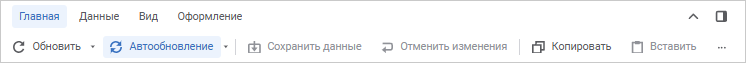
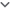
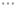
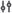
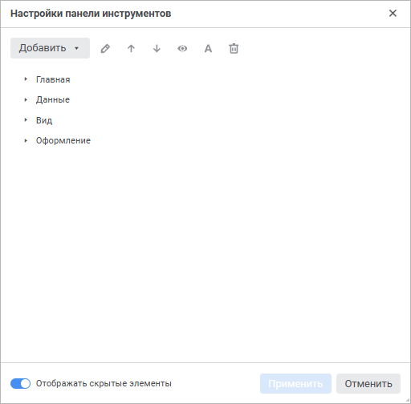
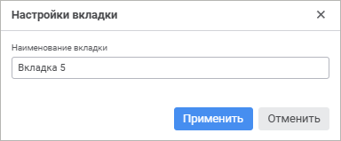
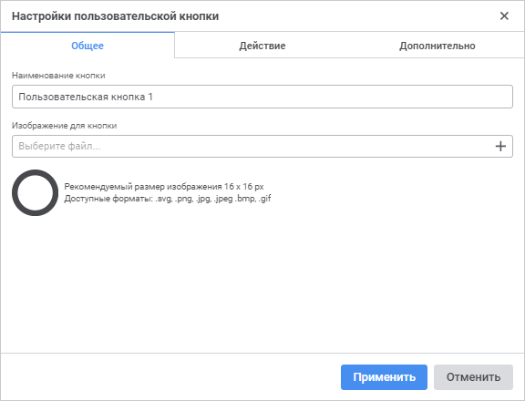
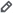
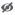

# Настройки панели инструментов: Формы ввода

Настройки панели инструментов: Формы ввода
-

# Настройки панели инструментов

По умолчанию панель инструментов содержит системные вкладки и кнопки
 для построения и настройки формы ввода:

Операции с панелью:

[Сворачивание/восстановление
 панели](javascript:TextPopup(this))

	Для экономии места на экране панель инструментов можно свернуть.
	 При сворачивании панели отображаются только наименования вкладок.

	Для сворачивания/восстановления панели инструментов нажмите кнопку
	  «Свернуть»
	 /  «Развернуть»
	 на панели инструментов.

[Прокрутка кнопок](javascript:TextPopup(this))

	Если какие-то кнопки не помещаются на экран, то они скрываются.
	 Для использования скрытых кнопок нажмите кнопку  «Показать» на панели инструментов,
	 будет открыто окно с кнопками.

	Для перемещения по окну используйте ленту прокрутки или колесико
	 мыши с зажатой клавишей SHIFT.

Для формирования пользовательской панели инструментов используйте окно
 «Настройки панели инструментов».

[Для открытия
 окна](javascript:TextPopup(this))

	Выполните команду  «Настроить панель инструментов» контекстного
	 меню [панели инструментов](../Starting/Starting.htm#elements).

Режимы настройки панели инструментов:

	- Отображать скрытые элементы. Активируйте переключатель «Отображать
	 скрытые элементы» для отображения
	 всех элементов панели инструментов. По умолчанию переключатель активен;

	- Режим просмотра.
	 Деактивируйте переключатель «Отображать скрытые элементы» для отображения элементов доступных
	 при просмотре. При наведении на системные вкладки и кнопки доступные
	 только в режиме просмотра отображается подсказка.

Доступные операции:

[Добавление вкладки](javascript:TextPopup(this))

	Доступно только для режима «Отображать
	 скрытые элементы».

	Для добавления вкладки:

		- Выберите вкладку панели инструментов из списка.

		- Выполните команду из раскрывающегося списка кнопки «Добавить > Вкладка». После
		 чего будет открыто окно «Настройки
		 вкладки»:

	

		- Задайте наименование вкладки.

	В результате выполненных действий вкладка будет добавлена после
	 выбранной вкладки. Если вкладка не была выбрана или выбрано несколько
	 вкладок, то вкладка добавится в конец списка вкладок.

	Вкладки, которые не содержат кнопок, остаются скрытыми до добавления
	 хотя бы одной кнопки.

[Добавление
 пользовательской кнопки](javascript:TextPopup(this))

	Добавление пользовательской кнопки доступно только на пользовательские
	 вкладки.

	Для добавления пользовательской кнопки:

		- Выберите вкладку панели инструментов из списка.

		- Выберите кнопку после которой должна будет расположиться
		 новая кнопка. Если на вкладку добавляется первая кнопка пропустите
		 шаг.

		- Выполните команду из раскрывающегося списка кнопки «Добавить > Пользовательскую кнопку».
		 Будет открыто окно «Настройки
		 пользовательской кнопки»:

	

		- Выполните [настройку пользовательской
		 кнопки](Advanced.htm).

	В результате выполненных действий пользовательская кнопка будет
	 добавлена после выбранной кнопки или первой на вкладке. Если кнопка
	 не была выбрана или выбрано несколько кнопок, то пользовательская
	 кнопка добавится в конец списка кнопок выбранной вкладки.

[Добавление разделителя](javascript:TextPopup(this))

	Для формирования логических групп на вкладках добавьте разделители.

	Добавление разделителя доступно только для пользовательских вкладок.

	Для добавления разделителя на панели инструментов:

		- Выберите кнопку панели инструментов из списка.

		- Выполните команду из раскрывающегося списка кнопки «Добавить >Разделитель».

	В результате выполненных действий разделитель будет добавлен после
	 выбранной кнопки. Если кнопка не была выбрана, выбрано несколько кнопок
	 или выбрана вкладка, то разделитель добавится в конец списка.

[Редактирование
 элемента](javascript:TextPopup(this))

	Доступно для пользовательских вкладок и кнопок.

	Для внесения изменений в элемент панели инструментов:

		- Выберите элемент панели инструментов из списка.

		- Выполните одно из действий:

			- нажмите кнопку 
			 «Редактировать»;

			- выполните команду  «Редактировать»
			 контекстного меню выбранного элемента.

[Изменение расположения
 элемента](javascript:TextPopup(this))

	Для изменения положения выбранного элемента панели инструментов
	 используйте механизм Drag&Drop или кнопки 
	 «Переместить вверх» и  «Переместить вниз».

	Вкладки перемещаются вместе с кнопками, которые в них добавлены.

	Разделители можно перемещать только в пределах одной вкладки.

[Настройка отображения
 элементов](javascript:TextPopup(this))

	Доступно для вкладок и кнопок.

	Скрытые элементы, которые отображаются только в режиме «Отображать
	 скрытые элементы», обозначаются символом .

	Для настройки отображения элементов панели инструментов выполните
	 действия:

		- Выберите один или несколько элементов панели инструментов,
		 используя клавишу CTRL.

		- Выполните одно из действий:

			- для отображения элемента в режиме «Отображать
			 скрытые элементы»:

				- нажмите кнопку  «Скрыть»;

				- выполните команду контекстного меню  «Скрыть»
				 выбранного элемента;

			- для отображения элемента во всех режимах:

				- нажмите кнопку  «Показать»;

				- выполните команду контекстного меню  «Показать»
				 выбранного элемента.

	При скрытии вкладки, кнопки, принадлежащие ей, также не буду отображаться
	 на панели инструментов.

[Настройка отображения
 наименования кнопки](javascript:TextPopup(this))

	У кнопок со скрытым наименованием на панели инструментов отображаются
	 только пиктограммы.

	Кнопки со скрытым наименованием обозначаются символом .

	Для настройки отображения наименований кнопок выполните следующие
	 действия:

		- Выберите одну или несколько кнопок, используя клавишу CTRL.

		- Выполните одно из действий:

			- для отображения только пиктограммы на панели инструментов
			 нажмите кнопку  «Скрыть
			 наименование»;

			- для отображения наименования кнопки на панели инструментов
			 нажмите кнопку  «Показать
			 наименование».

[Удаление
 элемента](javascript:TextPopup(this))

	Доступно для пользовательских вкладок, кнопок и разделителей.

	Для удаления элемента панели инструментов:

		- Выберите элемент панели инструментов из списка.

		- Нажмите кнопку  «Удалить».

	Вкладки удаляются вместе с кнопками. Если на вкладку перемещена
	 системная кнопка, то для удаления вкладки кнопку необходимо перенести
	 на другую вкладку.

Для сброса настроек выполните команду «Сбросить
 настройки» контекстного меню панели инструментов. В результате
 сброса настроек все системные и пользовательские кнопки будут отображены
 на панели инструментов в порядке по умолчанию, а пользовательские группы
 и разделители, добавленные пользователем, будут удалены.

См. также:

[Построение
 формы ввода](../Starting/ConstructForm.htm)

		Справочная
		 система на версию 10.9
		 от 18/08/2025,
		 © ООО «ФОРСАЙТ»,
