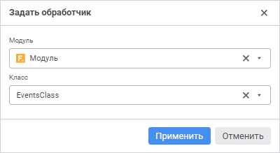

# Обработка событий формы

Обработка событий формы
-

# Обработка событий формы

Для задания обработки событий, которые генерируются при работе пользователя
 с формами, используйте обработчик событий.

Обработчик событий - это [модуль](uidevenv.chm::/01_Development_Environment/02_Work_in_Development_Environment/DevEnv_Object/DevEnv_Module.htm),
 созданный на языке Fore. Обработчик событий позволяет задавать действия
 при наступлении определенных событий, расширяя функциональные возможности
 форм ввода.

После завершения настройки связей между формами или элементами формы,
 если требуется, перейдите к шагу:

	- [Настройка оформления и вида отображения
	 формы](../Common/Design.htm);

	- [Работа с готовой формой ввода](../Work/FinishForm.htm).

## Подключение обработчика событий

Для подключения обработчика событий выполните команду  «Задать
 обработчик» раскрывающегося меню кнопки  «Обработчик» вкладки «Данные»
 панели инструментов. Будет открыто окно «Задать
 обработчик»:

Задайте:

	- Модуль. Выберите модуль
	 из раскрывающегося списка объектов репозитория или начните печатать
	 наименование модуля в строке поиска. Выбрать можно один модуль.

Для быстрого выбора объекта в поле для поиска введите его название/идентификатор/ключ
 в зависимости от настроек отображения. Поиск будет выполняться автоматически
 по мере ввода текста. Список будет содержать объекты, наименования/идентификаторы/ключи
 которых содержат вводимый текст.

Для настройки отображения объектов репозитория в списке нажмите кнопку
 «Отображение объекта» и выберите
 в раскрывающемся меню вариант отображения:

		- Наименование. Объекты
		 отображаются под своими наименованиями. Вариант по умолчанию;

		- Идентификатор. Объекты
		 отображаются под своими идентификаторами;

		- Ключ. Объекты отображаются
		 под своими ключами.

Выбрать можно несколько вариантов. Идентификатор
 и ключ будут указаны в скобках;

	- Класс. Выберите из раскрывающегося
	 списка класс, в котором располагается обработчик событий. Выбрать
	 можно один класс. Список становится доступным после выбора модуля,
	 если в нём описан класс, унаследованный от класса [ReportEvents](KeReport.chm::/Class/ReportEvents/ReportEvents.htm)
	 и содержащий реализацию методов для обработки событий форм ввода.

В классе для обработки событий может содержаться
 конструктор, который будет вызываться при каждой инициализации класса.
 Конструктор должен быть без параметров. Если в классе несколько конструкторов
 без параметров, то будет вызываться самый первый, расположенный в коде
 выше других.

Примечание.
 Инициализация класса-обработчика происходит каждый раз, когда в форме
 ввода выполняется какое-либо действие. При этом может генерироваться как
 одно событие, так и целая цепочка событий.

Завершите выбор, нажав кнопку «Применить».
 Кнопка становится доступной после выбора класса.

Для отмены использования обработчика событий выполните команду 
 «Сбросить» кнопки  «Обработчик»
 вкладки «Данные» панели инструментов.

### Пример модуля

Для выполнения примера [создайте
 модуль](UiDevEnv.chm::/01_Development_Environment/02_Work_in_Development_Environment/DevEnv_Object/DevEnv_Module.htm). Добавьте ссылки на системные сборки: Drawing,
 Express, Report, Tab.

	Class EventsClass: ReportEvents

	    Public Sub OnAfterRecalcSheet(Sheet: IPrxSheet);

	    Var

	        Tab: ITabSheet;

	        Range: ITabRange;

	        Style: ITabCellStyle;

	    Begin

	        // Получим таблицу листа формы
	 ввода

	        Tab := Sheet As ITabSheet;

	        // Выберем диапазон ячеек для раскрашивания

	        Range := Tab.Cells(0, 0, 10, 5);

	        // Зададим стиль оформления для выбранного диапазона

	        Style := Range.Style;

	        // Установим закраску фона ячеек выбранного диапазона зелёным цветом

	        Style.BackgroundBrush := New GxSolidBrush.Create(GxColor.FromName("Green"));

	    End Sub OnAfterRecalcSheet(Sheet: IPrxSheet);

	End Class EventsClass;

В результате при наступлении события, происходящего после вычисления
 листа формы ввода, фон диапазона ячеек A0:F10 будет перекрашен в зелёный
 цвет.

См. также:

[Построение
 формы ввода](../Starting/ConstructForm.htm) | [Работа
 с готовой формой ввода](../Work/FinishForm.htm)

		Справочная
		 система на версию 10.9
		 от 18/08/2025,
		 © ООО «ФОРСАЙТ»,
