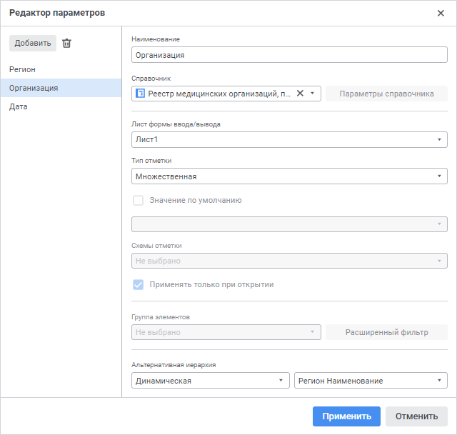
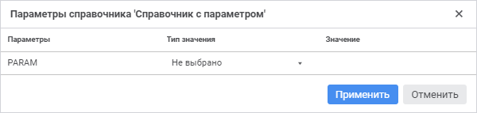
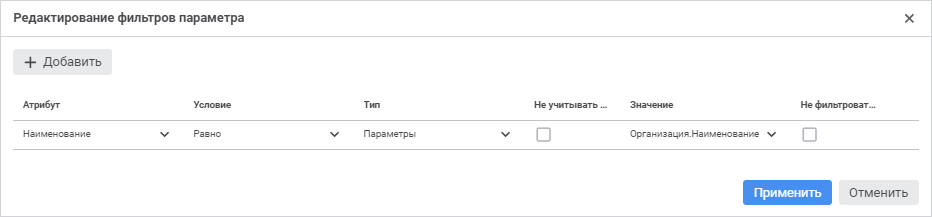
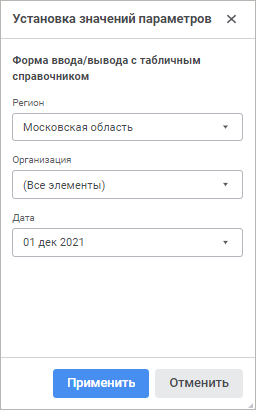

# Настройка параметров формы ввода

Настройка параметров формы ввода
-

# Настройка параметров формы ввода

Параметр предназначен для динамического управления данными, отображаемыми
 в форме ввода. Например, в качестве параметра реестровой формы ввода выбран
 список подразделений, при изменении отметки в параметре, в рабочей области
 формы ввода будут отображаться реестровые данные, соответствующие выбранному
 подразделению.

При добавлении параметра автоматически создаётся [элемент
 управления](Controls.htm) на листах, которые были выбраны при [определении
 свойств параметра](Parameters.htm#properties).

Для настройки параметров формы выполните шаги:

	- [Создайте](Parameters.htm#add) параметр.

	- [Задайте](Parameters.htm#properties) свойства параметра.

	- [Создайте связь](Parameters.htm#filter) с другим
	 параметром для управления доступными значениями параметра.

	- [Редактируйте](Parameters.htm#edit) параметр.

После завершения настройки параметров формы, если требуется, перейдите
 к шагу:

	- [Настройка
	 табличной области](../Table/AreaTable.htm);

	- [Настройка
	 редактора атрибута справочника](../Attribute/Attribute.htm);

	- [Настройка связей
	 между элементами формы](Links.htm);

	- [Настройка
	 оформления формы](../Common/Design.htm).

Для настройки параметров формы ввода/вывода нажмите кнопку  «Редактор
 параметров» вкладки «Главная»
 панели инструментов. Будет открыт диалог «Редактор
 параметров»:

Диалог состоит из списка параметров формы и панели настройки свойств.

[Создание
 параметра](javascript:TextPopup(this))

	Для создания параметра:

		- нажмите кнопку «Добавить»
		 в диалоге «Редактор параметров»;

		- нажмите кнопку  «Добавить
		 элемент управления» на панели «[Элементы управления](Controls.htm)». Будет открыт
		 диалог «Редактор параметров»
		 с новым автоматически созданным параметром.

[Определение
 свойств параметра](javascript:TextPopup(this))

	Задайте свойства параметра, используя панель свойств диалога «Редактор параметров»:

		- Наименование. Задайте
		 наименование параметра;

		- Справочник. Укажите
		 справочник, к которому будет привязан параметр.

Для быстрого выбора объекта в поле для поиска введите его название/идентификатор/ключ
 в зависимости от настроек отображения. Поиск будет выполняться автоматически
 по мере ввода текста. Список будет содержать объекты, наименования/идентификаторы/ключи
 которых содержат вводимый текст.

Для настройки отображения объектов репозитория в списке нажмите кнопку
 «Отображение объекта» и выберите
 в раскрывающемся меню вариант отображения:

		- Наименование. Объекты
		 отображаются под своими наименованиями. Вариант по умолчанию;

		- Идентификатор. Объекты
		 отображаются под своими идентификаторами;

		- Ключ. Объекты отображаются
		 под своими ключами.

Выбрать можно несколько вариантов. Идентификатор
 и ключ будут указаны в скобках;

		- Параметры справочника.
		 Задайте управление [параметрами](UiNavObj.chm::/reference_book/Master_RDS_reference_book/Parameters.htm)
		 справочника. Для этого нажмите кнопку «Параметры
		 справочника». Будет открыто окно «Параметры
		 справочника '<Наименование
		 справочника>'»:

	

	Примечание.
	 Кнопка «Параметры справочника»
	 доступна только для параметризованных справочников.

	Задайте настройки:

			- Параметры. Содержит
			 все параметры справочника. Столбец недоступен для редактирования;

			- Тип значения.
			 Выберите способ формирования значения параметра:

				- Не выбрано.
				 По умолчанию. Параметру не передаётся никакое значение;

				- Значение.
				 Параметру задаётся фиксированное значение;

				- Атрибут параметра.
				 Параметру передаётся значение атрибута параметра формы
				 ввода;

			- Значение. Задайте
			 значение параметра. Вид поля зависит от выбранного типа значения:

				- для типа «Значение».
				 Укажите в поле конкретное значение, соответствующее типу
				 атрибута справочника;

				- для типа «Атрибут
				 параметра». Выберите из раскрывающегося списка
				 атрибут доступного параметра формы;

	Примечание.
	 Поле «Значение» доступно только
	 для типов значения «Значение»
	 и «Атрибут параметра».

		- Листы формы ввода/вывода.
		 Выберите из раскрывающегося списка листы, на которых будет отображаться
		 параметр на панели «[Элементы
		 управления](../Work/UseControls.htm)». Если лист не установлен, то элемент управления
		 будет скрыт;

		- Тип отметки. Выберите
		 из раскрывающегося списка тип отметки элементов:

			- Единичная с обязательной
			 отметкой. По умолчанию;

			- Единичная с необязательной
			 отметкой;

			- Множественная;

		- Значение по умолчанию.
		 Задайте значение, которое будет отображаться до выбора элемента.
		 Для этого установите флажок и:

			- выберите элемент из раскрывающегося списка;

			- начните печатать название элемента в строке поиска;

			- используйте контекстное меню для [отметки
			 элементов](Controls.htm#selection) или [изменения
			 отметки](Controls.htm#editselection). Работа с отметкой и изменением отметки аналогична
			 работе с ними в элементах управления.

	 Если в качестве источника
	 альтернативной иерархии выбран параметр, то флажок неактивный;

		- [Схемы
		 отметки](UiNavObj.chm::/reference_book/look-and-feel_Reference_book/UiMd_reference_book_look-and-feel_Scheme.htm). Выберите схему отметки для
		 автоматизации выделения элементов по заданным правилам из раскрывающегося
		 списка. Для этого выберите схему в раскрывающемся списке. Если
		 у справочника отсутствуют схемы отметки или задана альтернативная
		 иерархия, выбор схемы отметки будет недоступен;

		- [Группа элементов](UiNavObj.chm::/reference_book/look-and-feel_Reference_book/UiMd_reference_book_look-and-feel_Group.htm).
		 Укажите группу элементов для ограничения списка доступных элементов.
		 Если у справочника отсутствуют группы элементов или задана альтернативная
		 иерархия, выбор группы элементов будет недоступен;

		- [Альтернативная
		 иерархия](UiNavObj.chm::/reference_book/look-and-feel_Reference_book/Use_AlterHier_ForRefBook.htm).
		 Выберите альтернативную иерархию для отображения элементов альтернативного
		 справочника, вместо элементов справочника, на котором построен
		 параметр, или настройте динамический выбор альтернативной иерархии
		 в зависимости от атрибута другого параметра. В зависимости от
		 типа альтернативной иерархии задайте:

	Примечание.
	 Задание альтернативной иерархии доступно, если у справочника не задана
	 схема отметки.

			- если выбран тип «Не
			 выбрано». Отображается основная иерархия. Указанный
			 тип используется по умолчанию.

			- если выбран тип «Фиксированная»,
			 то источником альтернативной иерархии является справочник.
			 Выберите доступный справочник в раскрывающемся списке или
			 нажмите кнопку поиска  и начните печатать
			 название справочника. Доступен выбор только одного справочника;

			- если выбран тип «Динамическая»,
			 то источником альтернативной иерархии является параметр. Выберите
			 атрибут параметра формы ввода в раскрывающемся списке или
			 нажмите кнопку поиска  и начните печатать
			 название параметра. При выборе данной настройки «Схема
			 отметки» и «Группа
			 элементов» недоступны.

	Если в справочнике был удален атрибут,
	 который был задан в качестве ключа альтернативной иерархии для параметра,
	 то значение параметра в [элементе управления](Controls.htm)
	 формы ввода станет пустым. Назначьте другой атрибут параметра в качестве
	 ключа альтернативной иерархии.

	Примечание.
	 Если не выбран справочник или атрибут параметра в качестве источника
	 альтернативной иерархии, то после нажатия кнопки «Применить»
	 будет применена основная иерархия.

[Ограничение
 доступных значений параметра с помощью фильтра](javascript:TextPopup(this))

	Для ограничения доступных значений параметра формы настройте связи
	 с другими параметрами формы с помощью расширенного фильтра.

	Для вызова диалога расширенного фильтра нажмите кнопку «Расширенный фильтр»:

	

	Настройка расширенного фильтра доступна при отсутствии настройки
	 группы элементов.

	Задайте расширенный фильтр:

	- Атрибут.
	 Выберите атрибут указанного справочника из раскрывающегося списка.
	 Для фильтрации элементов справочника по атрибутам [связанного
	 справочника](UiNavObj.chm::/reference_book/Master_RDS_reference_book/Link_Property.htm) выберите в списке доступных связанных
	 атрибутов атрибут справочника, выбранного при [создании
	 связи](UiNavObj.chm::/reference_book/Master_RDS_reference_book/Link.htm) с атрибутом указанного справочника. Связанные
	 атрибуты отображаются с первым уровнем вложенности и представляют
	 собой дерево из доступных связанных атрибутов;

Примечание.
 Если атрибут справочника содержит [множественные значения](UiNavObj.chm::/reference_book/Master_RDS_reference_book/Attributes/Attribute.htm),
 то при проверке условия фильтрации будут сравниваться все значения атрибута.
 Если хотя бы одно значение атрибута удовлетворяет условию, то элемент
 справочника будет автоматически удовлетворять условию.

	- Условие.
	 Задайте условие фильтрации. Возможные варианты: равно, не равно, больше,
	 меньше, больше или равно, меньше или равно, входит, не входит;

	- Тип.
	 Выберите тип фильтра. Возможные варианты: значение, атрибут;

	- Не
	 учитывать пустые. Пустые значения атрибута не будут учитываться,
	 если установить флажок. Доступно только для типа «Атрибут»;

	- Значение.
	 Зависит от выбранного атрибута и типа:

		- если выбран тип «Значение»,
		 то в поле указывается конкретное значение, соответствующее [типу данных](UiNavObj.chm::/reference_book/Master_RDS_reference_book/Attributes/Attribute.htm)
		 атрибута;

		- если выбран тип «Атрибут»,
		 то в поле выбирается атрибут из раскрывающегося списка, представляющего
		 собой дерево из доступных атрибутов;

		- если атрибут связанный и выбран тип «Значение»,
		 то в поле появляется всплывающее меню с доступными значениями связанного
		 справочника;

		- если атрибут связанный и выбран тип «Атрибут»,
		 то в поле появляется всплывающее меню, представляющее собой дерево
		 из доступных атрибутов [связанного
		 справочника](UiNavObj.chm::/reference_book/Master_RDS_reference_book/Link_Property.htm);

	- Не
	 фильтровать от пустых значений. Значения атрибута не будут
	 фильтроваться при пустом значении, если установить флажок.

	Завершите выбор, нажав кнопку «Применить».

[Редактирование
 параметра](javascript:TextPopup(this))

	Для редактирования параметра:

		- нажмите кнопку  «Редактор
		 параметров» вкладки «Главная»
		 панели инструментов;

		- выполните команду  «Редактировать» контекстного
		 меню элемента управления на панели «[Элементы
		 управления](../Work/UseControls.htm)».

	После выполнения одного из действий будет открыто окно «Редактор
	 параметров», в котором внесите требуемые изменения.

[Удаление
 параметра](javascript:TextPopup(this))

	Для удаления параметра:

		- нажмите кнопку  «Удалить»
		 диалога «Редактор параметров»;

		- выполните команду  «Удалить» контекстного меню элемента
		 управления на панели «[Элементы
		 управления](../Work/UseControls.htm)».

	Если параметр управляет другим параметром, то для удаления управляющего
	 параметра требуется убрать зависимость с управляемым параметром.

	Если атрибут параметра задан в качестве альтернативной иерархии
	 для другого параметра, то для удаления параметра, используемого для
	 альтернативной иерархии, необходимо изменить тип источника или источник
	 альтернативной иерархии или не использовать альтернативную иерархию.

## Открытие формы ввода с параметрами

При открытии формы ввода с параметрами отобразится диалог «Установка
 значений параметров»:

Вид полей для ввода параметров зависит от типа параметра. Если для параметра
 было указано значение по умолчанию, оно будет отображено в соответствующем
 поле.

Для остальных параметров необходимо ввести/выбрать (в зависимости от
 типа параметра) значения и нажать кнопку «Применить».

См. также:

[Построение
 формы ввода](../Starting/ConstructForm.htm) | [Настройка интерактивных
 элементов управления](Controls.htm) | [Работа с готовой
 формой ввода](../Work/FinishForm.htm)

		Справочная
		 система на версию 10.9
		 от 18/08/2025,
		 © ООО «ФОРСАЙТ»,
