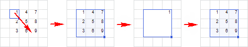
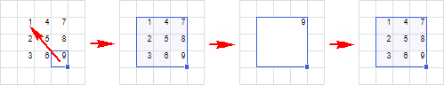

# Операции с ячейками

Операции с ячейками
-

# Операции с ячейками

При работе с листом доступны операции с ячейками:

	- добавление;

	- удаление;

	- объединение и разъединение;

	- [форматирование](../Common/Design.htm).

Добавление, удаление, объединение и разъединение ячеек внутри табличной
 области недоступно.

## Добавление ячеек

Для добавления ячейки в диапазон выполните команду «Вставить >
 Сдвинуть ячейки вниз» или «Вставить >
 Сдвинуть ячейки вправо» контекстного меню ячейки.

После выполнения данного действия на лист будет добавлена ячейка. При
 этом ячейки, расположенные ниже/правее сдвинутся вниз/вправо. Если был
 выделен диапазон ячеек, то будет добавлено столько же ячеек, сколько в
 выделенном диапазоне.

## Удаление ячеек

Для удаления выделенных ячеек из диапазона выполните команду «Удалить > Сдвинуть ячейки вверх»
 или «Удалить > Сдвинуть ячейки
 влево» контекстного меню ячейки.

После выполнения одного из действий выделенный диапазон ячеек будет
 удалён. При этом ячейки, расположенные ниже/правее диапазона сдвинутся
 вверх/влево.

## Объединение и разъединение ячеек

Несколько подряд выделенных ячеек можно объединить в одну. После объединения
 такая ячейка получает адрес ячейки, которая расположена в верхнем левом
 углу объединяемого диапазона.

Для объединения выделенного диапазона ячеек:

	- выполните команду 
	 «Объединить ячейки» контекстного
	 меню;

	- нажмите кнопку  «Объединить ячейки» вкладки «Оформление» [панели
	 ](../Common/Design.htm#cells_format)инструментов.

Для разъединения объединённых ячеек:

	- Отметьте ячейку.

	- Выполните одно из действий:

		- выполните команду 
		 «Разъединить ячейки» контекстного
		 меню ячейки;

		- нажмите кнопку 
		 «Разъединить ячейки» вкладки
		 «Оформление» [панели
		 ](../Common/Design.htm#cells_format)инструментов.

Объединённая ячейка будет содержать те данные, которые содержала первая
 ячейка выделяемого диапазона. После объединения данные остальных ячеек
 не пропадают, а просто скрываются. Таким образом, после разъединения данные
 всех ячеек диапазона будут восстановлены.

См. также:

[Работа
 с элементами листа](Sheets_elements.htm)

		Справочная
		 система на версию 10.9
		 от 18/08/2025,
		 © ООО «ФОРСАЙТ»,
