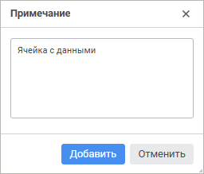

# Добавление примечания

Добавление примечания
-

# Добавление примечания

Для добавления пояснений, напоминаний, комментариев к ячейке листа используйте
 примечания.

Примечания могут быть многострочными. Ячейка, у которой есть примечание,
 отмечена красным треугольником в верхнем правом углу. Для просмотра примечания
 наведите указатель мыши на ячейку.

Для добавления примечания к выделенной ячейке выполните одно из действий:

	- выполните команду 
	 «Добавить примечание» в контекстном
	 меню ячейки;

	- нажмите сочетание клавиш SHIFT+F2.

В результате будет открыто окно для ввода текста примечания:

При работе с примечаниями доступны следующие операции:

[Редактирование
 примечания](javascript:TextPopup(this))

	Для редактирования примечания к выделенной ячейке:

		- выполните команду «Изменить
		 примечание» в контекстном меню ячейки;

		- нажмите сочетание клавиш SHIFT+F2.

	В результате будет открыто окно для редактирования текста примечания.

[Удаление примечания](javascript:TextPopup(this))

	Для удаления примечания к выделенной ячейке:

		- выполните команду «Удалить
		 примечание» в контекстном меню ячейки;

		- выполните команду «Очистить
		 примечания» в раскрывающемся меню кнопки  «Очистить»
		 вкладки «Данные» [панели
		 инструментов](Starting.htm#elements).

См. также:

[Работа
 с данными](Sheets_Data.htm)

		Справочная
		 система на версию 10.9
		 от 18/08/2025,
		 © ООО «ФОРСАЙТ»,
