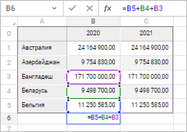
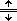

# Строка формул

Строка формул
-

# Строка формул

Строка формул представляет собой панель в верхней части окна формы ввода
 и располагается под лентой инструментов. Строка формул используется для
 ввода или изменения значений/формул в ячейках.

В строке отображается константа или формула, содержащаяся в активной
 ячейке:

Для задания или редактирования значения/[формулы](Sheets_Data.htm#formula)
 активной ячейки щёлкните по строке формул и определите новое значение/формулу.
 Ввод формулы начинается со знака равенства (=). При редактировании формулы
 адреса используемых ячеек выделяются разным цветом. Цвет адреса ячейки
 в строке формул соответствует цвету ячейки на [рабочей
 области](Starting.htm):

Для отмены изменений значения/формулы нажмите кнопку  «Отменить» или клавишу ESC.

Для сохранения изменений значения и расчёта формулы нажмите кнопку  «Принять» или клавишу ENTER.

Для вызова [мастера
 функций](UIReport.chm::/web/organizational_management/uireport_organizational_master_function.htm) нажмите кнопку  «Вставить функцию» или нажмите сочетание
 клавиш SHIFT+F3.

Для изменения размера строки формул наведите курсор мыши на нижнюю границу,
 при этом указатель сменит вид на .
 Зажмите кнопку мыши и растяните/сожмите строку до необходимого размера.
 Заданный размер строки формул сохраняется при сохранении формы ввода.
 Максимальная высота строки формул - 184px.

Для настройки отображения/скрытия строки формул установите/снимите отметку:

	- выполнив команду «Строка формул»
	 в раскрывающемся меню кнопки «Показать»
	 вкладки «Вид» панели инструментов;

	- выполнив команду «Вид >
	 Показать > Строка формул» главного меню.

По умолчанию отметка установлена и строка формул отображается.

См. также:

[Работа
 с данными](Sheets_Data.htm)

		Справочная
		 система на версию 10.9
		 от 18/08/2025,
		 © ООО «ФОРСАЙТ»,
