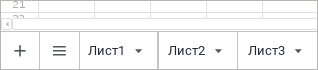

# Добавление нового листа и работа с ним

Добавление нового листа и работа с ним
-

# Добавление нового листа и работа
 с ним

При работе с формой ввода доступны различные операции с листами. Каждый
 лист имеет свою вкладку.

Для отображения вкладок листов:

	- выполните команду «Вкладки
	 листов отчёта» в раскрывающемся меню кнопки «Показать»
	 вкладки «Вид» панели инструментов;

	- выполните команду «Вид >
	 Показать > Вкладки листов отчёта» главного меню.

Если для получения формы ввода достаточно одного листа, то перейдите
 к шагу:

	- [Настройка параметров
	 формы](../Parameters/Parameters.htm);

	- [Настройка табличной области](../Table/AreaTable.htm);

	- [Настройка редактора атрибута
	 справочника](../Attribute/Attribute.htm).

Если нужно несколько листов, то добавьте лист.

Для работы с листами используйте вкладки листов:

[Переход по листам](javascript:TextPopup(this))

	Для перехода по листам:

		- выделите вкладку нужного листа;

		- выделите нужный лист в раскрывающемся списке кнопки  «Все листы».

[Работа
 с листами](javascript:TextPopup(this))

	При [работе с листами](Sheets_work.htm) возможны операции:

		- добавление листа;

		- удаление листа;

		- переименование листа;

		- копирование листа;

		- скрытие/отображение листа;

		- [защита листа](Defence.htm);

		- перемещение листа.

[Работа с элементами
 листов](javascript:TextPopup(this))

	При работе с [элементами листа](Sheets_elements.htm)
	 возможны операции:

		- [выделение](Sheets_elements.htm#element_selection);

		- [операции с ячейками](Cell.htm);

		- [операции со столбцами](Column.htm);

		- [операции со строками](Row.htm).

[Работа с данными
 на листе](javascript:TextPopup(this))

	При работе с[ данными на листах формы](Sheets_Data.htm)
	 доступны операции:

		- [ввод/редактирование
		 и сохранение данных](Sheets_Data.htm#entry_editing);

		- [копирование/вставка
		 данных](Sheets_Data.htm#copying_pasting);

		- [добавление примечания](Notice.htm);

		- [добавление именованного диапазона](named_ranges.htm);

		- [использование формул](Sheets_Data.htm#formula).

См. также:

[Построение
 формы ввода](ConstructForm.htm) | [Работа с готовой
 формой ввода](../Work/FinishForm.htm)

		Справочная
		 система на версию 10.9
		 от 18/08/2025,
		 © ООО «ФОРСАЙТ»,
