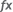

# Работа с данными

Работа с данными
-

# Работа с данными

Лист формы содержит ячейки, значения которых можно указать в явном виде,
 получить при настройке [атрибутной](../Attribute/Attribute.htm)
 или [табличной](../Work/DataEnter.htm) областей из источника,
 либо рассчитать по формуле.

С данными на листе отчёта доступны операции:

	- ввод данных и редактирование содержимого ячеек;

	- [автозаполнение
	 ячеек данными](UiNav.chm::/GUI/UiExpress_Tabl_Operation_AutoFillData.htm);

	- копирование и вставка данных;

	- удаление данных;

	- [добавление примечания](Notice.htm);

	- [добавление именованных диапазонов](named_ranges.htm);

	- использование формул.

## Ввод данных и редактирование содержимого
 ячеек

Для ввода или редактирования данных в ячейке выделите ячейку на листе
 отчета и введите необходимые данные.

После ввода данных для выхода из режима редактирования содержимого ячейки:

	- нажмите клавишу ENTER;

	- нажмите клавишу TAB;

	- нажмите клавишу перемещения курсора, при этом осуществится переход
	 на соседнюю ячейку в заданном направлении.

## Копирование и вставка данных

Копирование, перемещение и вставка данных из выделенной ячейки или области
 аналогичны [работе с данными через буфер
 обмена](../Work/CopyPaste.htm) для табличной области. Для корректировки вставляемых данных
 используйте [специальную вставку](Insert_spec.htm).

## Удаление данных

Для удаления содержимого ячейки или диапазона ячеек выделите требуемую
 ячейку или диапазон ячеек и нажмите клавишу DELETE.

При использовании [фильтрации](../Work/FilterSearch.htm)
 диапазона данных на листе формы ввода или табличной области удаление данных
 применяется только к видимым строкам/столбцам.

## Использование формул

Формулы представляют собой выражения, по которым выполняются преобразования
 одних данных в другие.

Формула начинается со знака равенства (=) и может включать в себя константы,
 операторы, ссылки на ячейки.

[Константы](javascript:TextPopup(this))

	Константа представляет собой готовое (невычисляемое) значение. Например,
	 константами являются: дата «10.10.2015», число «210» и текст «Прибыль
	 за квартал». Выражение, или его значение, константами не являются.

	Если в формуле не содержится ссылок на другие ячейки (например,
	 формула имеет вид =30+70+110), то значение в такой ячейке изменяется
	 только после изменения формулы вручную.

[Операторы](javascript:TextPopup(this))

	Операторами обозначаются операции, которые следует выполнить над
	 операндами формулы. Существует стандартный порядок выполнения вычислений,
	 однако его можно изменить с помощью скобок.

	При составлении формул можно использовать арифметические операторы
	 и операторы сравнения.

	Арифметические операторы используются для выполнения арифметических
	 операций, таких как сложение, вычитание, умножение. Операции выполняются
	 над числами. Используются арифметические операторы:

			 Знак операции
			 Описание

			 +
			 Сложение.

			 -
			 Вычитание.

			 *
			 Умножение.

			 /
			 Деление.

	Операторы сравнения используются для сравнения двух значений. Результатом
	 сравнения является логическое значение: True или False.

			 Знак операции
			 Описание

			 =
			 Равно.

			 <
			 Меньше.

			 >
			 Больше.

			 <=
			 Меньше или равно.

			 >=
			 Больше или равно.

			 <>
			 Больше или меньше (не равно).

[Ссылки на ячейки](javascript:TextPopup(this))

	Особенности использования в формуле ссылок на ячейки листов отчета:

		- Единичная ячейка.
		 Указывается адрес ячейки листа, например: B8;

		- Столбец. Для использования
		 в формуле всех ячеек одного столбца укажите через двоеточие его
		 наименование, например: B:B. Для использования в формуле всех
		 ячеек нескольких столбцов укажите через двоеточие их наименования,
		 например: A:C;

		- Строка. Для использования
		 в формуле всех ячеек одной строки укажите через двоеточие ее номер,
		 например: 5:5. Для использования в формуле всех ячеек нескольких
		 строк укажите через двоеточие их номера, например: 1:5;

		- Диапазон ячеек.
		 Для использования в формуле диапазона ячеек укажите через двоеточие
		 сначала адрес верхней левой ячейки, с которой начинается диапазон,
		 а затем адрес нижней правой ячейки, на которой заканчивается диапазон,
		 например:

	C7:D15

	Где:

			- C7.
			 Адрес верхней левой ячейки;

			- D15.
			 Адрес нижней правой ячейки;

		- Комбинированный диапазон
		 ячеек. Для описания области, состоящей из нескольких непересекающихся
		 диапазонов (включая единичные ячейки), укажите через точку с запятой
		 (;) адреса прямоугольных областей и отдельных ячеек. Например:

	C7:D15;A1:B4;B8

	Где:

		- C7:D15
		 и A1:B4. Диапазоны ячеек;

		- B8.
		 Единичная ячейка;

		- Ссылка на ячейки другого листа. Для использования в формуле
		 ячейки (диапазона ячеек) с другого листа укажите перед диапазоном
		 название листа в кавычках с восклицательным знаком.

	Ссылка на лист вставляется по алгоритму:

			- при переходе на другой лист в позицию курсора вставляется
			 наименование листа. Если был выделен терм, то наименование
			 листа вставляется на место выделенного терма. Выделение на
			 активном листе отсутствует;

			- производится выбор диапазона на листе - в позицию курсора
			 ввода вставляются ссылки на диапазон. Диапазон выделяется
			 пунктирной рамкой;

			- смена активного листа приводит к корректировке наименования
			 листа в полученном терме, ссылка на диапазон при этом не корректируется,
			 ей соответствует выделение на каждом активируемом листе. Изменение
			 границ выделенного диапазона на активном листе приводит к
			 корректировке ссылки на диапазон в полученном терме;

			- при смене активного листа курсор ввода остается в редакторе
			 ячейки либо в строке формул, в зависимости от того, где он
			 находился до этого;

			- если ввод формулы осуществляется с помощью редактора
			 ячейки, и при вводе формулы активирован другой лист либо вставлен
			 терм, то при переходе обратно на текущий лист редактор восстанавливается,
			 курсор ввода располагается после добавленного терма;

			- после окончания ввода формулы активным становится лист,
			 на котором осуществлялся ввод формулы.

	Редактирование формулы при активации
	 другого листа прекращается, если:

			- курсор ввода располагается после любого терма;

			- находится внутри терма;

			- выделено несколько символов, не являющихся термом: адрес
			 ячейки (A0) и наименование листа со знаком восклицания (“Лист1”!).

	При активации других листов во время
	 ввода формулы подсвечивается текущий лист. Ссылки на другие листы
	 в формуле и на листе не подсвечиваются цветом. Примеры ссылок:

	="Лист1"!A3

	Значение ячейки A3
	 с листа 1.

	=Sum("Лист2"!A:A)

	Сумма значений столбца A
	 c листа 2.

	=Sum("Лист3"!C31;A31;E31)

	Сумма комбинированного диапазона: значение
	 для ячейки С31 берется с листа
	 3, значения для ячеек A31
	 и E31 берутся с текущего листа.

	=Sum("Лист2"!B31:D31)

	Сумма диапазона значений с листа
	 2.

	Выбранная ячейка или диапазон будет подсвечена
	 пунктирной цветной рамкой. При вводе операторов, либо знаков, разделяющих
	 параметры функции, ячейка «фиксируется» и будет подсвечена сплошной
	 цветной рамкой, следующий щелчок приведет к указанию адреса еще одной
	 ячейки. Подсвеченные ячейки или диапазон можно с помощью мыши перемещать,
	 увеличивать и уменьшать, при этом адрес в формуле будет автоматически
	 изменен. Для увеличения/уменьшения диапазона наведите курсор на угол
	 ячейки и, после того как он примет вид двунаправленной стрелки, осуществите
	 перемещение границы диапазона в нужную сторону.

	Вводимый/редактируемый адрес ячейки
	 (диапазона) и границы соответствующей ячейки (диапазона) будут обозначаться
	 одним цветом.

[Стили ссылок
 A1 и R1C1](javascript:TextPopup(this))

	При создании ссылок в регламентных отчетах доступно использование
	 двух стилей ссылок:

		- А1. При использовании
		 стиля A1 столбцы обозначаются буквами, а строки - цифрами;

		- R1C1. При использовании
		 стиля R1C1 строки (row) и столбцы (column) обозначаются цифрами
		 и ссылки на ячейки в формулах задаются при помощи смещения от
		 текущей ячейки. Например, ссылка R[-1]C[2] ссылается на ячейку,
		 которая находится на одну строку выше и на два столбца правее
		 текущей ячейки.

	В формулах можно использовать смешанные стили, это не влияет на
	 результат расчета.

	Пример:

	=$A$0+R[0]C[-1]

	При копировании данной ссылки к значению ячейки А0 будет прибавляться
	 значение ячейки, расположенной в той строке, куда скопирована ссылка,
	 и столбце, расположенном слева от ячейки, в которую скопирована ссылка.

	Примечание.
	 Ссылки на строки/столбцы всегда формируются в стиле A1. При экспорте
	 ссылки, представленные в формате R1C1, будут преобразованы в формат
	 A1.

[Абсолютные и
 относительные ссылки](javascript:TextPopup(this))

	При создании формул можно использовать виды ссылки:

		- относительная ссылка
		 в формуле, например A1, основывается на позиции ячейки, содержащей
		 формулу, и ячейки, на которую указывает ссылка. При изменении
		 позиции ячейки, содержащей формулу, изменяется и ссылка. При копировании
		 или заполнении формулы вдоль строк и вдоль столбцов ссылка автоматически
		 корректируется;

		- абсолютная ссылка
		 ячейки в формуле, например, $A$1, всегда ссылается на ячейку,
		 расположенную в определенном месте. При изменении позиции ячейки,
		 содержащей формулу, абсолютная ссылка не изменяется. При копировании
		 или заполнении формулы вдоль строк и вдоль столбцов абсолютная
		 ссылка не корректируется;

		- смешанная ссылка
		 содержит либо абсолютный столбец и относительную строку, либо
		 абсолютную строку и относительный столбец. При изменении позиции
		 ячейки, содержащей формулу, относительная ссылка изменяется, а
		 абсолютная ссылка не изменяется. При копировании или заполнении
		 формулы вдоль строк и вдоль столбцов относительная ссылка автоматически
		 корректируется, а абсолютная ссылка не корректируется.

	В зависимости от используемого стиля ссылок различается способ указания
	 абсолютных и относительных ссылок:

		- стиль А1. При использовании
		 стиля А1 для указания абсолютных ссылок используется специальный
		 символ «$». Для фиксации ссылки в ячейке или строке формул:

			- введите символ «$» перед той частью ссылки, которую
			 необходимо зафиксировать;

			- нажмите клавишу F4: при однократном нажатии будет зафиксирована
			 ячейка, при повторном нажатии будет зафиксирована строка,
			 при тройном нажатии будет зафиксирован столбец, при четверном
			 нажатии ссылка станет снова относительной. Фиксируется ячейка,
			 рядом с которой находится курсор, выделите всю формулу для
			 фиксации всех ссылок в ней.

	=$A1

	При копировании данной ссылки столбец
	 «A» всегда будет зафиксирован. Относительная часть ссылки, т.е. номер
	 строки, будет меняться, в соответствии с той строкой, в которую будет
	 скопирована ссылка (=$A2, =$A3 и т.д);

		- стиль R1C1. При
		 использовании стиля R1C1 для указания абсолютных ссылок необходимо
		 указать номер строки/столбца после букв «R» или «C». Относительные
		 номера строк/столбцов указываются в квадратных скобках и соответствуют
		 смещению относительно текущей ячейки. Для фиксации ссылки в ячейке
		 или строке формул:

			- укажите номера строк/столбцов
			 в квадратных скобках;

			- нажмите клавишу F4: при
			 однократном нажатии будет зафиксирована ячейка, при повторном
			 нажатии будет зафиксирована строка, при тройном нажатии будет
			 зафиксирован столбец, при четверном нажатии ссылка станет
			 снова относительной. Фиксируется ячейка, рядом с которой находится
			 курсор, выделите всю формулу для фиксации всех ссылок в ней.

	При копировании относительный номер не
	 изменяется, но фактически он будет соответствовать уже другой строке/столбцу.

	=R[-3]C0

	При копировании данная ссылка будет иметь
	 такой же вид, но при вычислении ссылка будет соответствовать ячейке,
	 расположенной в первом столбце на три строки выше ячейки с формулой.

#### Особенности использования ссылок

		- Абсолютная ссылка =$A$0, составленная с использованием стиля
		 А1, аналогична ссылке =R0C0, составленной с использованием стиля
		 R1C1.

		- Ссылка =RC1, составленная с использованием стиля R1C1, аналогична
		 ссылке на ячейку, расположенной в столбце RC и первой строке,
		 составленной с использованием стиля А1.

### Операции с формулами

При работе с формулами возможны операции:

[Создание формулы](javascript:TextPopup(this))

	Формула может быть создана несколькими способами:

		- непосредственно в ячейке.
		 Для этого в редактируемой ячейке выполните действия:

			- Введите знак равенства. Если данный знак уже есть в
			 ячейке, пропустите данный шаг.

			- Сформируйте формулу, используя числа, операторы, ссылки
			 на ячейки и функции.

			- Для сохранения и расчета формулы нажмите клавишу ENTER;

		- в
		 [строке формул](Organizational_FormulaLine.htm);

		- при
		 помощи [мастера функций](uireport.chm::/web/organizational_management/uireport_organizational_master_function.htm).
		 Для этого нажмите кнопку 
		 «Вставить функцию», расположенную
		 в строке формул, или нажмите сочетание клавиш SHIFT+F3;

		- с
		 помощью копирования ячейки с уже созданной формулой. Для
		 этого выполните действия:

			- Скопируйте ячейку с формулой.

			- Активируйте возможность  
			 «[Специальная вставка](Insert_spec.htm)». Поставьте
			 флажок «Формулы ячеек».

			- Нажмите кнопку «OK».

	Для отмены ввода формулы нажмите клавишу ESC.

[Редактирование
 формулы](javascript:TextPopup(this))

	Формула может быть отредактирована:

		- непосредственно в ячейке.
		 Для этого в редактируемой ячейке:

			- Отредактируйте формулу, используя числа, операторы,
			 ссылки на ячейки и функции.

			- Для сохранения и расчета формулы нажмите клавишу ENTER.

		- в [строке
		 формул](Organizational_FormulaLine.htm);

		- при помощи [мастера функций](uireport.chm::/web/organizational_management/uireport_organizational_master_function.htm).
		 Для этого нажмите кнопку 
		 «Вставить функцию», расположенную
		 в строке формул, или нажмите сочетание клавиш SHIFT+F3.

	Для отмены ввода формулы нажмите клавишу ESC.

[Просмотр промежуточного
 значения формулы](javascript:TextPopup(this))

	Для просмотра промежуточного значения формулы:

		- Выделите ячейку с формулой.

		- В строке формул выделите часть, для которой необходимо посмотреть
		 промежуточный результат.

		- Нажмите клавишу F9. Вместо выделенной части формулы будет
		 отображен промежуточный результат.

		- Сохраните:

			- промежуточный
			 результат в формуле. Нажмите клавишу ENTER, промежуточный
			 результат заменит выделенную часть формулы;

			- формулу.
			 Нажмите клавишу ESC, выделенная часть формулы будет возвращена
			 обратно.

См. также:

[Добавление
 нового листа и работа с ним](Sheets.htm)

		Справочная
		 система на версию 10.9
		 от 18/08/2025,
		 © ООО «ФОРСАЙТ»,
