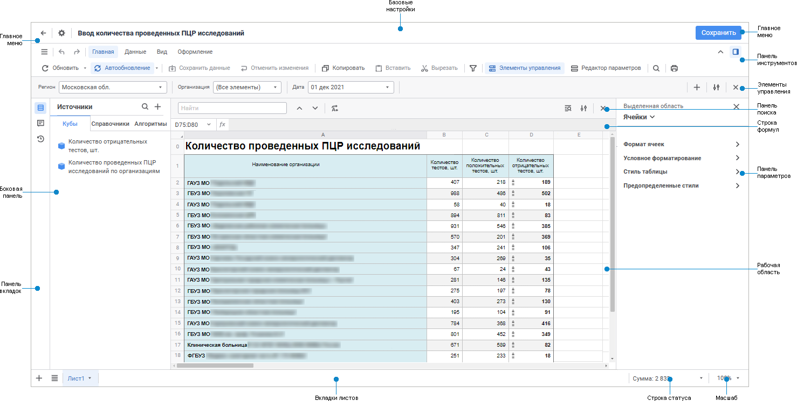

# Начало работы с расширением «Интерактивные формы ввода данных» в веб-приложении

Начало работы с расширением «Интерактивные формы ввода данных» в веб-приложении
-

# Начало работы с расширением «Интерактивные
 формы ввода данных» в веб-приложении

Для начала работы с расширением создайте новую или откройте готовую
 форму ввода.

[Создание
 новой формы ввода](javascript:TextPopup(this))

	Для создания новой формы ввода в [навигаторе
	 объектов](GetStarted.chm::/Interface/interface_navigator.htm):

		- нажмите кнопку  «Создать»
		 в главном меню и выберите тип объекта на боковой панели «[Новый объект](UiNav.chm::/02_Navigator/General_Principles_of_Work.htm#add_object)»;

		- выполните команду «Создать»
		 в контекстном меню списка объектов. Будет открыта боковая панель
		 «[Новый объект](UiNav.chm::/02_Navigator/General_Principles_of_Work.htm#add_object)»,
		 на которой выберите тип объекта.

[Открытие
 готовой формы ввода](javascript:TextPopup(this))

	Для открытия готовой формы ввода на редактирование в [навигаторе
	 объектов](GetStarted.chm::/Interface/Interface_Navigator.htm) выделите форму ввода и выполните одно
	 из действий:

		- выполните команду «Редактировать»
		 в контекстном меню формы ввода;

		- выполните команду «Редактировать
		 в новой вкладке» в контекстном меню формы ввода;

		- выполните команду «Редактировать
		 в новом окне» в контекстном меню формы ввода;

		- нажмите клавишу F4.

	Для открытия формы ввода на просмотр в [навигаторе
	 объектов](GetStarted.chm::/Interface/Interface_Navigator.htm) выделите форму ввода и выполните одно
	 из действий:

		- выполните команду «Открыть»
		 в контекстном меню формы ввода;

		- выполните команду «Открыть
		 в новой вкладке» в контекстном меню формы ввода;

		- выполните команду «Открыть
		 в новом окне» в контекстном меню формы ввода;

		- дважды щёлкните по форме ввода;

		- нажмите клавишу ENTER.

	Примечание.
	 Если в форме ввода содержатся [параметры](../Parameters/Parameters.htm),
	 то при открытии формы ввода задайте их значения.

Для построения формы смотрите статью
 «[Построение
 формы ввода](ConstructForm.htm)».

Для работы с готовой формой смотрите
 статью «[Работа
 с готовой формой ввода](../Work/FinishForm.htm)».

Пользовательский интерфейс формы ввода:

[Форма ввода
 в режиме просмотра](javascript:TextPopup(this))

	

[Элементы
 пользовательского интерфейса формы ввода](javascript:TextPopup(this))

		- Базовые настройки.
		 Предназначены для переименования и определения [общих
		 настроек](Starting.htm#main_parameters) формы ввода при редактировании.

		- Главное меню. Содержит
		 список команд, предназначенных для выполнения различных операций
		 над формой и кнопку для возвращения в навигатор. Также при редактировании
		 доступно сохранение формы ввода.

		- Панель инструментов.
		 Содержит вкладки с кнопками для [построения](ConstructForm.htm)
		 формы при редактировании и для работы с данными при просмотре.

		- Панель вкладок.
		 Содержит кнопки для выбора группы настроек, отображаемых на боковой
		 панели, при редактировании.

		- Боковая панель.
		 Предназначена для [выбора источников](../Table/Data_Sources.htm)
		 данных табличной области при редактировании.

		- Панель параметров.
		 Предназначена для настройки [форматирования
		 ячеек](../Common/Design.htm#format) и областей формы ввода при редактировании.

		- Элементы управления.
		 Предназначена для отображения [элементов
		 управления](../Parameters/Controls.htm), с помощью которых будет осуществляться оперирование
		 данными при [работе с готовой
		 формой](../Work/FinishForm.htm). Панель доступна, если нажата кнопка  «Элементы
		 управления» вкладки «Главная»
		 на панели инструментов.

		- Панель поиска. Предназначения
		 для [поиска и замены данных](../Work/Find_and_Replace.htm).
		 Панель доступна, если нажата кнопка  «Поиск и замена» вкладки «Главная» на панели инструментов.

		- Строка формул. Предназначена
		 для [ввода данных и формул](Organizational_FormulaLine.htm)
		 в ячейки таблицы, отображения адресов выделенных ячеек и [формул
		 алгоритмов](../Table/Calculation_Practices.htm), если значения ячеек по ним рассчитывается.

		- Рабочая область.
		 Предназначена для построения формы при редактировании и для ввода
		 данных при просмотре.

		- Вкладки листов.
		 Предназначены для работы с [листами формы](Sheets.htm)
		 при редактировании и для переключения между ними при просмотре.

		- Строка статуса.
		 Предназначена для отображения результатов расчёта [базовых
		 агрегатов](../Work/status_string.htm) выделенного диапазона ячеек таблицы.

		- Масштаб. Предназначен
		 для настройки [масштаба отображения
		 листа](../Work/View.htm#view) на рабочей области.

## Настройка расширения «Интерактивные формы
 ввода данных»

Для настройки расширения «Интерактивные
 формы ввода данных» используйте диалог «Настройки».

Примечание.
 Диалог «Настройки»
 доступен только при редактировании формы.

[Для открытия
 диалога «Настройки»](javascript:TextPopup(this))

	В главном меню:

		- нажмите кнопку  «Настройки» главного меню;

		- выполните команду «Общие >
		 Настройки» главного меню.

Доступные настройки:

[Общие](javascript:TextPopup(this))

	Вкладка «Общие» содержит
	 настройки:

		- Обновлять при открытии
		 на редактирование. Установите флажок для автоматического
		 обновления формы ввода при её открытии на редактирование. По умолчанию
		 флажок снят. При установке флажка при открытии формы ввода на
		 редактирование данные берутся из источников, применяется заданное
		 оформление, рассчитываются подключенные алгоритмы.
		 Данная настройка не влияет на настройки [автоматического
		 обновления](../Common/Refresh.htm#automatic) при просмотре формы ввода;

	- Объединять запросы при вычислении.
	 Установите флажок для:

		- ускорения работы формы ввода при отображении нескольких
		 атрибутов из одного справочника на листе формы или при выводе
		 показателей одного источника, если между ними расположен показатель
		 из другого источника;

		- расчёта алгоритма для показателей, добавленных в шапку несколько
		 раз;

		- запуска частичного перерасчёта данных в табличных областях.
		 Перерасчёт происходит, если изменяемые данные являются входными
		 данными для другой табличной области, значения которой рассчитываются
		 с помощью алгоритма, выполняемого при изменении.

Примечание.
 Работа с алгоритмом расчёта доступна только при наличии установленного
 расширения «[Алгоритмы расчёта](CalculationAlgorithm.chm::/Purpose.htm)».

Особенности объединения запросов:

		- если флажок снят, то перерасчёт данных выполняется только
		 в одной табличной области на текущем листе формы ввода. В других
		 табличных областях перерасчёт не выполняется;

		- если флажок установлен и в форме ввода есть несколько табличных
		 областей, построенных на одном источнике, то при использовании
		 алгоритмов расчёта может произойти перерасчёт данных ячеек даже
		 в тех табличных областях, для которых алгоритм расчёта не подключён.
		 Во избежание этого снимите флажок, либо используйте [представление-куб](UiNavObj.chm::/Cube/CreateCube/Master_Conception/UiMd_Cube_CreateCube_Master_Conception.htm)
		 в качестве источника для таких табличных областей;

		- если флажок установлен и в форме ввода есть табличная область,
		 построенная на [кубе](uinavobj.chm::/Cube/CreateCube/UiMd_Cube_CreateCube.htm)
		 с вычисляемыми элементами, то данные куба будут недоступны для
		 вычисления. Вычисление элементов может быть настроено:

			- в [стандартном
			 кубе](uinavobj.chm::/Cube/CreateCube/Master_Standart/UiMd_Cube_CreateCube_Master_Standart.htm) на страницах «Привязка
			 фактов куба», «Отношения»,
			 «Вычисляемые факты»,
			 «Управление параметрами»,
			 «Управляющие измерения»,
			 «Агрегация данных»;

			- в [представлении-кубе](uinavobj.chm::/Cube/CreateCube/Master_Conception/UiMd_Cube_CreateCube_Master_Conception.htm)
			 на страницах «Фиксация измерений»,
			 «Управление параметрами»,
			 «Управляющие измерения»;

			- в [виртуальном
			 кубе](uinavobj.chm::/Cube/CreateCube/Master_Virtual_Cube/UiMd_Cube_CreateCube_Master_Virtual.htm) на страницах «Управление
			 параметрами», «Управляющие
			 измерения»;

			- в [вычисляемом
			 кубе](uinavobj.chm::/Cube/CreateCube/Master_Calculation/UiMd_Cube_CreateCube_Master_Calculation.htm) на страницах «Управление
			 формулами», «Управление
			 параметрами», «Управляющие
			 измерения», «Редактор
			 формул»;

			- в [автоматическом
			 кубе](uinavobj.chm::/Cube/CreateCube/Master_Auto/UiMd_Cube_CreateCube_Master_Auto.htm) на страницах «Управляющие
			 измерения», «Агрегация
			 данных», «Управление
			 параметрами», «Фиксация
			 измерений».

Для вычисления данных куба используйте алгоритмы
 расчёта;

		- при вычислении перед объединением запросов можно задать
		 пользовательское событие с помощью метода [IPrxReportUserEvents.EventOnBeforeExecuteCombined](KeReport.chm::/Interface/IPrxReportUserEvents/IPrxReportUserEvents.EventOnBeforeExecuteCombined.htm)
		 в среде разработки;

		- объединение запросов недоступно при работе с [глобальным кешем](UiNav.chm::/02_Navigator/Cache_In_Blob.htm).

После установки флажка для применения настройки
 необходимо сохранить и переоткрыть форму. По умолчанию флажок установлен.

		- Загрузка только активного
		 листа. Установите флажок для загрузки данных только активного
		 листа формы, данные неактивных листов будут загружены при обращении
		 к ним. По умолчанию флажок установлен.

См. также:

[Построение
 форм ввода, контроля и согласования данных](../../DataEntryForms_Purpose.htm) | [Построение
 формы ввода](ConstructForm.htm) | [Работа с готовой
 формой ввода](../Work/FinishForm.htm)

		Справочная
		 система на версию 10.9
		 от 18/08/2025,
		 © ООО «ФОРСАЙТ»,
