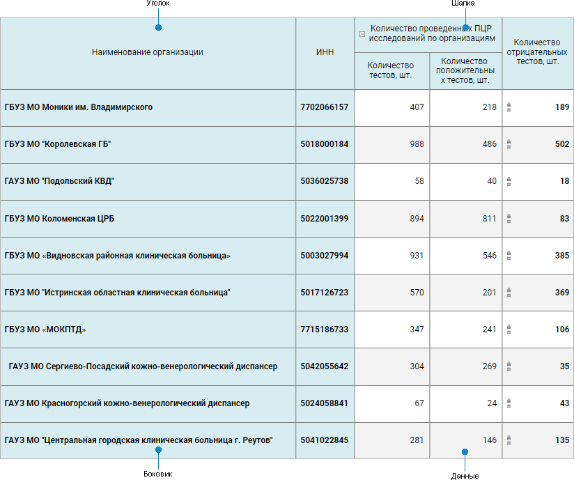

# Настройка табличной области

Настройка табличной области
-

# Настройка табличной области

Табличная область предназначена для создания табличных, реестровых и
 комбинированных форм ввода.

[Создание новой
 табличной области](javascript:TextPopup(this))

	Для создания новой табличной области нажмите кнопку  «Добавить
	 табличную область» вкладки «Данные»
	 панели инструментов.

[Редактирование
 готовой табличной области](javascript:TextPopup(this))

	Для редактирования готовой табличной области выделите ячейку, принадлежащую
	 табличной области и нажмите кнопку  «Редактировать» вкладки «Данные» панели инструментов.

Табличная область состоит из элементов:

Создание и редактирование выполняется с помощью редактора табличной
 области, в котором настраивается структура табличной области.

Структура табличной области формы ввода строится на показателях и измерениях.

Показатели - это многомерные
 наборы данных, объединенные общими аналитическими признаками, служащие
 для сбора, хранения и отображения информации, объединенной единой тематикой.
 В качестве показателя может быть выбран любой из доступных типов кубов
 или база данных временных рядов.

Измерения - справочники
 репозитория, из которых состоит многомерная структура показателя.

Примечание.
 Если в качестве измерения используется [параметризованный](UiNavObj.chm::/reference_book/Master_RDS_reference_book/Parameters.htm)
 справочник со связанными атрибутами, то в табличной области учитываются
 настройки параметров в [связи](UiNavObj.chm::/reference_book/Master_RDS_reference_book/Link.htm).

Все измерения разделяются на группы:

	- общие
	 измерения - это измерения, которые присутствуют во всех
	 добавленных в табличную область показателях;

	- частные
	 измерения - это измерения, которые не присутствуют хотя
	 бы в одном из добавленных показателей.

С помощью измерений и показателей формируются боковик, шапка и область
 данных табличной области, настройка которых выполняется также с помощью
 редактора табличной области.

## Настройка табличной области

Настройка табличной области состоит из этапов:

	- [Добавление источников](Data_Sources.htm).

	- [Настройка базовых свойств](basic_properties.htm).

	- [Задание структуры табличной
	 области](Table_Area_Structure.htm).

	- [Настройка алгоритмов расчёта](Calculation_Practices.htm).

	- [Управление параметрами](parameter_management.htm).

### Первичная настройка табличной области

Если при создании табличной области нет возможности выполнить её полную
 настройку, то для сохранения уже введенных настроек выполните первичную
 настройку табличной области. Для этого:

	- Убедитесь, что:

		- для реестровой формы: добавлено хотя бы одно измерение в
		 область «Боковик» и это
		 же измерение в область «Показатель»;

		- для табличной или комбинированной формы: добавлены хотя
		 бы один показатель в шапку и одно измерение в боковик и ограничено
		 количество выводимых элементов в шапку.

	- Нажмите кнопку «Добавить»
	 для построения табличной области на листе.

Последующая настройка табличной области проводится при её редактировании.

После завершения настройки табличной области, если требуется, перейдите
 к шагу:

	- [Настройка
	 редактора атрибута справочника](../Attribute/Attribute.htm);

	- [Настройка
	 параметров формы](../Parameters/Parameters.htm);

	- [Настройка
	 обработки событий формы](../Parameters/Links.htm);

	- [Прикрепление
	 вложений к ячейкам](../Parameters/Attachments.htm);

	- [Настройка
	 оформления формы](../Common/Design.htm).

Для удаления табличной области выделите любую ячейку табличной области
 и нажмите кнопку  «Удалить»
 вкладки «Главная» панели инструментов.

## Настройка содержимого уголка табличной области

По умолчанию уголок табличной области не содержит заголовка. Для отображения
 заголовка используйте контекстное меню уголка или настройку оформления
 [содержимого ячеек](../Common/Format.htm#corner_contents):

	- Не показывать наименование.
	 Ничего не отображается;

	- Произвольный текст.
	 Отображается введённый пользователем текст. Применяется ко всему уголку;

	- Наименование из шапки/боковика.
	 Выберите вид заголовка:

		- Измерение. Отображается
		 наименование измерения;

		- Атрибут. Отображается
		 наименование атрибута измерения;

		- Измерение.Атрибут.
		 Отображается наименование измерения и атрибута;

		- Пользовательское наименование.
		 Отображается отредактированное пользователем наименование.
		 При включении пользовательского наименования хотя бы для одной
		 строки или столбца в уголке, все ячейки уголка становятся редактируемыми.
		 Настраивается для каждого столбца/строки уголка. При переключении
		 вида заголовка на отображение наименования атрибута/измерения
		 пользовательское наименование сбрасывается.

См. также:

[Построение
 формы ввода](../Starting/ConstructForm.htm) | [Работа с готовой
 формой ввода](../Work/FinishForm.htm)

		Справочная
		 система на версию 10.9
		 от 18/08/2025,
		 © ООО «ФОРСАЙТ»,
