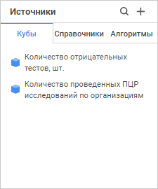
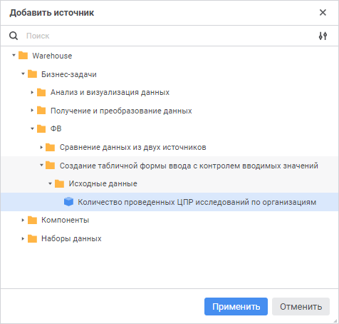

# Добавление источников

Добавление источников
-

# Добавление источников

Для управления источниками данных формы ввода используйте боковую панель
 «Источники».

[Для открытия
 панели](javascript:TextPopup(this))

	Нажмите кнопку  «Источники» на панели вкладок.

	Примечание.
	 Кнопка  «Источники» на панели вкладок
	 доступна только при создании или редактировании формы ввода.

Панель состоит из вкладок: «Кубы»,
 «Справочники», «Алгоритмы».
 На вкладках отображаются выбранные источники.

Для добавления источников данных:

	- Нажмите кнопку  «Добавить источник» в верхней или
	 центральной части панели «Источники».

Примечание.
 Кнопка  «Добавить
 источник» в центральной части панели «Источники»
 доступна, если ещё не добавлен ни один источник.

Откроется окно «Добавить
 источник»:

	- Для быстрого выбора объекта в поле для поиска введите его название/идентификатор/ключ
	 в зависимости от настроек отображения. Поиск будет выполняться автоматически
	 по мере ввода текста. Список будет содержать объекты, наименования/идентификаторы/ключи
	 которых содержат вводимый текст.

Для настройки отображения объектов репозитория
 в списке нажмите кнопку  «Отображение
 объекта» и выберите в раскрывающемся меню вариант отображения:

		- Наименование. Объекты
		 отображаются под своими наименованиями. Вариант по умолчанию;

		- Идентификатор. Объекты
		 отображаются под своими идентификаторами;

		- Ключ. Объекты отображаются
		 под своими ключами.

Выбрать можно несколько вариантов. Идентификатор
 и ключ будут указаны в скобках.

	- Выберите необходимый объект репозитория в дереве объектов репозитория
	 или введите наименование в строке поиска. Добавлять можно несколько
	 источников одновременно. Перечень объектов репозитория доступных для
	 выбора в окне «Добавить источник»
	 зависит от выбранной вкладки «Кубы»,
	 «Справочники» или «Алгоритмы»
	 панели «Источники».
	Если в табличной области предполагается использование справочников,
	 которые не являются измерениями кубов используемых в качестве источников
	 формы ввода, то их необходимо добавить в источники первыми, до добавления
	 кубов.

Примечание.
 Справочники, являющиеся измерениями куба, добавленного в форму ввода в
 качестве источника можно не добавлять на вкладку «Справочники»,
 так как они добавятся автоматически после добавления куба в область «Показатели» в [редакторе
 табличной области](Table_Area_Structure.htm).

	- Нажмите кнопку «Применить».

Выбранные источники будут расположены на вкладках панели «Источники»
 в зависимости от типа объекта.

На боковой панели «Источники»
 отображаются источники данных всех добавленных табличных областей формы
 ввода.

Для быстрого поиска нужного источника по названию из списка выбранных
 источников воспользуйтесь поиском:

	- Нажмите кнопку  «Поиск»
	 на боковой панели «Источники».

	- Введите искомый текст в поле для поиска. Поиск будет выполняться
	 автоматически по мере ввода искомого текста. В списке будут только
	 те источники, наименования которых содержат вводимый текст.

Для сброса результатов поиска нажмите кнопку
 
 «Очистить».

Для скрытия боковой панели «Источники»
 нажмите кнопку  «Источники» на панели вкладок.

Далее перейдите к [настройке базовых свойств](basic_properties.htm)
 табличной области.

См. также:

[Настройка
 табличной области](AreaTable.htm)

		Справочная
		 система на версию 10.9
		 от 18/08/2025,
		 © ООО «ФОРСАЙТ»,
