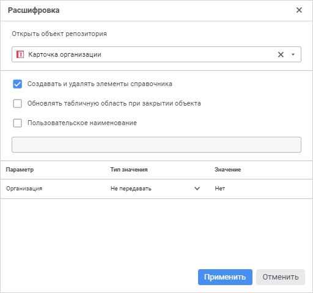
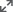
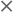

# Расшифровка измерений

Расшифровка измерений
-

# Расшифровка измерений

Для настройки перехода от элемента измерения к объекту, детализирующему
 его значение, используйте команду «Расшифровка»
 в контекстном меню измерения. Например, при щелчке по элементу измерения,
 как по гиперссылке, в реестровой форме ввода может осуществляться переход
 в другую форму ввода в виде карточки, в которой детализирована информация
 по выбранному элементу.

Примечание.
 Убедитесь, что для многолистовых форм ввода, используемых для расшифровки,
 установлен флажок «[Загрузка
 только активного листа](../Starting/Starting.htm#multiexecutor)» для ускорения открытия формы.

Задайте расшифровку измерений для:

	- Измерений боковика.
	 Для этого выполните команду «Расшифровка»
	 в контекстном меню измерения в редакторе табличной области;

	- Общих измерений шапки.
	 Для этого выполните команду «Расшифровка»
	 в контекстном меню общего измерения в редакторе табличной области.

После выполнения команды «Расшифровка»
 откроется диалог:

Настройте свойства:

	- Открыть объект репозитория.
	 Выберите объект репозитория из раскрывающегося списка, к которому
	 будет осуществляться переход по гиперссылке. Список отображается в
	 виде дерева со всеми объектами репозитория, которые доступны для выбора:
	 справочники НСИ, регламентные отчёты, формы ввода. Выбрать можно только
	 один объект.

Для быстрого выбора объекта в поле для поиска введите его название/идентификатор/ключ
 в зависимости от настроек отображения. Поиск будет выполняться автоматически
 по мере ввода текста. Список будет содержать объекты, наименования/идентификаторы/ключи
 которых содержат вводимый текст.

Для настройки отображения объектов репозитория в списке нажмите кнопку
 «Отображение объекта» и выберите
 в раскрывающемся меню вариант отображения:

		- Наименование. Объекты
		 отображаются под своими наименованиями. Вариант по умолчанию;

		- Идентификатор. Объекты
		 отображаются под своими идентификаторами;

		- Ключ. Объекты отображаются
		 под своими ключами.

Выбрать можно несколько вариантов. Идентификатор
 и ключ будут указаны в скобках;

	- Создавать
	 и удалять элементы справочника. Для активации кнопок  «Добавить
	 элемент» и  «Удалить
	 элемент», доступных:

		- на вкладке «Данные»
		 панели инструментов;

		- в раскрывающемся меню команды «Таблица»
		 главного меню;

		- в контекстном меню элементов табличной области;

установите флажок «Создавать
 и удалять элементы справочника». Используйте кнопки для [добавления/удаления
 элементов](../Work/New_entries.htm) в табличной области, содержащей измерения с расшифровкой.
 Элемент будет добавлен в корень справочника;

Примечание.
 При добавлении/удалении элементов с помощью кнопок  «Добавить
 элемент» и  «Удалить
 элемент» происходит автоматическое обновление табличной области.

	- Обновлять табличную область
	 при закрытии объекта. Для обновления табличной области после
	 закрытия объекта, в котором производилось добавление или удаление
	 элементов измерения, независимо от того, были ли изменения в объекте,
	 установите флажок «Обновлять табличную
	 область при закрытии объекта». Если флажок снят, то табличная
	 область будет обновляться только если в объекте были сохранены данные.
	 Флажок становится доступным после установки флажка «Создавать
	 и удалять элементы справочника».

Свойство «Обновлять
 табличную область при закрытии объекта» выполняется при нажатии
 кнопки   «Сохранить
 данные» главного меню. Если в форме ввода для сохранения измененных
 данных используется [пользовательская
 кнопка](../Custom_module/Advanced.htm), то добавьте соответствующий признак в js-функции постобработчика:

function cbAfterSaveData(callback,
 args)

{

args.DataEntryForm.isChangedOnServer
 = true;

callback();

}

	- Пользовательское наименование.
	 Для разъяснения создаваемого измерения с расшифровкой введите наименование,
	 установив флажок «Пользовательское
	 наименование». Команда выполняется совместно с командой «Создавать и удалять элементы справочника».
	 Если флажок снят, то наименование по умолчанию будет совпадать с наименованием
	 измерения, для которого настраивается расшифровка;

Примечание.
 При задании пользовательского наименования только для одного измерения
 табличной области кнопка  «[Добавить
 элемент](../Work/New_entries.htm)» будет переименована в указанное пользовательское наименование.

	- Параметры. Для настройки
	 передачи атрибутов параметров между формой ввода и объектом репозитория
	 выберите параметр из списка. Список отображается для объектов, имеющих
	 параметры. Если у выбранного объекта есть параметры, то задайте значения
	 для параметров выбранного объекта:

		- Тип значения. Выберите
		 один из вариантов задания значения: значение атрибута, параметр
		 формы, вручную и не передавать.
		 По умолчанию выбран способ «Не
		 передавать»;

Примечание.
 При выборе способа задания «Не передавать»
 значения передаваться не будут.

		- Значение. Выберите
		 значение, которое будет передаваться в параметр объекта при открытии
		 формы или создании записи. В зависимости от выбранного способа
		 задания значения возможны:

			- Атрибут. При
			 выборе способа задания «Значение
			 атрибута» в раскрывающемся списке «Атрибут»
			 становятся доступными все атрибуты измерения;

			- Параметр. При
			 выборе способа задания «Параметр
			 формы» в раскрывающемся списке «Параметр»
			 становятся доступными все параметры формы ввода;

			- Значение. При
			 выборе способа задания «Вручную»
			 появляется поле ввода «Значение»,
			 в котором можно вручную отметить один или несколько элементов
			 измерения в зависимости от типа параметра.

Примечание.
 Для настройки расшифровки измерений задайте значения для всех параметров
 объекта репозитория либо оставьте способ задания «Не
 передавать», иначе кнопка «ОК»
 будет неактивна.

Для сохранения указанных свойств и закрытия диалога нажмите кнопку «Применить». Для закрытия диалога
 без сохранения свойств нажмите кнопку «Отмена».

При открытии объекта репозитория или добавлении элемента в объект будут
 передаваться заданные значения параметра.

В результате настройки элементы измерения с расшифровкой будут подсвечены
 как гиперссылки, при щелчке по элементу в модальном окне будет открываться
 настроенный объект, в который будут передаваться заданные значения параметра.
 Размер модального окна можно изменять с помощью кнопки  «Развернуть». При нажатии на кнопку
  «Развернуть» окно развернётся до
 размеров окна браузера, повторное нажатие кнопки свернет окно до первоначального
 размера. Закрыть окно можно в помощью кнопки  «Закрыть».

См. также:

[Построение
 формы ввода](../Starting/ConstructForm.htm) | [Работа с готовой
 формой ввода](../Work/FinishForm.htm)

		Справочная
		 система на версию 10.9
		 от 18/08/2025,
		 © ООО «ФОРСАЙТ»,
