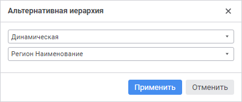

# Выбор элементов измерений: Формы ввода

Выбор элементов измерений: Формы ввода
-

# Выбор элементов измерений

При настройке структуры табличной области в редакторе табличной области
 формы ввода выберите элементы измерений. Для этого доступны настройки:

[Альтернативная
 иерархия](javascript:TextPopup(this))

	Задание альтернативной иерархии доступно для боковика, если не настроена
	 группировка измерений.

	Используйте альтернативную иерархию для отображения элементов альтернативного
	 справочника, вместо элементов справочника, на котором построено измерение,
	 или настройте динамический выбор альтернативной иерархии в зависимости
	 от атрибута параметра формы ввода. Для этого:

		- Выполните команду «Альтернативная
		 иерархия» контекстного меню измерения. Откроется окно «Альтернативная иерархия»:

	

		-  Задайте:

			- Тип альтернативной
			 иерархии. Выберите из раскрывающегося списка один из
			 вариантов: фиксированная, динамическая или не выбрано. По
			 умолчанию альтернативная иерархия не применяется;

			- Источник альтернативной
			 иерархии. Зависит от выбранного типа альтернативной
			 иерархии:

				- если выбран тип «Фиксированная»,
				 то [источником
				 альтернативной иерархии является справочник](UiNavObj.chm::/reference_book/look-and-feel_Reference_book/Use_AlterHier_ForRefBook.htm).
				 Выберите доступный справочник в раскрывающемся списке
				 или нажмите кнопку поиска  и начните
				 печатать название справочника. Доступен выбор только одного
				 справочника;

				- если выбран тип «Динамическая»,
				 то [источником
				 альтернативной иерархии является атрибут параметра](UiNavObj.chm::/reference_book/look-and-feel_Reference_book/Attributes_as_alt_hier.htm)
				 формы ввода. Выберите атрибут параметра формы ввода в
				 раскрывающемся списке или нажмите кнопку поиска  и начните печатать название параметра. Если
				 значение атрибута выбранного элемента в параметре не является
				 ключом альтернативной иерархии, то будет выведено соответствующее
				 сообщение и применена основная иерархия. При выборе данной
				 настройки «Схема отметки»
				 и «Группа элементов»
				 недоступны, для измерения боковика недоступна [группировка](Table_Area_Structure.htm#group_settings).

	Совет.
	 Для получения подробной информации о настройке динамического выбора
	 альтернативной иерархии в зависимости от атрибута параметра обратитесь
	 к статье «[Как
	 настроить динамическое изменение отображаемых элементов измерения
	 боковика](../../FAQ/Select_alternative_hierarchy.htm)».

				- если выбран тип «Не
				 выбрано», то список недоступен.

	Примечание.
	 Если не выбран справочник или атрибут параметра в качестве источника
	 альтернативной иерархии, то после нажатия кнопки «Применить»
	 будет применена основная иерархия.

	Если атрибут справочника, который был
	 задан в качестве ключа альтернативной иерархии, удален, то при открытии
	 формы будет применена основная иерархия для измерения.

	Для установки основной иерархии справочника выполните команду «Альтернативная иерархия > Сбросить» контекстного меню измерения.
	 Данная команда присутствует, если для справочника установлена альтернативная
	 иерархия.

[Схема отметки](javascript:TextPopup(this))

	Для автоматизации выделения элементов по заданным правилам используйте
	 [схему
	 отметки](UiNavObj.chm::/reference_book/look-and-feel_Reference_book/UiMd_reference_book_look-and-feel_Scheme.htm). Для этого выберите схему отметки в раскрывающемся
	 списке «Схема отметки» контекстного
	 меню измерения.

	Примечание.
	 Если у справочника отсутствуют схемы отметки или задана альтернативная
	 иерархия, выбор схемы отметки будет недоступен.

	Для сброса схемы отметки выполните команду «Схема
	 отметки > Сбросить»
	 контекстного меню измерения. Данная команда присутствует, если для
	 справочника установлена схема отметки.

[Группа элементов](javascript:TextPopup(this))

	Для ограничения списка доступных элементов измерения укажите [группу
	 элементов](UiNavObj.chm::/reference_book/look-and-feel_Reference_book/UiMd_reference_book_look-and-feel_Group.htm). Для этого выберите группу элементов
	 в раскрывающемся списке «Группа элементов»
	 контекстного меню измерения.

	Примечание.
	 Если у справочника отсутствуют группы элементов или задана альтернативная
	 иерархия, выбор группы элементов будет недоступен.

	Для сброса группы элементов выполните команду «Группа
	 элементов > Сбросить»
	 контекстного меню измерения. Данная команда присутствует, если для
	 справочника установлена группа элементов.

[Отметка элементов
 измерения](javascript:TextPopup(this))

	Отметка по измерениям позволяет ограничить перечень элементов измерений,
	 на основании которых будет построена табличная область.

	Для отметки элементов измерения:

		- Откройте окно с помощью команды «Редактировать
		 <Наименование
		 измерения>»
		 в контекстном меню измерения:

	

	- В открывшемся окне выберите один из вариантов фильтра:

		- Все
		 элементы. Отмечены будут все элементы. Недоступен для фиксированных
		 измерений с отключенной агрегацией;

		- Выбранные
		 элементы. Отметьте только нужные элементы или исключите
		 выбранные элементы из отметки, установив флажок «Исключить
		 выбранные». Для фиксированных измерений с отключенной агрегацией
		 можно выбрать только один элемент и флажок «Исключить
		 выбранные» недоступен.

Для поиска элемента из списка начните вводить
 наименование искомого элемента в строку поиска . При
 вводе слова целиком или его части в списке будут отображаться элементы,
 наименования которых содержат искомое сочетание символов.

		- Расширенный
		 фильтр. Добавьте правила в расширенный фильтр, нажав кнопку
		 «Добавить». Задайте:

			- Атрибут. Выберите
			 атрибут указанного справочника из раскрывающегося списка.
			 Для фильтрации элементов справочника по атрибутам [связанного
			 справочника](UiNavObj.chm::/reference_book/Master_RDS_reference_book/Link_Property.htm) выберите в списке доступных
			 связанных атрибутов атрибут справочника, выбранного при [создании
			 связи](UiNavObj.chm::/reference_book/Master_RDS_reference_book/Link.htm) с атрибутом указанного справочника.
			 Связанные атрибуты отображаются с первым уровнем вложенности
			 и представляют собой дерево из доступных связанных атрибутов;

Примечание.
 Если атрибут справочника содержит [множественные
 значения](UiNavObj.chm::/reference_book/Master_RDS_reference_book/Attributes/Attribute.htm), то при проверке условия фильтрации будут
 сравниваться все значения атрибута. Если хотя бы одно значение атрибута
 удовлетворяет условию, то элемент справочника будет автоматически удовлетворять
 условию.

			- Условие. Задайте
			 условие фильтрации. Возможные варианты: равно, не равно, больше,
			 меньше, больше или равно, меньше или равно, входит, не входит;

			- Тип. Выберите
			 тип фильтра. Возможные варианты: значение, параметр;

			- Не учитывать пустые.
			 Пустые значения не будут учитываться, если установить флажок.
			 Доступно только для типа «Параметр»;

			- Значение. Зависит
			 от выбранного атрибута и типа.

Если выбран тип «Значение»,
 то в поле указывается конкретное значение, соответствующее [типу
 атрибута](UiNavObj.chm::/reference_book/Master_RDS_reference_book/Attributes/Attribute.htm).

Если выбран тип «Параметр»,
 то в поле выбирается атрибут из раскрывающегося списка, представляющего
 собой дерево из доступных параметров с атрибутами.

Если атрибут связанный и выбран тип «Значение», то в поле появляется
 всплывающее меню с доступными значениями справочника.

Если атрибут связанный и выбран тип «Параметр», то в поле появляется
 всплывающее меню, представляющее собой дерево из доступных параметров
 с атрибутами [связанного
 справочника](UiNavObj.chm::/reference_book/Master_RDS_reference_book/Link_Property.htm);

			- Не фильтровать от пустых
			 значений. Пустые значения атрибута не будут фильтроваться,
			 если установить флажок.

Примечание.
 Если для измерения настроена [альтернативная иерархия](UiNavObj.chm::/reference_book/look-and-feel_Reference_book/Use_AlterHier_ForRefBook.htm)
 и расширенный фильтр от параметра, то расширенный фильтр будет применяться
 к альтернативному справочнику.

Нажмите кнопку  «Удалить» для удаления выделенного
 правила расширенного фильтра.

	- Завершите выбор, нажав кнопку «Применить».

Примечание.
 Команды «Альтернативная иерархия»,
 «Схема отметки», «Группа
 элементов» доступны, если в справочниках настроены [альтернативные
 иерархии](UiNavObj.chm::/reference_book/look-and-feel_Reference_book/Attributes_as_alt_hier.htm), [схема
 отметки](UiNavObj.chm::/reference_book/look-and-feel_Reference_book/UiMd_reference_book_look-and-feel_Scheme.htm), [группы
 элементов](UiNavObj.chm::/reference_book/look-and-feel_Reference_book/UiMd_reference_book_look-and-feel_Group.htm).

См. также:

[Настройка
 табличной области](AreaTable.htm) | [Построение
 формы ввода](../Starting/ConstructForm.htm)

		Справочная
		 система на версию 10.9
		 от 18/08/2025,
		 © ООО «ФОРСАЙТ»,
