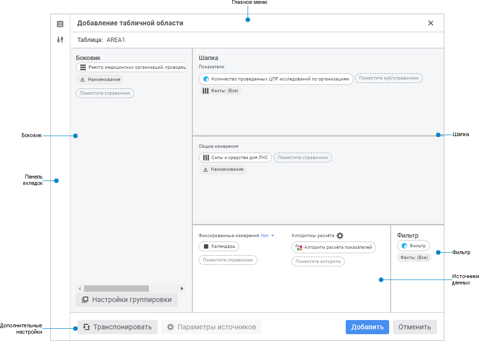

# Задание структуры табличной области: Формы ввода в веб-приложении

Задание структуры табличной области: Формы ввода в веб-приложении
-

# Задание структуры табличной области

Структура табличной области включает:

	- Измерения боковика.
	 Измерения, которые располагаются в боковике табличной области. В боковике
	 могут располагаться [общие измерения](AreaTable.htm#shared)
	 показателей, при необходимости можно перенести в боковик [частные
	 измерения](AreaTable.htm#private) показателей;

	- Измерения шапки. Показатели
	 и измерения, которые располагаются в шапке табличной области. В шапке
	 могут располагаться [общие и частные
	 измерения](AreaTable.htm#dimensions) показателей. Частные измерения показателей отображаются
	 под показателем;

	- Фиксированные измерения.
	 [Общие и частные измерения](AreaTable.htm#dimensions) показателей,
	 элементы которых не выводятся ни в шапку, ни в боковик.

Примечание.
 Если [общее измерение](AreaTable.htm#shared) не добавлено в
 измерения боковика или в общие измерения шапки табличной области, то оно
 будет являться [частным измерением](AreaTable.htm#private)
 показателей.

Фильтр - это куб, предназначенный
 для фильтрации выводимых в боковике элементов измерений для различных
 значений параметров. В ячейках фильтра может быть установлено значение
 или ячейка остается пустой. В боковик будут выводится элементы, у которых
 есть значения.

Примечание.
 При использовании фильтра  недоступно [отображение
 итоговых значений](../Work/totals.htm).

[Структура фильтра](javascript:TextPopup(this))

	Фильтр должен содержать хотя бы одно общее измерением с показателем.
	 Структура фильтра может не совпадать со структурой показателя, для
	 которого будет проводится фильтрация:

		- если в показателе есть измерения, отсутствующие в фильтре,
		 то при фильтрации эти измерения не учитываются;

		- если в фильтре есть измерения, которых нет в показателе,
		 то при фильтрации по этим измерениям будет учитываться первый
		 выделенный элемент;

		- если в измерении показателя есть элемент, отсутствующий
		 в фильтре, то при фильтрации элемент не будет выведен в боковик.

	Таким образом, при смене значения параметра будут изменяться отображаемые
	 элементы боковика без редактирования табличной области.

	Примечание.
	 Фильтр не выводится в шапку табличной области, если во всех его [частных измерениях](AreaTable.htm#private) отмечено не более
	 одного элемента. При выделении нескольких элементов измерения фильтрация
	 произойдет по первому выделенному элементу, остальные будут проигнорированы.

Для задания структуры табличной области используйте редактор табличной
 области:

[Элементы редактора
 табличной области](javascript:TextPopup(this))

		- Главное меню. Содержит
		 поле для задания наименования табличной области;

		- Боковик. Содержит
		 измерения боковика, предназначена для настройки его структуры;

		- Шапка. Содержит
		 измерения шапки, предназначена для настройки её структуры;

		- Источники данных.
		 Содержит фиксированные измерения и алгоритмы расчета, предназначена
		 для их настройки;

		- Фильтр. Содержит
		куб, предназначенный для фильтрации выводимых
		 в боковике элементов измерений для различных значений параметров.

		- [Панель
		 вкладок](../Starting/Starting.htm#elements). Содержит кнопки для выбора группы настроек,
		 отображаемых на боковой панели, в режиме редактирования;

		- Дополнительные настройки.
		 Содержит кнопки для настройки группировки, [транспонирования
		 табличной области](../Work/Transpose.htm), [управления
		 параметрами](parameter_management.htm), сохранения табличной области и отмены изменений.

Для определения структуры табличной области:

	- Задайте наименование табличной области в поле «Таблица».

	- [Добавьте](#add) измерения, показатели, фильтр
	 и алгоритмы в структуру.

	- [Измените](Table_Area_Structure.htm#move) расположение
	 измерений и показателей.

	- [Выберите элементы](Select_dimension_elements.htm)
	 в измерениях.

	- [Выполните расшифровку](Detail_dimensions.htm) измерений
	 для настройки перехода от элемента измерения к объекту,
	 детализирующему его значение.

	- Выполните [группировку
	 измерений](Table_Area_Structure.htm#group_settings) боковика по заданным атрибутам, если требуется.

	- [Выведите](Table_Area_Structure.htm#name) дополнительные
	 наименования элементов измерений боковика.

	- [Задайте агрегацию](#aggregation) фиксированных измерений.

При необходимости [транспонируйте](Table_Area_Structure.htm#transpose)
 таблицу или добавьте фильтр для общих измерений при выделении элементов
 на основе значений атрибутов.

Далее перейдите к [настройке алгоритмов
 расчёта](Calculation_Practices.htm), если требуется.

Для завершения работы в редакторе табличной области нажмите кнопку:

	- «Добавить» при создании
	 табличной области;

	- «Сохранить» при редактировании
	 табличной области;

	- «Отмена» для выхода
	 из редактора без добавления табличной области или без изменения её
	 настроек.

Для дополнительных настроек структуры табличной области добавьте [фильтр для общих измерений](../Common/Filter.htm#filter)
 при выделении элементов на основе значений атрибутов, используя [панель
 параметров](../Starting/Starting.htm#elements).

## Операции над измерениями, показателями, фильтром
 и алгоритмами

Доступные операции над измерениями, показателями, фильтром и алгоритмами
 в редакторе табличной области:

[Добавление
 измерений, показателей и алгоритмов](javascript:TextPopup(this))

	Для добавления измерений, показателей и алгоритмов:

		- Нажмите кнопку  «Источники» на панели вкладок.
		 Откроется боковая панель «[Источники](Data_Sources.htm)».

		- Выберите нужную вкладку.

		- Наведите курсор на нужный источник. Курсор примет вид указателя
		 .
		 С помощью механизма Drag&Drop переместите источник в соответствующую
		 область редактора. По умолчанию алгоритмы добавляются на вкладку
		 «[На
		 изменение](Calculation_Practices.htm#addalgorithm)». Для добавления алгоритма на вкладку «[На
		 сохранение](Calculation_Practices.htm#addalgorithm)» откройте окно «[Алгоритмы расчета](Calculation_Practices.htm)»,
		 перейдите на вкладку и переместите алгоритм с помощью механизма
		 Drag&Drop.

[Добавление
 фильтра](javascript:TextPopup(this))

	Для добавления фильтра:

		- Нажмите кнопку  «Источники» на панели вкладок.
		 Откроется боковая панель «[Источники](Data_Sources.htm)».

		- Выберите вкладку «Кубы».

		- Наведите курсор на куб, который имеет хотя бы одно общее
		 измерением с показателем. С помощью механизма Drag&Drop переместите
		 куб в область «Фильтр»
		 редактора табличной области. Добавить можно только один фильтр.

	Примечание.
	 Выполните [добавление нужного источника](Data_Sources.htm)
	 при его отсутствии.

[Перемещение
 измерений и показателей](javascript:TextPopup(this))

	Для перемещения измерения в другую область используйте механизм
	 Drag&Drop или команду контекстного меню. Перемещение доступно
	 для измерений боковика, частных, общих и фиксированных измерений.

	Для перемещения частного измерения показателя используйте команду
	 контекстного меню, при этом для перемещения частного измерения в фиксированные
	 необходимо сначала перенести его в общие измерения. Такое перемещение
	 необходимо, если для измерения необходимо настроить агрегацию. Если
	 агрегация не требуется, то для фиксации частного измерения выполните
	 команду контекстного меню. При этом частное измерение останется под
	 показателем, изменится значок у измерения.

	Примечание.
	 Для перемещения показателя из шапки табличной области в боковик нажмите
	 кнопку «Транспонировать».

[Удаление
 измерений, показателей, фильтра и алгоритмов](javascript:TextPopup(this))

	Для удаления измерений, показателей, фильтра и алгоритмов выполните
	 команду «Удалить <наименование измерения/показателя/фильтра/алгоритма>» контекстного меню требуемого
	 измерения, показателя, фильтра или алгоритма.

[Ограничение
 перечня элементов фильтра](javascript:TextPopup(this))

	Для ограничения перечня элементов измерений фильтра:

		- Откройте окно с помощью команды «Редактировать
		 <Наименование
		 измерения>»
		 в контекстном меню измерения.

	- В открывшемся окне выберите один из вариантов фильтра:

		- Все
		 элементы. Отмечены будут все элементы. Недоступен для фиксированных
		 измерений с отключенной агрегацией;

		- Выбранные
		 элементы. Отметьте только нужные элементы или исключите
		 выбранные элементы из отметки, установив флажок «Исключить
		 выбранные». Для фиксированных измерений с отключенной агрегацией
		 можно выбрать только один элемент и флажок «Исключить
		 выбранные» недоступен.

Для поиска элемента из списка начните вводить
 наименование искомого элемента в строку поиска . При
 вводе слова целиком или его части в списке будут отображаться элементы,
 наименования которых содержат искомое сочетание символов.

		- Расширенный
		 фильтр. Добавьте правила в расширенный фильтр, нажав кнопку
		 «Добавить». Задайте:

			- Атрибут. Выберите
			 атрибут указанного справочника из раскрывающегося списка.
			 Для фильтрации элементов справочника по атрибутам [связанного
			 справочника](UiNavObj.chm::/reference_book/Master_RDS_reference_book/Link_Property.htm) выберите в списке доступных
			 связанных атрибутов атрибут справочника, выбранного при [создании
			 связи](UiNavObj.chm::/reference_book/Master_RDS_reference_book/Link.htm) с атрибутом указанного справочника.
			 Связанные атрибуты отображаются с первым уровнем вложенности
			 и представляют собой дерево из доступных связанных атрибутов;

Примечание.
 Если атрибут справочника содержит [множественные
 значения](UiNavObj.chm::/reference_book/Master_RDS_reference_book/Attributes/Attribute.htm), то при проверке условия фильтрации будут
 сравниваться все значения атрибута. Если хотя бы одно значение атрибута
 удовлетворяет условию, то элемент справочника будет автоматически удовлетворять
 условию.

			- Условие. Задайте
			 условие фильтрации. Возможные варианты: равно, не равно, больше,
			 меньше, больше или равно, меньше или равно, входит, не входит;

			- Тип. Выберите
			 тип фильтра. Возможные варианты: значение, параметр;

			- Не учитывать пустые.
			 Пустые значения не будут учитываться, если установить флажок.
			 Доступно только для типа «Параметр»;

			- Значение. Зависит
			 от выбранного атрибута и типа.

Если выбран тип «Значение»,
 то в поле указывается конкретное значение, соответствующее [типу
 атрибута](UiNavObj.chm::/reference_book/Master_RDS_reference_book/Attributes/Attribute.htm).

Если выбран тип «Параметр»,
 то в поле выбирается атрибут из раскрывающегося списка, представляющего
 собой дерево из доступных параметров с атрибутами.

Если атрибут связанный и выбран тип «Значение», то в поле появляется
 всплывающее меню с доступными значениями справочника.

Если атрибут связанный и выбран тип «Параметр», то в поле появляется
 всплывающее меню, представляющее собой дерево из доступных параметров
 с атрибутами [связанного
 справочника](UiNavObj.chm::/reference_book/Master_RDS_reference_book/Link_Property.htm);

			- Не фильтровать от пустых
			 значений. Пустые значения атрибута не будут фильтроваться,
			 если установить флажок.

Примечание.
 Если для измерения настроена [альтернативная иерархия](UiNavObj.chm::/reference_book/look-and-feel_Reference_book/Use_AlterHier_ForRefBook.htm)
 и расширенный фильтр от параметра, то расширенный фильтр будет применяться
 к альтернативному справочнику.

Нажмите кнопку  «Удалить» для удаления выделенного
 правила расширенного фильтра.

	- Завершите выбор, нажав кнопку «Применить».

[Изменение
 порядка расположения измерений, показателей и атрибутов измерения](javascript:TextPopup(this))

	Для изменения порядка отображения измерений и показателей в боковике/шапке
	 таблицы, а также их атрибутов, используйте механизм Drag&Drop
	 внутри области. Верхнее измерение расположенное в боковике/шапке будет
	 отображаться крайним левым/верхним в табличной области.

[Отображение
 дополнительных наименований элементов измерений](javascript:TextPopup(this))

	Для настройки отображения наименований элементов в боковике/шапке
	 формы:

		- Наведите курсор на измерение в области «Боковик»/«Общие измерения».

		- Выполните команду «Добавить
		 атрибут» контекстного меню измерения.

		- Выполните следующее действие:

			- установите флажок напротив
			 атрибута для добавления атрибута измерения. Возможна множественная
			 отметка;

	Примечание.
	 Если выбрано несколько атрибутов, то каждый выбранный атрибут будет
	 отображаться в табличной области в отдельном столбце/строке.

			- снимите флажок напротив атрибута
			 для скрытия атрибута измерения. Возможна множественная отметка.

	В результате будет настроено отображение дополнительных наименований
	 элементов измерений.

	Примечание.
	 При настройке отображения наименований элементов в боковике/шапке
	 формы в списке атрибутов недоступны [скрытые
	 атрибуты](UiNavObj.chm::/reference_book/Master_Calendar_reference_book/UiMd_reference_book_Master_Calendar_page3Attr.htm).

[Агрегация
 фиксированных измерений](javascript:TextPopup(this))

	Агрегация позволяет объединять значения элементов, отмеченных в
	 фиксированных измерениях.

	Для задания агрегации выберите метод в раскрывающемся списке в области
	 фиксированных измерений:

		- Нет. Агрегация не
		 производится. Выбран по умолчанию;

		- Сумма. Суммируются
		 значения элементов фиксированных измерений;

		- Минимум. У элементов
		 фиксированных измерений выбирается минимальное значение;

		- Максимум. У элементов
		 фиксированных измерений выбирается максимальное значение;

		- Арифметическое среднее. Определяется среднее
		 значение элементов фиксированных измерений с учётом пустых
		 значений.

	При множественной отметке элементов по умолчанию будет выбран метод
	 агрегации «Сумма».

[Транспонирование](javascript:TextPopup(this))

	Для размещения измерений боковика в шапке и измерений шапки в боковике
	 нажмите кнопку «Транспонировать».

	Транспонировать табличную область можно при:

		- редактировании формы ввода. Для этого нажмите кнопку  «Транспонировать» вкладки «Данные» панели инструментов;

		- [работе с готовой формой](../Work/Transpose.htm).

[Настройка
 группировки](javascript:TextPopup(this))

	Для объединения элементов боковика по заданным атрибутам выполните
	 следующие действия:

		- Нажмите кнопку «Настройки
		 группировки». Будет открыто окно «Настройка
		 группировки»:

	- Добавьте необходимые атрибуты в область «Сгруппированные
	 атрибуты». Для этого:

		- Выделите атрибут в области «Измерения
		 боковика».

		- Выполните одно из действий:

			- с помощью механизма Drag&Drop переместите атрибут
			 в область «Сгруппированные
			 атрибуты»;

			- нажмите кнопку «Группировать».

Примечание.
 [Скрытые
 атрибуты](UiNavObj.chm::/reference_book/Master_Calendar_reference_book/UiMd_reference_book_Master_Calendar_page3Attr.htm) измерения недоступны для группировки.

	- Выберите уровень справочника, для которого настраивается группировка.
	 Для этого выберите наименование [уровня](UiNavObj.chm::/reference_book/Master_RDS_reference_book/Level.htm)
	 из раскрывающегося списка измерения в области «Сгруппированные
	 атрибуты». По умолчанию выбран вариант «Без
	 уровня». В этом случае группировка применяется ко всем уровням
	 сразу.

	- Разместите атрибуты в нужном порядке:

		- Выделите атрибут в области «Сгруппированные
		 атрибуты».

		- Используйте кнопки 
		 «Переместить вверх» и
		   «Переместить
		 вниз».

Расположение атрибутов в области «Сгруппированные
 атрибуты» влияет на расположение элементов в боковике таблицы.

	- Удалите атрибуты, если они не должны участвовать в группировке.
	 Для этого:

		- Выделите атрибут в области
		 «Сгруппированные атрибуты».

		- Выполните одно из действий:

			- с помощью механизма Drag&Drop переместите атрибут
			 в область «Измерения боковика»;

			- нажмите кнопку «Разгруппировать».

	- Активируйте переключатель «Скрывать
	 пустые значения атрибутов» для отображения только тех атрибутов,
	 значения которых заданы. По умолчанию переключатель активен. Скрывать
	 пустые значения атрибутов требуется, если у элементов значения некоторых
	 атрибутов не заданы. При скрытых пустых значениях атрибутов в таблице
	 будут выведены сначала сгруппированные элементы, а после - элементы,
	 не включенные в группы, то есть те, у которых отсутствует значения
	 атрибутов, по которым настроена группировка.

В результате выполненных действий будут назначены
 атрибуты, по которым осуществляется группировка элементов. Группировка
 распространяется на элементы одного измерения.

Примечание.
 Группировку можно настроить для каждого измерения, отображаемого в боковике,
 кроме измерения, для которого настроена альтернативная иерархия.

	Группировку элементов боковика также можно настроить с помощью группы
	 параметров «[Размещение](../Common/Layout.htm#dimensions)».

[Запрет
 ввода значений показателей](javascript:TextPopup(this))

	Для запрета редактирования ячеек показателя в табличной области
	 установите отметку команде «Запретить
	 ввод значений» контекстного меню требуемого показателя.

	Для разрешения ввода значений в ячейки показателя снимите отметку
	 с команды.

[Переименование
 показателей](javascript:TextPopup(this))

	Для переименования показателя выполните команду «Переименовать
	 показатель» контекстного меню требуемого показателя, после
	 чего введите новое наименование.

См. также:

[Построение
 формы ввода](../Starting/ConstructForm.htm) | [Вставка и настройка табличной
 области](AreaTable.htm) | [Работа с готовой формой
 ввода](../Work/FinishForm.htm)

		Справочная
		 система на версию 10.9
		 от 18/08/2025,
		 © ООО «ФОРСАЙТ»,
