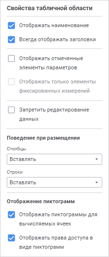

# Настройка базовых свойств

Настройка базовых свойств
-

# Настройка базовых свойств

Для настройки базовых свойств табличной области используйте боковую
 панель «Свойства табличной области»:

[Для открытия
 панели](javascript:TextPopup(this))

	Нажмите кнопку  «Свойства
	 табличной области» на [панели
	 вкладок](../Starting/Starting.htm#elements) при открытом [редакторе
	 табличной области](Table_Area_Structure.htm).

	Примечание.
	 Кнопка  «Свойства табличной области» на панели
	 вкладок доступна только при добавлении или редактировании [табличной
	 области](AreaTable.htm).

Для настройки табличной области задайте параметры:

	- Отображать наименование.
	 Установите флажок для отображения на листе наименования табличной
	 области. Наименование табличной области будет отображаться в верхней
	 части листа формы ввода. По умолчанию флажок установлен;

	- Всегда отображать заголовки.
	 Установите флажок для отображения на листе боковика при отсутствии
	 отметки по измерениям шапки и шапки при отсутствии отметки по измерениям
	 боковика. По умолчанию флажок установлен. Отсутствие отметки возможно
	 при привязке измерения боковика или шапки к параметру;

	- Отображать отмеченные элементы
	 параметров. Установите флажок для отображения на листе текущих
	 значений [параметров](../Parameters/Parameters.htm) формы,
	 указанных отметкой в элементах управления. Убедитесь, что параметры
	 уже созданы. При установленном флажке над формой ввода будут отображены
	 наименования параметров и элементы, установленные в параметрах. По
	 умолчанию флажок установлен;

	- Отображать только элементы
	 фиксированных измерений. Установите флажок для отображения
	 на листе только элементов, не отображаемых в табличной области. По
	 умолчанию флажок снят. Доступен при установке флажка «Отображать
	 отмеченные элементы параметров»;

	- Запретить редактирование данных.
	 Установите флажок для запрета редактирования данных в форме. При установленном
	 флажке данные табличной области будут доступны только для чтения.
	 По умолчанию флажок снят;

	- Поведение
	 при размещении. При добавлении табличной области на лист формы
	 ввода поведение столбцов и строк на листе может различным. Выберите
	 поведение в раскрывающемся списке «Столбцы»
	 или «Строки»:

		- Вставлять. Добавление
		 табличной области на лист будет осуществляться с увеличением строк
		 или столбцов на листе со смещением. Количество строк или столбцов
		 при смещении будет равно количеству строк или столбцов добавляемой
		 табличной области. Например, информация, расположенная в строках
		 ниже, будет смещена вниз, а информация, расположенная в столбцах
		 справа, будет смещена вправо;

		- Захват смежных столбцов/строк.
		 Добавление табличной области на лист будет осуществляться в строки
		 или столбцы табличного листа без смещения строк или столбцов на
		 листе. Положение информации на листе формы ввода не изменится.
		 Рекомендуется использовать данное поведение, если форма ввода
		 впоследствии будет подключена к бизнес-процессу и в рамках этого
		 процесса будет изменяться количество элементов измерения;

	- Отображение
	 пиктограмм. Настройте отображение пиктограмм для ячеек, которые
	 нельзя [редактировать](UiAnalyticalArea.chm::/Working_with_table_data/Edit_and_save_data.htm),
	 с помощью флажков:

		- Отображать пиктограммы
		 для вычисляемых ячеек. При установке флажка в ячейках с
		 [агрегированными
		 элементами](UiNavObj.chm::/Cube/Agregation.htm),
		 [вычисляемыми
		 элементами](UiAnalyticalArea.chm::/Work_with_dimensions/Edited_elements.htm), элементами, рассчитанными с помощью
		 [подключенного алгоритма расчёта](Calculation_Practices.htm),
		 появится пиктограмма .

Если элементы рассчитаны с помощью подключенного
 алгоритма расчёта, то пиктограмма 
 не отображается при выполнении следующих условий:

			- В [блоке
			 расчёта](calculationalgorithm.chm::/Web/Calculation_block/Calculation_unit.htm) задан куб для [фильтрации
			 по данным](calculationalgorithm.chm::/Web/Calculation_block/FilteringByData.htm).

			- В таблице, поля которой связаны с [измерением
			 куба](UiNavObj.chm::/Cube/CreateCube/Master_Standart/UiMd_Cube_CreateCube_Master_Standart_3.htm), содержатся пустые значения.

При использовании алгоритма расчёта с фильтрацией
 данных пиктограмма  отображается,
 если в рассчитываемой ячейке имеются данные для расчёта.

		- Отображать права доступа
		 в виде пиктограмм. При установке флажка в ячейках с отсутствием
		 [прав
		 доступа](Admin.chm::/03_Admin/Admin_AdminObjects.htm)
		 на изменение появится пиктограмма .

По умолчанию флажки установлены.

Далее перейдите к [настройке структуры](Table_Area_Structure.htm)
 табличной области.

См. также:

[Настройка
 табличной области](AreaTable.htm)

		Справочная
		 система на версию 10.9
		 от 18/08/2025,
		 © ООО «ФОРСАЙТ»,
