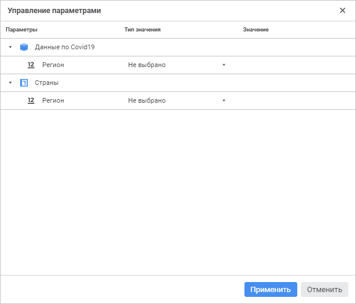

# Управление параметрами: Формы ввода в веб-приложении

Управление параметрами: Формы ввода в веб-приложении
-

# Управление параметрами

Если в форме ввода используются параметрические показатели, измерения
 или фильтр, то для их параметров можно задать значения или настроить управление
 через [параметры формы ввода](../Parameters/Parameters.htm).
 Управление параметрическими показателями, измерениями и фильтром осуществляется
 с помощью диалога «Управление параметрами»:

[Для открытия
 диалога](javascript:TextPopup(this))

	Нажмите кнопку  «Параметры
	 источников» в [редакторе
	 табличной области](Table_Area_Structure.htm).

Задайте настройки:

	- Параметры.
	 Содержит все кубы, справочники, измерения, в структуре которых имеются
	 параметры. Столбец недоступен для редактирования.

Если один и тот же куб добавлен в форме ввода
 в качестве показателя несколько раз, то в диалоге можно будет настроить
 управление для каждого экземпляра куба. Если параметрическое измерение
 добавлено в шапку и боковик, то в диалоге управления параметрами измерение
 будет отображено в одном экземпляре;

Примечание.
 Частные измерения куба не отображаются. Управление параметрами частных
 измерений должно быть настроено в самом кубе.

	- Тип
	 значения. Выберите способ формирования значения параметра:

		- Не выбрано. По умолчанию.
		 Параметру не передаётся никакое значение;

		- Значение. Параметру
		 задаётся фиксированное значение;

		- Атрибут параметра.
		 Параметру передаётся значение атрибута [параметра
		 формы ввода](../Parameters/Parameters.htm);

	- Значение.
	 Задайте значение параметра. Вид поля зависит от выбранного типа значения:

		- для типа «Значение».
		 Укажите в поле конкретное значение, соответствующее типу атрибута
		 справочника;

		- для типа «Атрибут параметра».
		 Выберите из раскрывающегося списка параметр формы ввода и его
		 атрибут.

Примечание.
 Поле «Значение» доступно только
 для типов значения «Значение»
 и «Атрибут параметра».

См. также:

[Настройка
 табличной области](AreaTable.htm)

		Справочная
		 система на версию 10.9
		 от 18/08/2025,
		 © ООО «ФОРСАЙТ»,
