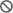
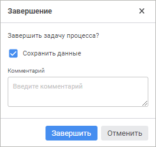
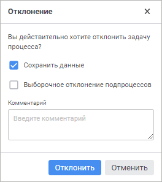

# Ввод и согласование данных в бизнес-процессах

Ввод и согласование данных в бизнес-процессах
-

# Ввод и согласование данных в бизнес-процессах

Для выполнения шагов процесса ввода или согласования данных используйте
 кнопки  «Завершить задачу» и  «Отклонить задачу» вкладки «Главная» [панели
 инструментов](../Starting/Starting.htm#elements). Кнопки отображаются только в форме ввода, открытой на[ просмотр](../Starting/Starting.htm#open), и доступны, если
 для пользователя есть активные шаги на текущем активном листе.

Примечание.
 Работа с бизнес-процессами доступна только при установленном расширении
 «[Управление бизнес-процессами](BPM.chm::/Modeling_of_business_processes.htm)».

[Рекомендации
 по работе бизнес-процессов в форме ввода](javascript:TextPopup(this))

	Для корректной работы бизнес-процессов в форме ввода [отметка
	 по измерениям](BPM.chm::/Desktop/Facility_Agreement/Configuring_the_Authorization_Object.htm) объекта полномочий должна полностью
	 содержаться в [отметке
	 по измерениям](../Table/Select_dimension_elements.htm) формы ввода, используемой в шаге процесса. Отметка
	 по измерениям формы ввода не изменяется при настройке фильтрации данных
	 [табличной области](../Table/AreaTable.htm):

		- [добавление
		 фильтра](../../Desktop/Table/Table_Area_Structure.htm);

		- [фильтрация
		 общих измерений по связанным атрибутам](../../Desktop/Table/Table_Area_Structure.htm);

		- [фильтрация
		 данных в столбцах таблицы](../../Desktop/Work/FilterSearch.htm#filter).

	Параметры фильтрации влияют только на отображение данных.

	При работе с настроенными сегментами доступно отображение подсветки
	 данных в форме ввода при выполнении шага в мониторинге процесса. Подсветка
	 отображается, если отметка табличной области формы ввода полностью
	 содержит отметку по измерениям соответствующего сегмента.

	Особенности взаимодействия формы ввода с [объектом
	 полномочий](BPM.chm::/Desktop/Facility_Agreement/Create_Authorization_Object.htm):

		- если в объекте полномочий содержится несколько кубов с отметками
		 по измерениям, например: куб А и куб B, то в форме ввода должен
		 содержаться хотя бы один источник данных с отметкой, которая одновременно
		 содержится в отметках куба А и куба В;

		- если в нескольких формах ввода используются данные из одного объекта
		 полномочий, то результат выполнения/отклонения шагов может быть
		 сохранен во всех формах ввода, если они были указанны в [мастере
		 шага](BPM.chm::/Desktop/Process/StepsProcess/CreateStepsProcess.htm). Ввод и согласование данных будут доступны
		 в любой из указанных форм ввода.

## Завершение и согласование шага процесса

Для завершения/согласования активного шага процесса:

	- Нажмите кнопку  «Завершить
	 задачу».

Появится окно подтверждения действия:

	- При необходимости задайте в окне настройки:

		- Сохранить данные.
		 Задайте настройки сохранения изменённых данных при завершении/согласовании
		 шага. По умолчанию флажок установлен и данные сохраняются;

Примечание.
 Флажок отображается только при наличии в форме несохранённых данных.

		- Комментарий. Введите
		 комментарий к завершению/согласованию шага.

	- Нажмите кнопку «Завершить».

В результате активный шаг будет завершён/согласован.

## Отклонение шага процесса

Для отклонения завершённого шага процесса на предыдущий:

	- Нажмите кнопку  «Отклонить
	 задачу». Появится окно подтверждения действия:

	- При необходимости задайте в окне настройки:

		- Сохранить данные.
		 Задайте настройки сохранения изменённых данных при отклонении
		 шага. По умолчанию флажок установлен и данные сохраняются;

Примечание.
 Флажок отображается только при наличии в форме несохранённых данных.

		- Выборочное отклонение подпроцессов.
		 Установите флажок для изменения автоматического способа исполнения
		 шага «Вызов подпроцесса»
		 на ручной. В этом случае будет доступен выборочный перезапуск
		 подпроцессов в ручном режиме. По умолчанию флажок снят и шаг процесса
		 отклоняется до ручного шага вместе с подпроцессами автоматического
		 шага;

		- Комментарий. Введите
		 пояснение отклонения шага.

	- Нажмите кнопку «Отклонить».

В результате завершённый шаг процесса будет отклонён.

См. также:

[Начало
 работы с расширением «Интерактивные формы ввода данных» в настольном приложении](../../Desktop/Starting/Starting.htm) |
 [Работа с готовой формой ввода](FinishForm.htm)

		Справочная
		 система на версию 10.9
		 от 18/08/2025,
		 © ООО «ФОРСАЙТ»,
