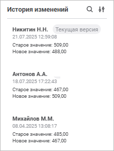

# Просмотр истории изменений значений в ячейке: Форма ввода, веб-приложение

Просмотр истории изменений значений в ячейке: Форма ввода, веб-приложение
-

# Просмотр истории изменений значений в ячейке

Для анализа изменений данных в ячейке таблицы доступен просмотр истории
 изменений значений в ячейке.

Для просмотра истории изменений используйте панель «История
 изменений»:

[Для открытия
 панели](javascript:TextPopup(this))

	Для открытия панели нажмите кнопку  «История изменений» боковой панели.

	При просмотре формы кнопка  «История
	 изменений» будет доступна, если источником таблицы является
	 куб, у которого установлен флажок «[Вести
	 историю изменений](uinavobj.chm::/Cube/CreateCube/Master_Standart/Additional_Settings.htm#history)».

Для ведения истории изменений источником таблицы должен быть куб, у
 которого установлен флажок «[Вести
 историю изменений](uinavobj.chm::/Cube/CreateCube/Master_Standart/Additional_Settings.htm#history)».

Для каждой записи в истории указаны:

	- Пользователь. [Полное
	 наименование пользователя](Admin.chm::/03_Admin/Users/Admin_UserProp_Common.htm#discription), который создал комментарий.
	 Если полное наименование не задано, отображается [имя
	 пользователя](Admin.chm::/03_Admin/Users/Admin_UserProp_Common.htm#discription);

	- Дата и время изменения значения;

	- Старое и новой значение.

Записи формируются при [вводе и сохранении](DataEnter.htm)
 значений в ячейку.

На панели истории изменений доступны операции:

[Поиск значения](javascript:TextPopup(this))

	Для поиска значения нажмите кнопку  «Поиск».

	В строке поиска введите искомый текст.

	Список будет отфильтрован по найденным совпадениям.

[Настройка отображения](javascript:TextPopup(this))

	Для сортировки и фильтрации записей по времени создания нажите кнопку
	  «Настройки отображения».

	Выберите способ сортировки:

		- сначала новые;

		- сначала старые.

	Выберите способ фильтрации:

		- все;

		- последний час;

		- последний день;

		- последняя неделя;

		- последний месяц.

См. также:

[Работа
 с готовой формой ввода](FinishForm.htm)

		Справочная
		 система на версию 10.9
		 от 18/08/2025,
		 © ООО «ФОРСАЙТ»,
