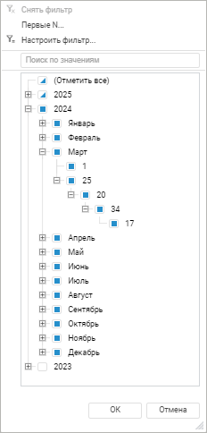
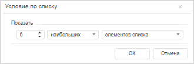
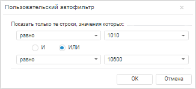
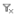

# Фильтрация: Формы ввода

Фильтрация: Формы ввода
-

# Фильтрация

Фильтрация данных позволяет отобразить в таблице
 только те данные, которые соответствуют заданным условиям.

В форме ввода можно настроить фильтрацию для:

	- данных в таблице;

	- диапазона листа.

На листе формы одновременно может быть настроена только фильтрация одного
 диапазона или одной таблицы.

Для фильтрации диапазона данных на листе формы или таблицы:

	- Выделите диапазон данных на листе формы или ячейку таблицы.

	- Нажмите кнопку  «Фильтрация»
	 панели инструментов:

		- в таблице у заголовков шапки
		 таблицы отобразятся кнопки  «Настройка фильтрации»;

		- для диапазона ячеек  у
		 заголовков отобразятся кнопки  «Настройка фильтрации». Первая
		 непустая строка выделенного диапазона считается строкой, содержащей
		 заголовки столбцов. Фильтрация значений в каждом столбце начинается
		 со второй непустой строки выделенного диапазона.

	- Нажмите кнопку  «Настройка
	 фильтрации» или активируйте ячейку заголовка столбца и нажмите
	 сочетание клавиш ALT+стрелка вниз.

	Для столбцов, содержащих значения типа «Дата»,
	 в фильтре будет выполнена агрегация дат в виде иерархии Год - Месяц
	 - День - Час - Минута - Секунда:

	- Укажите необходимые значения в списке или настройте способ фильтрации.
	 Доступны следующие стандартные операции автофильтра:

		- Снять фильтр. Операция
		 предназначена для отображения всех строк;

		- Первые
		 N. Операция предназначена для вывода указанного количества
		 элементов списка. Количество элементов задается либо явно, либо
		 в процентах от общего количества фильтруемых элементов:

В данном окне можно установить следующие
 параметры:

			- Количество строк.
			 Поле ввода, с помощью которого можно определить количество
			 отображаемых строк;

			- Признак. Определяет
			 какие элементы будут отображаться - наибольшие или наименьшие;

			- Условие выбора.
			 Определяет каким образом задается количество элементов - явно
			 или в процентах от количества элементов;

Примечание.
 Данный фильтр будет недоступен, если в фильтруемых строках отсутствуют
 числовые значения.

		- Настроить
		 фильтр. Операция, предназначенная для определения условий
		 фильтрации в окне «Пользовательский
		 автофильтр»:

В данном окне можно установить следующие
 параметры:

			- Условие выбора.
			 Раскрывающийся список, определяющий условие для отображения
			 элементов (равно, не равно...);

			- Значение. Раскрывающийся
			 список, определяющий значение условия для отображения элементов.
			 Данный список элементов содержит все значения диапазона автофильтра,
			 отсортированные без учета регистра. Регистр учитывается только
			 при совпадении значений;

			- Условия фильтрации.
			 Переключатель, определяющий порядок использования двух условий
			 одновременно. Предусмотрено два варианта использования сочетаний
			 условий:

				- «И». При
				 установке переключателя будут отображаться строки, удовлетворяющие
				 обоим условиям;

				- «ИЛИ». При
				 установке переключателя будут отображаться строки, удовлетворяющие
				 хотя бы одному из двух условий.

	- Установите флажок около элемента, по которому будет выполняться
	 фильтрация. Доступна множественная отметка.

Примечание.
 Для столбцов, содержащих значения типа «Дата»,
 доступна возможность выбора как элементов, так и уровней иерархии.

Для быстрого выбора элемента фильтрации воспользуйтесь
 поиском. Введите текст в поле для поиска. Поиск будет выполняться автоматически
 по мере ввода текста. В списке будут только те элементы, значения которых
 содержат вводимый текст.

В результате применения фильтрации в таблице будут отображаться все
 элементы отмеченные в списке, сформированном из всех значений фильтруемых
 строк. У столбцов, для которых настроена фильтрация, кнопка примет вид: .

При использовании автофильтра диапазона данных на листе формы ввода
 или табличной области:

	- вставка значения из одной ячейки в диапазон ячеек применяется
	 только к видимым строкам/столбцам;

	- вставка диапазона значений применяется ко всем видимым строкам/столбцам.
	 Вставляемый диапазон значений расширяется с учётом размера области
	 копирования, в том числе на скрытые строки/столбцы;

	- [перемещение диапазона значений в
	 буфер обмена](CopyPaste.htm#cut) применяется ко всем строкам/столбцам независимо от
	 их видимости при фильтрации. [Копирование
	 диапазона значений в буфер обмена](CopyPaste.htm#copy) применяется только к видимым
	 строкам/столбцам;

	- [удаление данных](../Starting/Sheets_Data.htm#delete)
	 применяется только к видимым строкам/столбцам.

Поведение будет одинаковым для всего диапазона данных независимо от
 расположения фильтра.

Для выключения фильтрации:

	- у столбца выполните команду «Снять фильтр» раскрывающегося списка
	 кнопки  «Настройка
	 фильтрации»;

	- сразу для всех столбцов переведите кнопку  «Фильтрация» вкладки «Главная»
	 панели инструментов в ненажатое состояние.

Закончив выполнять сортировку и фильтрацию, перейдите к шагу, если требуется:

	- [Добавление новых записей](New_entries.htm);

	- [Использование интерактивных элементов
	 для управления отметкой](UseControls.htm);

	- [Настройка вида отображения](View.htm);

	- [Поиск и замена](Find_and_Replace.htm);

	- [Экспорт формы ввода](../Common/Export.htm);

	- [Предварительный
	 просмотр](ParamPage/Tuning_ParamPage.htm#preview) и [печать](ParamPage/Tuning_ParamPage.htm#print)
	 формы ввода.

См. также:

[Работа
 с готовой формой ввода](FinishForm.htm)

		Справочная
		 система на версию 10.9
		 от 18/08/2025,
		 © ООО «ФОРСАЙТ»,
