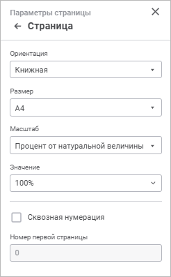

# Общие параметры страницы: Формы ввода, веб-приложение

Общие параметры страницы: Формы ввода, веб-приложение
-

# Общие параметры страницы

Для общих параметров страницы формы ввода доступна [быстрая](Tuning_ParamPage.htm#quick_setup)
 и [расширенная](Tuning_ParamPage.htm#advanced_setup) настройка.

Примечание.
 Набор параметров быстрой и расширенной настройки отличается.

Для расширенной настройки общих параметров страницы используйте группу
 параметров «Страница» [панели
 параметров](../../Starting/Starting.htm#elements):

[Для открытия
 группы параметров](javascript:TextPopup(this))

	- Выполните одно из действий:

		- выполните команду «Параметры
		 страницы» группы команд «Разметка
		 страницы» главного меню;

		- откройте форму ввода на [предварительный
		 просмотр](Tuning_ParamPage.htm#preview):

			- выполните команду «Файл > Печать >
			 Предварительный просмотр» главного меню;

			- нажмите кнопку  «Печать» вкладки «Главная»
			 панели инструментов;

			- нажмите сочетание клавиш CTRL+P.

Нажмите кнопку 
 «Параметры страницы» в правом
 верхнем углу.

		- Перейдите в группу параметров «Страница».

Задайте параметры:

	- Ориентация. Выберите
	 вариант ориентации страницы в раскрывающемся списке:

		- книжная;

		- альбомная;

	- Размер.
	 Выберите размер страницы в раскрывающемся списке. Раскрывающийся список
	 содержит предустановленные варианты размеров бумаги, такие как А4,
	 А5 и другие;

	- Масштаб.
	 Выберите способ масштабирования страницы в раскрывающемся списке:

		- Процент от натуральной
		 величины. Выберите значение масштаба как процент от натуральной
		 величины в раскрывающемся списке «Значение»;

		- Размещение на листах.
		 Укажите количество листов для ограничения по ширине и/или высоте
		 печатной страницы в полях «Листов
		 в ширину», «Листов в высоту»,
		 которые отобразятся после выбора способа. Если задать значение
		 только в одном из полей, а второе оставить пустым, то ограничение
		 на количество печатаемых листов будет накладываться только на
		 заданное поле.

	- Нумерация.
	 Установите флажок «Сквозная нумерация»
	 для нумерации страниц листов в сквозном порядке. Для листов, у которых
	 этот флажок снят, используется собственная нумерация страниц. При
	 снятии флажка номера страниц для листов с установленным флажком пересчитываются.

В поле «Номер
 первой страницы» укажите номер, с которого будет начинаться нумерация
 страниц листа. Значение параметра учитывается для каждого листа отчёта
 даже при использовании сквозной нумерации. Для сквозной нумерации страниц
 нескольких листов задайте значение в поле «Номер
 первой страницы» для первого листа отчёта, у которого установлен
 флажок «Сквозная нумерация». У
 остальных листов с установленным флажком «Сквозная
 нумерация» в поле «Номер первой
 страницы» задайте значение «0».

Примечание.
 Данный параметр нумерации влияет только на [колонтитулы](Footers_params.htm)
 с тегом «&[Page]». Для колонтитулов с тегами «&[Pages]», «&[Sheet.Page]»
 и «&[Sheet.Pages]» сквозная нумерация не может быть применена.

После выполнения действий будут настроены общие
 параметры страницы для [печати](Tuning_ParamPage.htm#print).

См. также:

[Настройка
 формы ввода под печать](Tuning_ParamPage.htm)

		Справочная
		 система на версию 10.9
		 от 18/08/2025,
		 © ООО «ФОРСАЙТ»,
