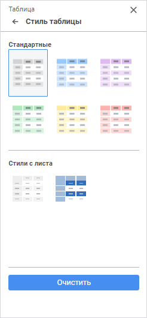
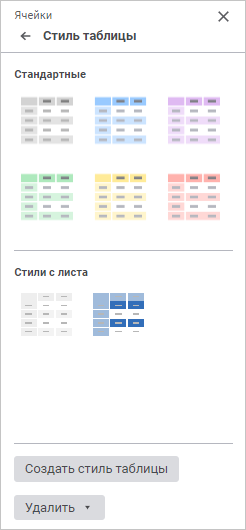
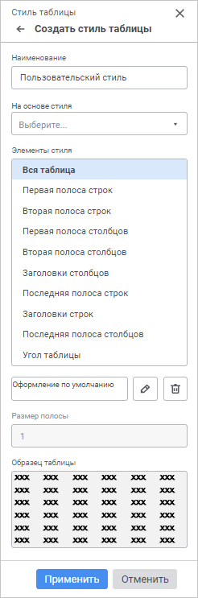
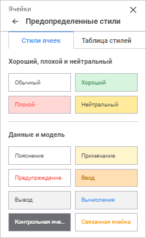
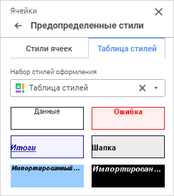

# Настройка стиля таблицы

Настройка стиля таблицы
-

# Настройка стиля таблицы

	Для настройки оформления произвольного диапазона ячеек предназначены
	 следующие группы параметров:

		- [Стиль
		 таблицы](#standard). Позволяет применить стандартный или пользовательский
		 стиль в виде таблицы с чередующимся оформлением строк/столбцов;

		- [Предопределённые
		 стили](#predefined). Позволяет применить стандартные стили ячеек
		 или стили из подключенной таблицы стилей.

	[Для открытия
	 групп параметров](javascript:TextPopup(this))

		Для открытия на панели параметров группы параметров «Стиль
		 таблицы» или «Предопределённые
		 стили»:

			- Выделите ячейку или диапазон ячеек.

			- Нажмите кнопку 
			 «Параметры» на панели
			 инструментов. Будет открыта панель параметров.

			- Выберите требуемый тип области в раскрывающемся меню
			 заголовка панели параметров.

			- Перейдите в группу параметров «Стиль
			 таблицы»/«Предопределённые
			 стили».

## Стиль таблицы

	Группа параметров «Стиль таблицы»
	 позволяет задать оформление диапазона ячеек на листе формы ввода с
	 помощью стандартных или пользовательских стилей в виде таблицы с чередующимся
	 оформлением строк/столбцов.

	Вид группы параметров отличается в зависимости от выбранного типа
	 области:

		Таблица Ячейки

			

			

	Примечание.
	 Стили с листа отображаются в группе параметров «Стиль
	 таблицы», если применен хотя бы один стиль оформления.

	Доступны следующие стили:

		- Стандартные. Предустановленные
		 стили без возможности редактирования;

		- Стили с листа. Все
		 стили, используемые на активном листе формы ввода для областей
		 «Таблица» и Ячейки».
		 Это могут быть как стандартные стили, так и стили, созданные пользователем.

	[Применение
	 стиля](javascript:TextPopup(this))

		Для применения стиля к ячейкам или таблице выберите один из
		 стандартных стилей или стилей с листа в группе параметров «Стиль таблицы». Доступны следующие
		 стандартные стили:

		

		Примечание.
		 На активном листе можно применить стили таблицы для нескольких
		 областей.

	[Создание
	 пользовательского стиля](javascript:TextPopup(this))

		Для создания пользовательского стиля таблицы:

			- Нажмите кнопку «Создать
			 стиль таблицы». Кнопка доступна в группе параметров
			 «Стиль таблицы» для
			 области «Ячейки».

			- Задайте необходимые настройки пользовательского стиля:

		

		Доступны следующие настройки:

				- На основе стиля.
				 В раскрывающемся списке выберите один из стандартных стилей
				 таблицы (Синий, Тёмно-синий и прочие). Выбранный стиль
				 скопируется в редактируемый;

				- Элементы стиля. Список содержит
				 все элементы стиля, для которых можно настроить параметры
				 оформления. При выборе элемента данного списка снизу будут
				 отображены его текущие настройки. Для изменения оформления
				 выбранного элемента стиля нажмите кнопку «Редактировать».
				 Будет открыта группа параметров «[Оформление элемента](../Common/Format.htm)»,
				 содержащая различные настройки оформления. Для установки
				 параметров оформления по умолчанию нажмите на кнопку «Удалить»;

				- Размер полосы. С
				 помощью редактора чисел или клавиатуры установите размер
				 полосы в строках;

				- Образец таблицы. В
				 данной области отображается внешний вид таблицы, который
				 она примет после применения установленных параметров.
				 Проверьте, соответствует ли внешний вид таблицы ожидаемому
				 результату.

	[Редактирование
	 пользовательского стиля](javascript:TextPopup(this))

		Для редактирования стиля выполните команду контекстного меню
		 «Редактировать» для изменяемого
		 стиля в стилях с листа. Будет открыта группа параметров «Создать стиль таблицы», содержащая
		 различные настройки стиля.

		Примечание.
		 Редактирование стиля доступно в группе параметров «Стиль
		 таблицы» для области «Ячейки».

		Стандартные стили, используемые в форме ввода, доступны для
		 редактирования в стилях с листа. После редактирования стиль становится
		 пользовательским.

	[Удаление
	 стиля](javascript:TextPopup(this))

		Для удаления одного стиля выберите команду «Удалить»
		 в контекстном меню этого стиля в группе параметров «Стиль
		 таблицы» в стилях с листа.

		В зависимости от выбранного типа области удаление возможно выполнить
		 следующими способами:

			- для области «Таблица».
			 Нажмите кнопку «Очистить».
			 Все стили, применённые к таблице, будут удалены из стилей
			 с листа. Если стили не применялись, кнопка будет не доступна;

			- для области «Ячейки».
			 Нажмите кнопку «Удалить».
			 Появится раскрывающийся список со следующими командами:

				- Удалить стиль выделенной
				 таблицы. Производит удаление стиля, применённого
				 к таблице с выделенными ячейками;

				- Удалить все стили
				 с листа. Производит удаление всех стилей, применённых
				 на активном листе.

		Примечание.
		 При удалении стилей таблиц настройки, заданные в группе параметров
		 «[Оформление](../../../uireport/Web/Table/Attribute/Format.htm)»,
		 сохраняются.

## Предопределённые стили

	Группа параметров «Предопределённые
	 стили» позволяет:

		- осуществить быструю настройку оформления выделенного диапазона
		 ячеек на листе формы ввода;

		- подключить к форме ввода [таблицу
		 стилей](UiNav.chm::/StylesTable/StylesTablePurpose.htm) и применить из неё стили для оформления
		 выделенного диапазона ячеек на листе формы ввода:

		 Вкладка
		 «Стиль ячеек» Вкладка
		 «Таблица стилей»

			

			Для применения стиля ячеек к выделенному диапазону ячеек
			 выберите один из стандартных стилей.

			

			Для применения стиля из таблицы стилей:

				- Выберите в раскрывающемся списке «Набор
				 стилей оформления» таблицу стилей. Выбранная таблица
				 стилей будет подключена к форме ввода. В группе параметров
				 будут отображены стили из подключённой таблицы стилей.

			Примечание.
			 К одной форме ввода можно применить только одну таблицу стилей.

				- Выберите требуемый стиль.

			В результате выполнения действий к форме ввода будет подключена
			 таблица стилей и для выделенного диапазона ячеек будет применён
			 выбранный стиль из таблицы.

			Для отключения таблицы стилей от формы ввода нажмите кнопку
			  «Очистить».
			 Появится информационное окно с подтверждением действия. При
			 отключении таблицы стилей применённые стили сохраняются.

См. также:

[Настройка
 оформления и вида отображения формы ввода](../Common/Design.htm) | [Таблица стилей](UiNav.chm::/StylesTable/StylesTablePurpose.htm)

		Справочная
		 система на версию 10.9
		 от 18/08/2025,
		 © ООО «ФОРСАЙТ»,
