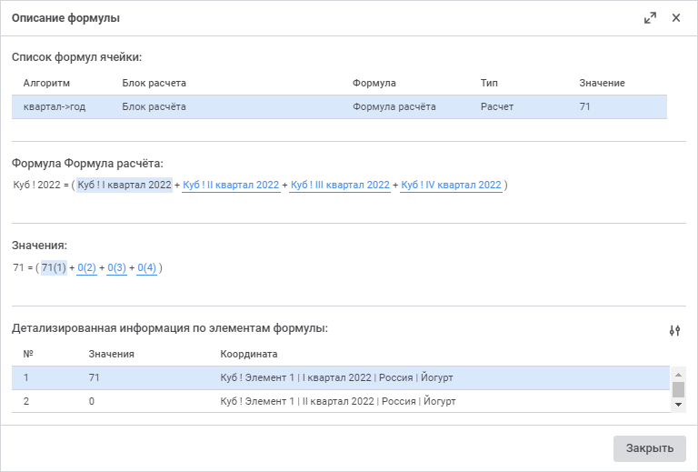

# Просмотр описания формулы

Просмотр описания формулы
-

# Просмотр описания формулы

При выделении ячейки, значение которой рассчитывается с помощью настроенного
 алгоритма, [выполняемого при
 изменении](../Table/Calculation_Practices.htm), в [строке формул](../Starting/Starting.htm#elements)
 будет отображена формула расчета. Если значение ячейки получено расчетом
 нескольких алгоритмов с несколькими блоками расчета или агрегации, то
 в строке формул будет выведена формула последнего рассчитанного алгоритма
 и последнего блока. Если в состав формулы входит операнд, который выводится
 в табличных областях формы ввода, то он отображается как адрес ячейки,
 на которую ссылается формула. Если в состав формулы входит операнд, который
 не выводится в табличных областях формы ввода, то он отображается значением.
 Операнды участвуют в формуле только если находятся на загруженных листах
 формы ввода. Если формула содержит циклические ссылки, то соответствующее
 предупреждение будет отображено в строке формул.

Примечание.
 Для актуализации данных при редактировании формы ввода выполните их [обновление](../Common/Refresh.htm).

Для просмотра детализированной информации по формуле расчёта используйте
 окно «Описание формулы»:

[Для открытия
 окна](javascript:TextPopup(this))

	Для открытия окна «Описание формулы»
	 выделите ячейку и:

		- выполните команду «Описание
		 формулы» контекстного меню ячейки;

		- нажмите кнопку  «Описание формулы» вкладки «Данные» панели инструментов;

		- выполните команду «Таблица
		 >  Описание формулы» главного меню.

Примечание.
 Окно «Описание формулы» доступно
 при [редактировании](../Starting/ConstructForm.htm) и [просмотре](FinishForm.htm)
 формы ввода.

В диалоге представлена информация:

	- Список формул ячейки.
	 Список алгоритмов с блоками расчёта. Если у ячейки задано несколько
	 алгоритмов с блоками расчёта или агрегации, то выводится последний,
	 с помощью которого было рассчитано окончательное значение в ячейке.
	 Данный алгоритм располагается первым в списке. Ниже отображаются все
	 алгоритмы с блоками контроля в порядке их применения. В списке выводится
	 наименование алгоритма, наименование блока, наименование формулы,
	 тип алгоритма расчета и полученное значение;

	- Формула «<Наименование формулы>».
	 Формула расчёта значения в ячейке, задана в виде: <Наименование
	 источника>[<Наименование элемента измерения>]. Если у всех
	 операндов формулы совпадает элемент измерения, то он не отображается
	 в формуле;

	- Значения. Формула с
	 подставленными значениями с порядковыми номерами;

	- Детализированная информация
	 по элементам формулы. Список значений с информацией:

		- Порядковый номер.
		 Порядковый номер значения, совпадающий с номером, указанным в
		 формуле со значениями;

		- Значение;

		- Координата. Наименование
		 источника и отметка по всем его измерениям.

При выделении значения в области «Формула»
 автоматически выделяется строка с детальной информацией по этому элементу
 в области «Детализированная информация
 по элементам формулы» и значение в области «Значение».
 При выделении строки с детальной информацией в области «Детализированная
 информация по элементам формулы» автоматически выделяется соответствующее
 значение в области «Формула» и
 значение в области «Значение».
 При выделении значения в области «Значение»
 автоматически выделяется соответствующее значение в области «Формула»
 и строка с детальной информацией по этому элементу в области «Детализированная
 информация по элементам формулы».

Для завершения просмотра описания формулы нажмите кнопку «Закрыть»
 или  «Закрыть».

Для повышения удобства работы с формулами в окне присутствует возможность
 выбора атрибутов справочников, отображаемых в формулах. Для этого:

	- Нажмите кнопку  «Настройки
	 отображения» над областью «Детализированная
	 информация по элементам формулы». Откроется окно «Настройки
	 отображения»:

	- Выберите из раскрывающихся списков столбца «Атрибут»
	 требуемый атрибут для каждого справочника из столбца «Измерения».
	 По умолчанию для всех измерений установлен атрибут «Наименование».

	- Нажмите кнопку «Сохранить»
	 для сохранения выбранных атрибутов. Заданные настройки атрибутов сохраняются
	 для конкретного пользователя.

Примечание.
 Для конкретного пользователя для каждого справочника запоминаются выбранные
 атрибуты. Сохранённые атрибуты измерений автоматически применяются во
 всех формах ввода, в которых используются измерения соответствующих справочников.

В результате в области «Формула»
 и в столбце «Координата» области
 «Детализированная информация по элементам
 формулы» для формул будут отображаться выбранные атрибуты справочников.

См. также:

[Начало
 работы с расширением «Интерактивные формы ввода данных» в веб-приложении](../Starting/Starting.htm) |
 [Работа с готовой формой ввода](../../Desktop/Work/FinishForm.htm)

		Справочная
		 система на версию 10.9
		 от 18/08/2025,
		 © ООО «ФОРСАЙТ»,
