# Расчёт итоговых значений: Форма ввода/вывода, веб-приложение

Расчёт итоговых значений: Форма ввода/вывода, веб-приложение
-

# Расчёт итоговых значений

	Расчёт итоговых значений таблицы по столбцам и/или строкам и настройка
	 их отображения выполняются с помощью группы параметров «Итоги
	 по строкам»/«Итоги по столбцам».

	[Для открытия
	 группы параметров](javascript:TextPopup(this))

			- Выделите таблицу, ячейку или диапазон ячеек, принадлежащих
			 таблице.

			- Выполните действие:

				- для отображения итогов по столбцам:

					- установите флажок «Итоги
					 по столбцам» раскрывающегося меню кнопки  «Итоги» вкладки «Данные» панели инструментов;

					- нажмите кнопку  «Настройка» рядом
					 с флажком «Итоги»
					 группы параметров «[Размещение](../Common/Layout.htm)»
					 для типа области «Боковик»;

					- выполните команду «Данные >
					  Итоги > Итоги по
					 столбцам» главного меню;

				- для отображения итогов по строкам:

					- установите флажок «Итоги
					 по строкам» раскрывающегося меню кнопки  «Итоги» вкладки «Данные» панели инструментов;

					- нажмите кнопку  «Настройка» рядом
					 с флажком «Итоги»
					 группы параметров «[Размещение](../Common/Layout.htm)»
					 для типа области «Шапка»;

					- для отображения итогов по столбцам и/или команду
					 «Данные >
					  Итоги > Итоги по
					 строкам» главного меню для отображения итогов
					 по строкам.

	Для отображения/скрытия итогов для данного измерения установите/снимите
	 флажок «[Отображать
	 итог](../Common/Layout.htm#dimensions)» в контекстном меню измерения.

	Для отображения итога для элемента измерения выполните команду «[Метод расчёта итогов](#element)»
	 контекстного меню элемента.

	Набор настроек в группах параметров «Итоги
	 по строкам» и «Итоги по столбцам»
	 идентичен:

	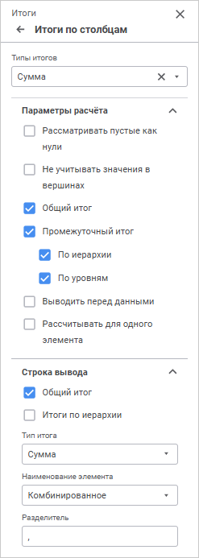

	Доступные настройки:

		- [Типы итогов](#types);

		- [Параметры расчёта](#parameters);

		- [Строка вывода](#output).

## Типы итогов

	Выберите из раскрывающегося списка «Типы
	 итогов» один или несколько требуемых типов итогов:

		- Сумма;

		- Среднее арифметическое;

		- Минимум;

		- Максимум;

		- Мода;

		- Медиана;

		- Дисперсия;

		- Среднеквадратическое отклонение;

		- Асимметрия;

		- Эксцесс;

		- Размах;

		- Коэффициент вариации;

		- Сумма квадратов;

		- Автокорреляция 1-го порядка;

		- Верхняя дециль;

		- Верхняя квартиль;

		- Нижняя квартиль;

		- Нижняя дециль;

		- Количество пустых ячеек;

		- Количество непустых ячеек.

	Итоговые значения выбранных типов будут автоматически рассчитаны.
	 Для сброса выбранных типов и скрытия итогов нажмите кнопку  «Очистить».

	[Примеры
	 итогов по столбцам и строкам](javascript:TextPopup(this))

		Пример итогов по столбцам:

		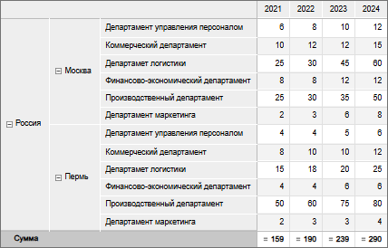

		Пример итогов по строкам:

		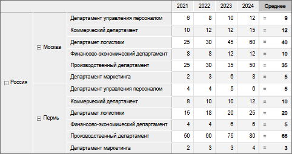

## Параметры расчёта

	После выбора [типов итоговых значений](#types) задайте
	 параметры их расчёта на вкладке «Параметры
	 расчёта»:

		- Рассматривать пустые как
		 нули. При установленном флажке пустые значения в ячейках
		 будут рассматриваться как нули. Это может быть важно, например,
		 при вычислении средних значений. По умолчанию флажок снят;

	Примечание.
	 Установка флажка не влияет на результат расчёта итоговых значений
	 типа «Количество пустых ячеек»
	 и «Количество непустых ячеек»,
	 а также на результат [расчёта базового
	 агрегата](status_string.htm) «Среднее» в строке
	 статуса.

		- Не учитывать значения в
		 вершинах. При установленном флажке не будут учитываться
		 значения родительских элементов иерархии. По умолчанию флажок
		 снят;

	Примечание.
	 Параметр рекомендуется использовать, если в родительские элементы
	 были [агрегированы данные](uinavobj.chm::/cube/agregation.htm)
	 из всех дочерних элементов.

		- Общий итог. При
		 установленном флажке отображаются общие итоговые значения по столбцам/строкам
		 таблицы, рассчитанные по всем элементам с установленной [отметкой](../Table/Select_dimension_elements.htm)
		 . По умолчанию флажок установлен;

	Примечание.
	 Если общий итог совпадает с промежуточным итогом по иерархии/уровням,
	 то рекомендуется отключить отображение общего итога во избежание дублирования
	 информации.

		- Промежуточный итог.
		 При установленном флажке отображаются итоговые значения, расположенные
		 по строкам/столбцам таблицы, в зависимости от состояния флажков:

			- По иерархии.
			 Итоги рассчитываются по [иерархии
			 измерений](uinavobj.chm::/reference_book/Master_RDS_reference_book/base_settings.htm#hierarchy) боковика/шапки таблицы по каждому
			 элементу с установленной [отметкой](../Table/Select_dimension_elements.htm);

			- По уровням.
			 Итоги рассчитываются по [уровням
			 измерений](uinavobj.chm::/reference_book/Master_RDS_reference_book/Level.htm) боковика/шапки таблицы по каждому
			 элементу с установленной [отметкой](../Table/Select_dimension_elements.htm).

	Флажки «По
	 иерархии», «По уровням»
	 актуальны, если в таблице отображаются элементы иерархического измерения
	 разных уровней иерархии.

	Примечание.
	 Если боковик/шапка таблицы состоит из нескольких иерархических измерений,
	 то при расчёте промежуточных итогов каждое следующее левое/верхнее
	 измерение берёт итог высшего уровня правого/нижнего измерения.

	В наименованиях итоговых элементов отображаются
	 наименования родительских элементов иерархии и/или наименования уровней
	 соответственно. Флажки «По иерархии»
	 и «По уровням» установлены
	 по умолчанию.

		- Выводить перед данными.
		 При установленном флажке итоговые значения отображаются перед
		 ячейками с данными. По умолчанию флажок снят;

		- Рассчитывать для одного
		 элемента. При установленном флажке дополнительно будут
		 рассчитываться итоговые значения для элементов по каждому уровню
		 и для элементов, содержащих один столбец/строку. По умолчанию
		 флажок снят.

	Примечание.
	 Если боковик/шапка табличной области состоит из нескольких иерархических
	 измерений, то при расчёте итоговых значений каждое следующее измерение
	 берёт итог высшего уровня правого/нижнего измерения.

	[Примеры
	 отображения итогов при различных параметрах расчёта](javascript:TextPopup(this))

		Рассмотрим таблицу с отображением итогов по столбцам:

		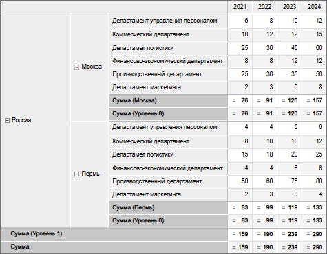

		Здесь установлены флажки «Общий
		 итог», «Промежуточный
		 итог», «По иерархии»
		 и «По уровням». Остальные
		 флажки сняты.

		Примеры отображения итогов в таблице:

			- при установке только флажков «Общий
			 итог», «Промежуточный
			 итог» и «По иерархии»:

		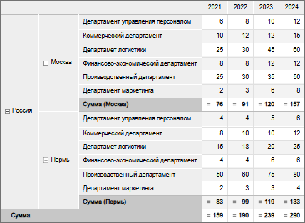

			- при установке только флажков «Общий
			 итог», «Промежуточный
			 итог» и «По уровням»:

		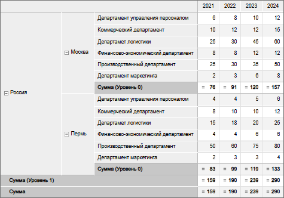

			- при установке флажка «Выводить
			 перед данными»:

		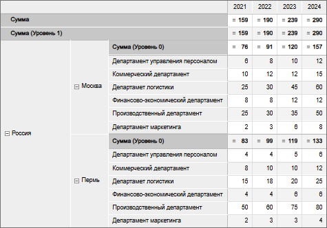

			- с пустыми ячейками для итоговых значений типа «Среднее арифметическое»
			 без установки флажка «Рассматривать
			 пустые как нули»:

		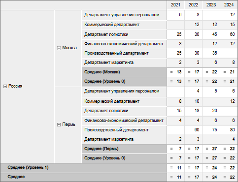

		При установке флажка «Рассматривать
		 пустые как нули»:

		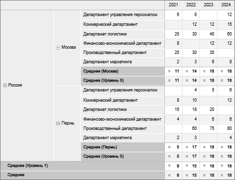

## Строка вывода

	Если в таблице отображаются элементы иерархического измерения разных
	 уровней иерархии, то для вывода общего итога и/или итога иерархии
	 в строку родительского элемента задайте параметры на вкладке «Строка вывода»:

		- Общий итог. При
		 установленном флажке в строку родительского элемента будет выводиться
		 общее итоговое значение. По умолчанию флажок снят;

		- Итоги по иерархии.
		 При установленном флажке в строку родительского элемента будут
		 выводиться итоговые значения по иерархии. По умолчанию флажок
		 снят;

		- Тип итога. Из раскрывающегося
		 списка выбирается один из [типов итогов](#types), применённых
		 к таблице. Параметр доступен, если установлен флажок «Общий
		 итог» и/или «Итоги по
		 иерархии»;

		- Наименование элемента.
		 Из раскрывающегося списка выбирается тип отображения наименования
		 родительского элемента:

			- Исходный элемент.
			 Выводится наименование исходного элемента;

			- Метод итога.
			 Выводится наименование метода итога;

			- Комбинированное.
			 По умолчанию. Выводятся наименования исходного элемента и
			 метода итога.

	Параметр доступен, если установлен флажок
	 «Общий итог» и/или «Итоги по иерархии»;

		- Разделитель. В поле
		 задаётся разделитель между наименованиями элемента и метода итога.
		 По умолчанию в качестве разделителя установлена запятая «,». Параметр
		 доступен, если установлен флажок «Общий
		 итог» и/или «Итоги по
		 иерархии» и выбран тип наименования «Комбинированное».

	[Примеры
	 отображения итогов в строке родительского элемента](javascript:TextPopup(this))

		Рассмотрим таблицу с отображением итогов по столбцам:

		

		Здесь установлены флажки «Общий
		 итог», «Промежуточный
		 итог», «По иерархии»
		 и «По уровням» на вкладке
		 «[Параметры
		 расчёта](#parameters)». Остальные флажки сняты.

		Примеры отображения итогов в строке родительского элемента:

			- при установке флажка «Общий
			 итог», типа итога «Сумма»,
			 наименования элемента «Комбинированное»
			 и разделителя «,»:

		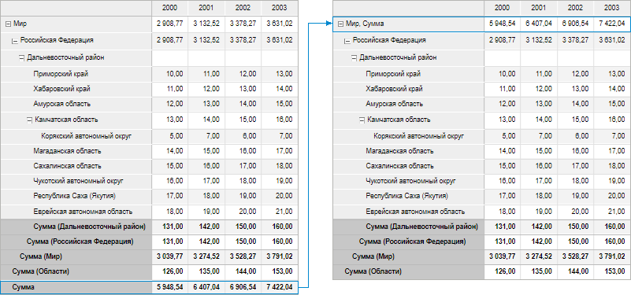

			- при установке флажка «Итоги
			 по иерархии», типа итога «Сумма»
			 и наименования элемента «Метод
			 итога»:

		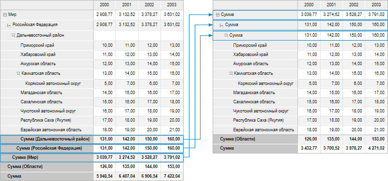

			- при установке флажков «Общий
			 итог» и «Итоги по
			 иерархии», типа итога «Сумма»
			 и наименования элемента «Исходный
			 элемент»:

		

## Итог для элемента измерения

	Для настройки метода расчёта итогов элемента измерения, для которого
	 настроен расчёт итогов, выполните команду «Метод
	 расчёта итогов» контекстного меню элемента и выберите метод:

		- Нет. Итог для элемента
		 не будет рассчитываться;

		- Сумма;

		- Среднее;

		- Минимум;

		- Максимум;

		- Мода;

		- Медиана;

		- Дисперсия.

	Выбрать можно только один метод.

	Команда доступна для элементов измерений в шапке таблицы, если рассчитываются
	 итоги по столбцам; для элементов измерений в боковике таблицы, если
	 рассчитываются итоги по строкам.

	При использовании своего метода расчёта для элемента название итоговых
	 значений измениться на «Итог».

	Для возврата метода расчёта измерения для элемента выполните команду
	 «Метод расчёта итогов» >
	 «Сбросить» контекстного меню
	 элемента.

См. также:

[Работа
 с готовой формой ввода](FinishForm.htm)

		Справочная
		 система на версию 10.9
		 от 18/08/2025,
		 © ООО «ФОРСАЙТ»,
