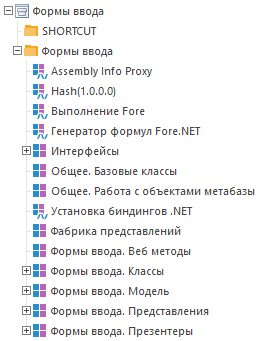

# Введение: API форм ввода

Введение: API форм ввода
-

# Введение в API форм ввода

В данном разделе представлено описание API, предназначенного для работы
 с расширением «[Интерактивные
 формы ввода данных](DataEntryForms.chm::/DataEntryForms_Purpose.htm)». API позволяет расширить функциональность
 форм ввода за счёт создания собственных макросов, которые будут использоваться
 при работе с листами и табличными областями.

## Подключение сборок

Для использования API форм ввода предварительно должно быть [установлено](Setup.chm::/Extensions/install_or_update_extensions.htm)
 само расширение «Интерактивные формы
 ввода данных». После установки в корневой папке репозитория будет
 создана папка «Компоненты», в которой будет доступен компонент форм ввода
 со следующим содержимым:

API форм ввода доступно для использования при создании макросов, которые
 в дальнейшем будут подключаться к [пользовательским
 кнопкам](DataEntryForms.chm::/Desktop/Custom_module/Advanced.htm#create). Создайте прикладной модуль и подключите следующие
 сборки из состава компонента форм ввода:

	- Общее. Базовые классы.
	 (Идентификатор ASM_INPUT_FORM_V3_COMMON_BASE_CLASSES).

	- Формы ввода. Классы.
	 (Идентификатор ASM_INPUT_FORM_V3_CLASSES).

	- Формы ввода. Модель.
	 (Идентификатор ASM_INPUT_FORM_V3_MODEL).

После этого в прикладном модуле будут доступны для использования [классы](../Class/DataEntryForm_Classes.htm), [интерфейсы](../Interface/DataEntryForm_Interfaces.htm)
 и [перечисления](../Enums/DataEntryForm_Enums.htm), представленные
 в описании.

Так как формы ввода имеют [зависимость](Setup.chm::/Extensions/install_or_update_extensions.htm)
 от компонента «Конструктор бизнес-приложений»,
 то в определённых ситуациях может потребоваться подключение сборок из
 состава этого компонента. Например, ряд базовых интерфейсов и классов
 содержатся в модуле «Базовые классы» (идентификатор UNIT_BASE_CLASSES).

## Структура прикладного макроса

Прикладной макрос должен быть реализован в глобальном пространстве имён
 и иметь следующую сигнатуру:

Sub <Name> (<Param>: IPrxReport);

End Sub;

или:

Function <Name> (<Param>: IPrxReport):
 <тип результата>;

End Function;

При нажатии на пользовательскую кнопку в параметре процедуры/функции
 будет доступен регламентный отчёт, связанный с формой ввода. Этот отчёт
 может быть передан в конструктор [DataEntryForm.CreateByReport](../Class/DataEntryForm/DataEntryForm.CreateByReport.htm)
 для создания экземпляра формы ввода и работы с ним в прикладном коде.
 Полученный экземпляр формы ввода приведите к интерфейсу [IDataEntryForm](../Interface/IDataEntryForm/IDataEntryForm.htm)
 для дальнейшей работы. После завершения работы для сохранения изменений
 вызовите один из доступных методов Save*
 интерфейса [IDataEntryForm](../Interface/IDataEntryForm/IDataEntryForm.htm).
 По завершению работы всего прикладного макроса вызовите метод [IDataEntryForm._Dispose](../Interface/IDataEntryForm/IDataEntryForm._Dispose.htm) для освобождения
 ресурсов.

См. также:

[Формы
 ввода. Ядро](../DataEntryFormsCore_Title.htm)

		Справочная
		 система на версию 10.9
		 от 18/08/2025,
		 © ООО «ФОРСАЙТ»,
