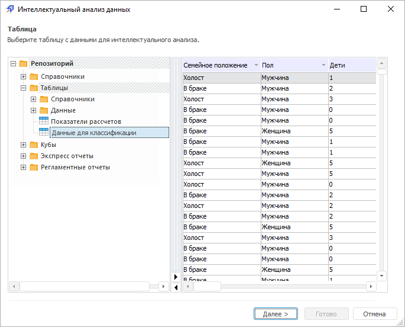

# Выбор данных для анализа

Выбор данных для анализа
-

# Выбор данных для анализа

В зависимости от того, откуда был [запущен
 интеллектуальный анализ данных](../DataMining_Starting.htm), возможны различные варианты выбора
 данных для анализа:

	- из инструмента отчётности продукта
	 «Форсайт. Аналитическая платформа»:

		- Аналитические панели.
		 Интеллектуальный анализ данных выполняется над данными, размещенными
		 в визуализаторе «Таблица»
		 (с учётом [отметки](UiSelection.chm::/Selection/Selection_of_the_dimension_elements.htm)
		 и [фильтрации](UiAnalyticalArea.chm::/Working_with_table_data/Filtering.htm));

		- Аналитические запросы (OLAP).
		 Интеллектуальный анализ данных выполняется над данными, размещенными
		 в области данных отчета (с учётом [отметки](UiSelection.chm::/Selection/Selection_of_the_dimension_elements.htm)
		 и [фильтрации](UiAnalyticalArea.chm::/Working_with_table_data/Filtering.htm));

		- Отчеты. Интеллектуальный
		 анализ данных выполняется над выделенным диапазоном данных, размещенных
		 в области данных отчета;

		- Анализ временных рядов.
		 Интеллектуальный анализ данных выполняется над данными, размещенными
		 на листе рабочей книги;

	- из объекта репозитория «Таблица».
	 Интеллектуальный анализ данных выполняется над данными, размещенными
	 в таблице;

	- из навигатора объектов.
	 В иерархическом дереве объектов репозитория выберите таблицу, содержащую
	 данные для анализа. Содержимое выбранной таблицы отображается для
	 просмотра:

Для продолжения работы с интеллектуальным
 анализом данных нажмите кнопку «Далее».

После выбора данных для анализа [выберите
 тип анализа](Methods/Performing_DataMining.htm).

См. также:

[Запуск
 и порядок работы](../DataMining_Starting.htm) | [Выбор
 типа анализа](Methods/Performing_DataMining.htm)

		Справочная
		 система на версию 10.9
		 от 18/08/2025,
		 © ООО «ФОРСАЙТ»,
