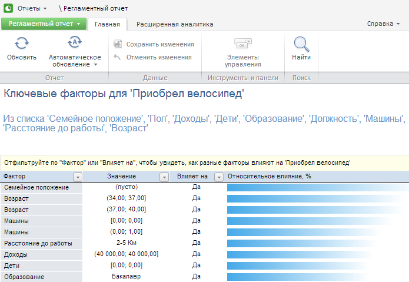
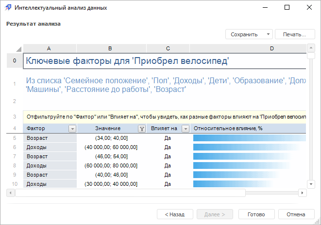

# Работа с результатами анализа

Работа с результатами анализа
-

# Работа с результатами анализа

После выполнения интеллектуального анализа данных доступен просмотр
 и выполнение различных операций над результатами анализа.

## В веб-приложении

В веб-приложении доступен просмотр результатов анализа в виде регламентного
 отчёта. Результаты анализа открываются на отдельной вкладке, аналогичной
 вкладке с результатами анализа в настольном приложении:

Над результатом анализа доступны операции:

[Сохранение](javascript:TextPopup(this))

	Для сохранения результатов анализа выполните команду «Регламентный
	 отчет > Сохранить как» в главном меню. В открывшемся окне
	 укажите расположение, имя и уникальный идентификатор сохраняемого
	 отчёта. Если идентификатор не указан, он создается автоматически при
	 сохранении.

	Важно.
	 Идентификатор может состоять только из букв латинского алфавита, цифр
	 и знака «_» и не должен начинаться с цифр.

[Экспорт](javascript:TextPopup(this))

	Для экспорта результатов анализа во внешние форматы выполните команду
	 «Регламентный отчет > Экспорт»
	 в главном меню и выберите формат:

		- книга Excel 97-2003 (*.xls);

		- книга Excel (*.xlsx);

		- документ PDF (*.pdf);

		- документ в формате RTF (*.rtf);

		- презентация PowerPoint (*.pptx);

		- веб-страница (*.html);

		- веб-страница, архив в одном файле (*.mht);

		- изображение (*.emf).

	Подробное описание возможности приведено в разделе «[Экспорт регламентного отчёта](UiReport.chm::/desktop/Reports/OperationReport/UiReport_Reports_Operation_Export.htm)».

[Печать](javascript:TextPopup(this))

	Для печати результатов анализа выполните команду «Регламентный
	 отчет > Печать» в главном меню. Будет открыта страница для
	 предварительного просмотра и печати отчета. Внешний вид страницы и
	 порядок работы зависит от используемого браузера.

[Публикация в
 социальных сетях](javascript:TextPopup(this))

	Для публикации результатов анализа в социальные сети выполните команду
	 «Регламентный отчет > Поделиться»
	 в главном меню и выберите социальную сеть:

		- LiveJournal;

		- Google+.

	Подробное описание возможности приведено в разделе «[Публикация
	 в социальных сетях](UiNav.chm::/GUI/Format/Publishing.htm)».

## В настольном приложении

Вид страницы «Результат анализа»
 зависит от [типа выполняемого
 анализа данных](Methods/Performing_DataMining.htm):

Над результатом анализа доступны операции:

[Сохранение](javascript:TextPopup(this))

	Для сохранения результата анализа нажмите кнопку «Сохранить».
	 В открывшемся меню выберите вариант сохранения результатов анализа:

		- В новый отчет. Результаты
		 выгружаются в новый регламентный отчет;

		- На новый лист. Вариант
		 доступен только для регламентного отчета. Результаты выгружаются
		 на новые листы в отчете;

		- В файл. Результаты
		 выгружаются в файл в формате *.xls с результатами анализа;

		- В источник. Вариант
		 доступен только для метода анализа «[Заполнение по шаблону](Methods/DataMining_PatternSubst.htm)»
		 во всех инструментах, кроме «Аналитических
		 панелей». Данные, которые были получены в результате заполнения,
		 выгружаются в источник данных. Перед выгрузкой будет запрошено
		 подтверждение выполняемого действия. К выгруженным данным будет
		 применено оформление, установленное для измененных данных. Обратите
		 внимание, что выполняется только выгрузка данных, сохранение данных
		 должно выполняться пользователем.

	Примечание.
	 Выгрузка данных в источник доступна, если у пользователя есть соответствующие
	 права. Выгрузка данных в источник, являющийся регламентным отчетом,
	 доступна, если регламентный отчет открыт в режиме редактирования.

[Печать](javascript:TextPopup(this))

	Для печати результатов анализа нажмите кнопку «Печать».
	 Будет открыто окно печати отчета.

См. также:

[Выбор
 данных для анализа](DataMining_Master1_Table.htm)

		Справочная
		 система на версию 10.9
		 от 18/08/2025,
		 © ООО «ФОРСАЙТ»,
