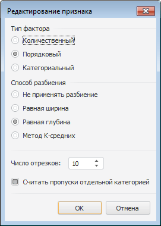

# Редактирование признака

Редактирование признака
-

# Редактирование признака

Редактирование признака применяется для преобразования вещественных
 входных данных в категориальные в следующих видах анализа:

	- [кластеризация](Methods/DataMining_CategDetect.htm)
	 (для [метода
	 К-мод](lib.chm::/06_datamining/lib_kmodes.htm));

	- [поиск исключений](Methods/DataMining_ExceptionSearch.htm);

	- [заполнение по
	 шаблону](Methods/DataMining_PatternSubst.htm) (для методов «[Дерево решений](lib.chm::/06_datamining/lib_decisiontree.htm)»
	 и «[Логистическая
	 регрессия](lib.chm::/06_datamining/lib_logisticregr.htm)», «Ансамбли деревьев решений»);

	- [ключевые факторы](Methods/DataMining_KeyInf.htm).

Примечание.
 Редактирование признака доступно только в настольном приложении.

Для задания настроек редактирования признака или фактора, влияющего
 на анализируемый признак, используйте диалог «Редактирование
 признака»:

Задайте следующие параметры:

	- Тип фактора. Определите
	 тип фактора, влияющего на анализируемый признак:

		- Количественный.
		 Набор данных, элементы которого можно упорядочить, и между которыми
		 можно найти расстояние. Например, расход топлива автомобилей.
		 Можно упорядочить и сказать, у кого больше, а у кого меньше;

		- Порядковый. Набор
		 данных, элементы которого можно упорядочить, но между которыми
		 нельзя найти расстояние. Например, статус заказа в Интернет-магазине:
		 обрабатывается платеж (0), товар отправлен (1), товар доставляется
		 (2), товар доставлен (3), товар получен (4), открыт спор (5),
		 спор закрыт (6). Порядок понятен, а найти расстояние между элементами
		 такого массива нельзя;

		- Категориальный.
		 Набор данных, элементы которого нельзя упорядочить, и между которыми
		 нельзя найти расстояние. Например, что обычно едят на завтрак
		 люди из выборки: бутерброд, каша, яичница и т.д. Ни упорядочить,
		 ни найти расстояние между элементами массива нельзя;

Примечание.
 Выбор типа фактора доступен только для метода «[Ансамбли
 деревьев решений](Methods/DataMining_PatternSubst.htm)».

	- Способ разбиения. Определите
	 способ разбиения входного массива данных:

		- Не применять разбиение.
		 Массив данных не будет разбит на группы;

		- Равная ширина. Массив
		 данных будет разбит на отрезки равной ширины;

		- Равная глубина.
		 Массив данных будет разбит на отрезки, содержащие равное число
		 значений;

		- Метод К-средних.
		 Массив данных будет разбит на отрезки с помощью метода [К-средних](Lib.chm::/04_Other_models/Lib_kMeans.htm);

	- Число отрезков. Задайте
	 число отрезков, на которое требуется разбить массив данных;

	- Считать пропуски отдельной
	 категорией. Определите, будут ли пропуски в данных считаться
	 отдельной категорией. По умолчанию флажок установлен и пропуски выделяются
	 в отдельную категорию.

Примечание.
 Параметр «Считать пропуски отдельной
 категорией» присутствует только при настройке фактора.

См. также:

[Выбор
 типа анализа](Methods/Performing_DataMining.htm)

		Справочная
		 система на версию 10.9
		 от 18/08/2025,
		 © ООО «ФОРСАЙТ»,
