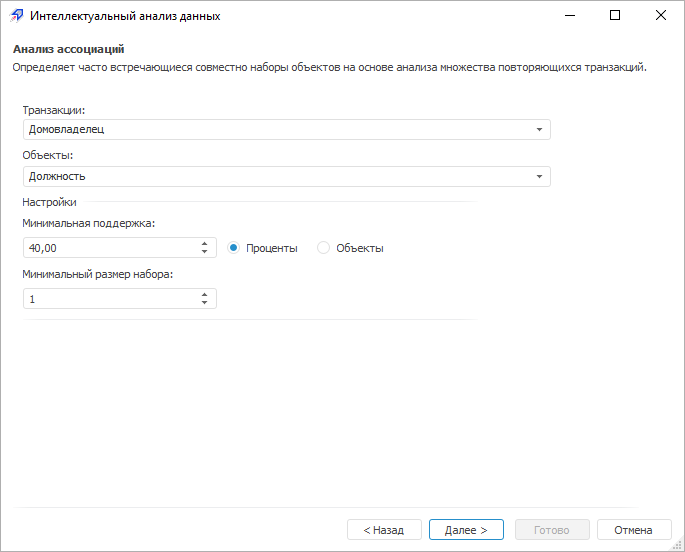
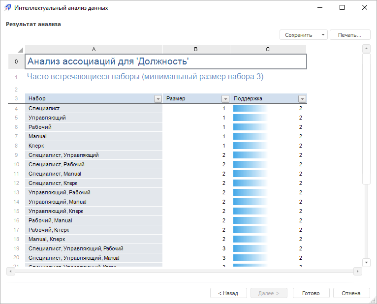

# Анализ «Анализ ассоциаций»

Анализ «Анализ ассоциаций»
-

# Анализ «Анализ ассоциаций»

Данный вид анализа определяет часто встречающиеся совместно наборы элементов
 на основе анализа множества повторяющихся транзакций.

Другими словами, целью анализа является установление следующих зависимостей:
 если в транзакции встретился некоторый набор элементов X,
 то на основании этого можно сделать вывод о том, что другой набор элементов
 Y также же должен появиться в
 этой транзакции. Установление таких зависимостей дает возможность находить
 очень простые и интуитивно понятные правила.

Для работы с анализом «Анализ ассоциаций»:

	- [Выберите данные для
	 анализа](../DataMining_Master1_Table.htm).

Примечание.
 Для расчёта метода [выбранные
 данные](../DataMining_Master1_Table.htm) должны содержать минимум один признак и одно наблюдение не
 считая заголовков. Если в качестве источника данных выступает:

   - регламентный отчет.
 Заголовками является первая строка в выбранном диапазоне;

   - рабочая книга.
 Заголовками являются имена рядов;

   - экспресс отчет,
 аналитическая панель, таблица
 данных. Заголовками являются заголовки столбцов.

	- [Выберите вид анализа](Performing_DataMining.htm).

	- Настройте параметры анализа:

В окне доступны следующие операции:

[Выбор
 данных транзакций](javascript:TextPopup(this))

	В раскрывающемся списке «Транзакции»
	 выберите столбец таблицы с данными транзакций, на основе которых будет
	 выполнен анализ.

[Выбор
 данных для анализа](javascript:TextPopup(this))

	В раскрывающемся списке «Объекты»
	 выберите столбец таблицы с данными, для которых будет выполнен анализ.

[Настройка
 дополнительных параметров](javascript:TextPopup(this))

	Задайте дополнительные параметры анализа
	 ассоциаций:

		-

			- Минимальная поддержка.
			 Задайте уровень поддержки ассоциаций. Под поддержкой понимается
			 сочетание наборов в транзакции. Установите переключатель,
			 определяющий в виде чего задается данный параметр:

			-

				- Проценты.
				 Уровень поддержки задается в процентах. Значение по умолчанию
				 «10%»;

				- Объекты.
				 Уровень поддержки задается в объектах. Значение по умолчанию
				 «1 объект»;

			- Минимальный размер
			 набора. Задайте минимальный размер набора ассоциаций.
			 Например, сколько раз встречается определенный продукт в транзакции.

	Совет.
	 Значение параметра «Минимальная поддержка»
	 выбирается таким образом, чтобы ограничить количество найденных ассоциаций.
	 Если поддержка имеет большое значение, то алгоритмы будут находить
	 ассоциации, хорошо известные аналитикам или настолько очевидные, что
	 нет никакого смысла проводить такой анализ. С другой стороны, низкое
	 значение поддержки ведет к генерации огромного количества ассоциаций,
	 что, конечно, требует существенных вычислительных ресурсов. Тем не
	 менее, большинство интересных ассоциаций находится именно при низком
	 значении порога поддержки. Хотя слишком низкое значение поддержки
	 ведет к генерации статистически необоснованных ассоциаций.

Для перехода к следующей странице мастера
 нажмите кнопку «Далее».

	- Выполните необходимые действия над результатами анализа.

Результаты анализа можно сохранить в файл,
 распечатать или вставить на лист регламентного отчёта. Более подробные
 сведения приведены в разделе «[Работа
 с результатами анализа](../DataMining_Result.htm)».

Пример результатов анализа «Анализ
 ассоциаций»:

Если во время выполнения анализа возникли
 предупреждения, то будет отображена дополнительная вкладка «[Предупреждения](../Warnings.htm)».

См. также:

[Выбор
 типа анализа](Performing_DataMining.htm) | [Анализ ассоциаций](lib.chm::/06_datamining/lib_assosiation.htm)
 | [ISmAssociationRules](statlib.chm::/interface/ismassociationrules/ismassociationrules.htm)

		Справочная
		 система на версию 10.9
		 от 18/08/2025,
		 © ООО «ФОРСАЙТ»,
