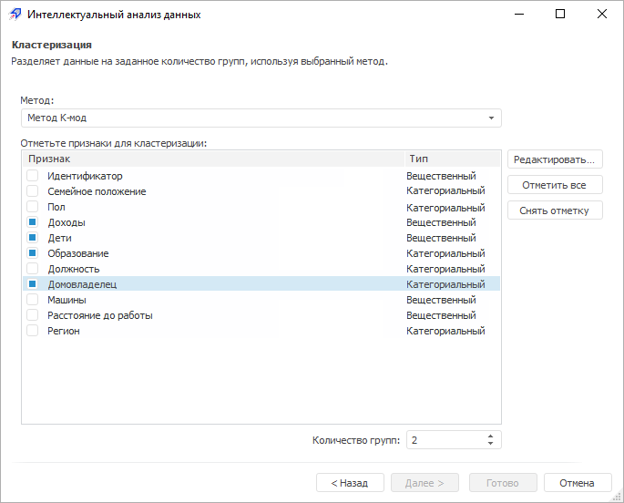
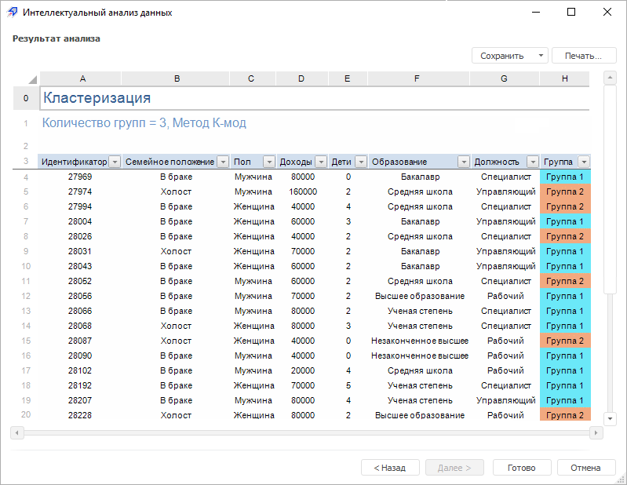

# Анализ «Кластеризация»

Анализ «Кластеризация»
-

# Анализ «Кластеризация»

Данный вид анализа разделяет данные на заданное количество групп, используя
 выбранный метод кластеризации.

Для работы с анализом «Кластеризация»:

	- [Выберите данные для
	 анализа](../DataMining_Master1_Table.htm).

Примечание.
 Для расчёта метода [выбранные
 данные](../DataMining_Master1_Table.htm) должны содержать минимум один признак и три наблюдения не считая
 заголовков. Если в качестве источника данных выступает:

   - регламентный отчет.
 Заголовками является первая строка в выбранном диапазоне;

   - рабочая книга.
 Заголовками являются имена рядов;

   - экспресс отчет,
 аналитическая панель, таблица
 данных. Заголовками являются заголовки столбцов.

	- [Выберите вид анализа](Performing_DataMining.htm).

	- Настройте параметры анализа:

В окне доступны следующие операции:

[Выбор
 метода группировки данных](javascript:TextPopup(this))

	В раскрывающемся списке выберите метод
	 группировки данных:

			- Метод К-мод.
			 Данные разбиваются на небольшое число категорий (до 10) таким
			 образом, чтобы расстояние между группами было сведено к минимуму.
			 Метод работает на категориальных значениях;

			- Самоорганизующиеся
			 карты Кохонена. Данный метод группирует объекты с помощью
			 нейронной сети Кохонена. Используется обучение без учителя,
			 то есть результат зависит только от структуры входных данных.
			 Метод работает на числовых значениях.

[Задание
 признаков для кластеризации](javascript:TextPopup(this))

	Отметьте флажками те столбцы таблицы
	 данных, значения в которых необходимо разбить на группы:

			- для отметки всех столбцов нажмите кнопку «Отметить
			 все»;

			- для снятия отметки со всех столбцов нажмите кнопку «Снять отметку».

[Задание
 количества групп](javascript:TextPopup(this))

	С помощью редактора чисел или клавиатуры
	 задайте количество групп, на которое будут разбиты значения.

[Редактирование
 признака](javascript:TextPopup(this))

	Если необходимо, отредактируйте выбранный для
	 анализа признак. Для этого нажмите кнопку «Редактировать».
	 Будет открыто окно «[Редактировать признак](../Edit_Attribute.htm)».

	Примечание.
	 Редактирование признака для кластеризации доступно только в настольном
	 приложении для метода K-мод.

Для перехода к следующей странице мастера
 нажмите кнопку «Далее».

	- Выполните необходимые действия над результатами анализа.

Результаты анализа можно сохранить в файл,
 распечатать или вставить на лист регламентного отчета. Более подробные
 сведения приведены в разделе «[Работа
 с результатами анализа](../DataMining_Result.htm)».

Пример результатов анализа «Кластеризация»:

Если во время выполнения анализа возникли
 предупреждения, то будет отображена дополнительная вкладка «[Предупреждения](../Warnings.htm)».

См. также:

[Выбор
 типа анализа](Performing_DataMining.htm) | [Самоорганизующиеся
 карты Кохонена](lib.chm::/06_datamining/lib_som.htm) | [Кластеризация методом
 К-мод](lib.chm::/06_datamining/lib_kmodes.htm) | [ISmKmeansClusterAnalysis](statlib.chm::/interface/ismkmeansclusteranalysis/ismkmeansclusteranalysis.htm)
 | [ISmSelfOrganizingMap](statlib.chm::/interface/ismselforganizingmap/ismselforganizingmap.htm)

		Справочная
		 система на версию 10.9
		 от 18/08/2025,
		 © ООО «ФОРСАЙТ»,
