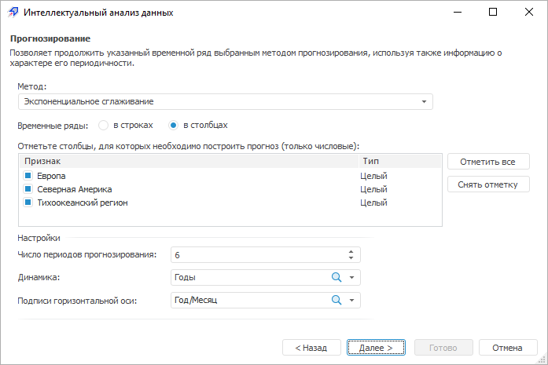
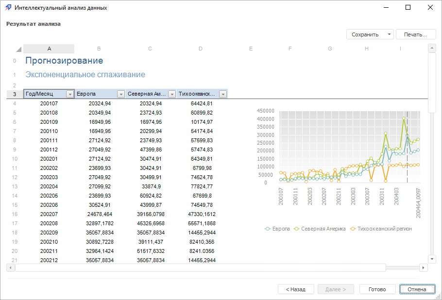

# Анализ «Прогнозирование»

Анализ «Прогнозирование»
-

# Анализ «Прогнозирование»

Данный вид анализа позволяет продолжить указанный временной ряд выбранным
 методом прогнозирования, используя также информацию о характере его периодичности.

Примечание.
 Вид анализа «Прогнозирование»
 доступен для всех инструментов продукта «Форсайт. Аналитическая платформа»,
 кроме инструмента анализа временных рядов.

Для работы с анализом «Прогнозирование»:

	- [Выберите данные для
	 анализа](../DataMining_Master1_Table.htm).

Примечание.
 Для расчёта метода [выбранные
 данные](../DataMining_Master1_Table.htm) должны содержать минимум один признак и два наблюдения не считая
 заголовков. Если в качестве источника данных выступает:

   - регламентный отчет.
 Заголовками является первая строка или столбец в выбранном диапазоне;

   - экспресс отчет,
 аналитическая панель, таблица
 данных. Заголовками являются заголовки строк или столбцов.

Откуда будут браться заголовки (из строк или из столбцов), зависит от переключателя
 «Временные ряды».

	- [Выберите вид анализа](Performing_DataMining.htm).

	- Настройте параметры анализа:

В окне доступны следующие операции:

[Выбор
 метода прогнозирования](javascript:TextPopup(this))

	Все методы прогнозирования работают на
	 числовых значениях. Доступные методы:

			- Грей-метод.
			 Подходит для прогнозирования поведения нелинейных временных
			 рядов. Данный метод относится к нестатистическим методам прогнозирования
			 и особенно эффективен в условиях недостаточного числа наблюдений;

			- Подбор формы зависимости.
			 Позволяет исключить из временного ряда сезонную составляющую
			 и построить теоретический временной ряд, в основе которого
			 лежит математически-выраженная закономерность изменения;

			- Экспоненциальное сглаживание.
			 Является одним из наиболее распространенных приемов выравнивания
			 и прогнозирования широкого класса временных рядов. В его основе
			 лежит расчет экспоненциальных средних.

[Выбор
 положения временных рядов](javascript:TextPopup(this))

	В группе «Временные
	 ряды» выберите положение рядов:

			- В строках. Установите
			 переключатель, если временные ряды расположены в строках;

			- В
			 столбцах. Установите переключатель, если временные
			 ряды расположены в столбцах.

[Выбор
 столбцов/строк](javascript:TextPopup(this))

	Отметьте флажками те столбцы таблицы,
	 которые содержат временные ряды, требующие построения прогноза:

			- для отметки всех столбцов нажмите кнопку «Отметить
			 все»;

			- для снятия отметки со всех столбцов нажмите кнопку «Снять отметку»;

	Примечание.
	 Отмеченные столбцы таблицы данных должны содержать только числовые
	 значения.

[Настройка
 параметров прогнозирования](javascript:TextPopup(this))

	В области «Настройки»
	 укажите параметры прогнозирования значений временных рядов:

		-

			- Число периодов прогнозирования.
			 Задайте число периодов, на котором будет выполнен прогноз
			 значений;

			- Динамика. Укажите
			 календарную динамику временного ряда, для которого выполняется
			 прогноз. Параметр недоступен, если для прогнозирования выбран
			 Грей-метод;

			- Подписи горизонтальной
			 оси. Укажите столбец, значения которого будут использованы
			 в качестве подписей горизонтальной оси на графике с результатами
			 прогнозирования.

Для перехода к следующей странице мастера
 нажмите кнопку «Далее».

	- Выполните необходимые действия над результатами анализа.

Результаты анализа можно сохранить в файл,
 распечатать или вставить на лист регламентного отчёта. Более подробные
 сведения приведены в разделе «[Работа
 с результатами анализа](../DataMining_Result.htm)».

Пример результатов анализа «Прогнозирование»:

Если во время выполнения анализа возникли
 предупреждения, то будет отображена дополнительная вкладка «[Предупреждения](../Warnings.htm)».

См. также:

[Выбор
 типа анализа](Performing_DataMining.htm) | [Грей-метод](lib.chm::/02_time_series_analysis/grey.htm)
 | [Экспоненциальное
 сглаживание](Lib.chm::/02_Time_series_analysis/UiModelling_ExpSmooth.htm)

		Справочная
		 система на версию 10.9
		 от 18/08/2025,
		 © ООО «ФОРСАЙТ»,
