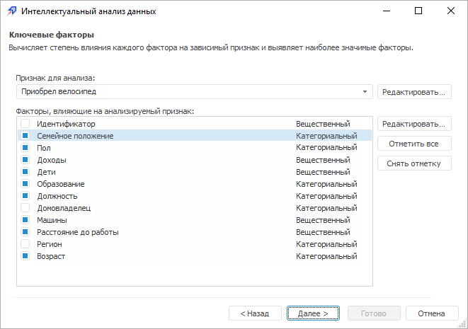
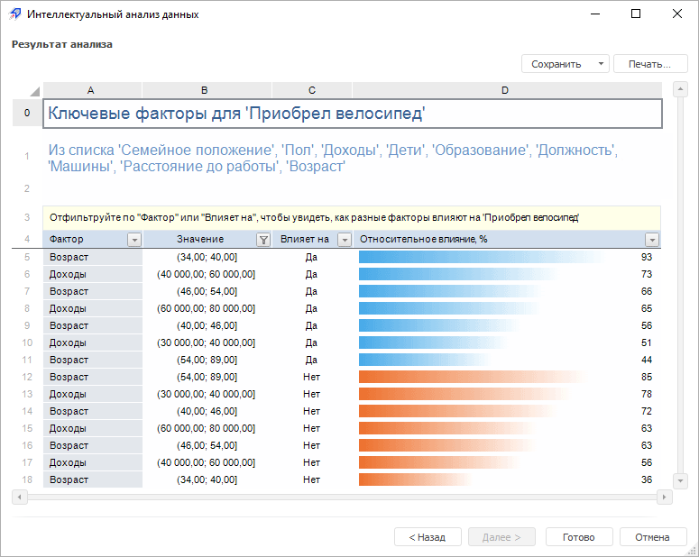

# Анализ «Ключевые факторы»

Анализ «Ключевые факторы»
-

# Анализ «Ключевые факторы»

Данный вид анализа вычисляет степень влияния каждого фактора на зависимый
 признак и выявляет наиболее значимые факторы.

Метод работает только с категориальными, то есть нечисловыми данными:
 текст или значения True/False. Числовые входные данные будут преобразованы
 в категориальные с помощью процедуры [Binning](../../DataMining_Intro.htm#binning).

Для работы с анализом «Ключевые факторы»:

	- [Выберите данные для
	 анализа](../DataMining_Master1_Table.htm).

Примечание.
 Для расчёта метода [выбранные
 данные](../DataMining_Master1_Table.htm) должны содержать минимум один признак и одно наблюдение не
 считая заголовков. Если в качестве источника данных выступает:

   - регламентный отчет.
 Заголовками является первая строка в выбранном диапазоне;

   - рабочая книга.
 Заголовками являются имена рядов;

   - экспресс отчет,
 аналитическая панель, таблица
 данных. Заголовками являются заголовки столбцов.

	- [Выберите вид анализа](Performing_DataMining.htm).

	- Настройте параметры анализа:

В окне доступны следующие операции:

[Выбор
 признака для анализа](javascript:TextPopup(this))

	В раскрывающемся списке выберите столбец
	 таблицы со значениями зависимой переменной, для которой будут оцениваться
	 зависимости.

[Задание
 факторов, влияющих на анализируемый признак](javascript:TextPopup(this))

	Отметьте флажками те факторы, влияние
	 которых на зависимую переменную должно быть оценено:

			- для отметки всех факторов нажмите кнопку «Отметить
			 все»;

			- для снятия отметки со всех факторов нажмите кнопку
			 «Снять отметку».

[Редактирование
 признака и факторов](javascript:TextPopup(this))

Для редактирования анализируемого признака или выбранного фактора, влияющего
 на анализируемый признак, нажмите кнопку «Редактировать»,
 расположенную напротив раскрывающегося списка со значениями зависимой
 переменной или напротив списка факторов, влияющих на зависимую переменную,
 соответственно. Будет открыто окно «[Редактировать признак](../Edit_Attribute.htm)».

	Примечание.
	 Редактирование анализируемого признака или выбранного фактора, влияющего
	 на анализируемый признак, доступно только в настольном приложении.

Для перехода к следующей странице мастера
 нажмите кнопку «Далее».

	- Выполните необходимые действия над результатами анализа.

Результаты анализа можно сохранить в файл,
 распечатать или вставить на лист регламентного отчёта. Более подробные
 сведения приведены в разделе «[Работа
 с результатами анализа](../DataMining_Result.htm)».

Пример результатов анализа «Ключевые
 факторы»:

Если во время выполнения анализа возникли
 предупреждения, то будет отображена дополнительная вкладка «[Предупреждения](../Warnings.htm)».

См. также:

[Выбор
 типа анализа](Performing_DataMining.htm) | [Наивный байесовский
 классификатор](lib.chm::/06_datamining/lib_naivebayes.htm) | [ISmNaiveBayes](statlib.chm::/interface/ismnaivebayes/ismnaivebayes.htm)

		Справочная
		 система на версию 10.9
		 от 18/08/2025,
		 © ООО «ФОРСАЙТ»,
