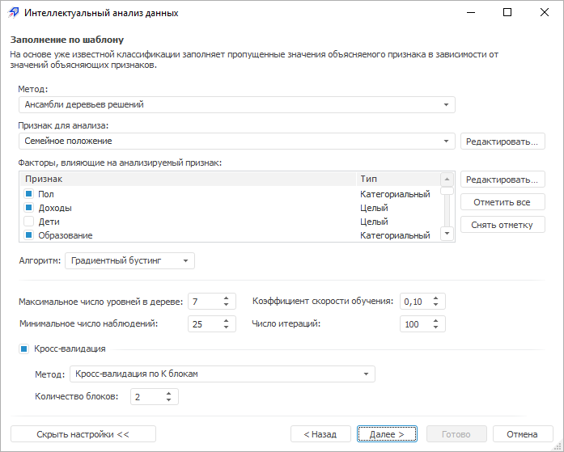
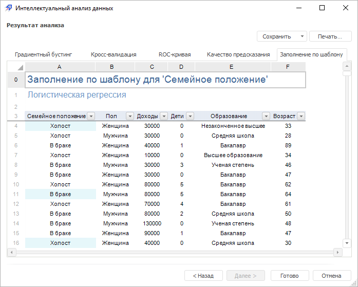
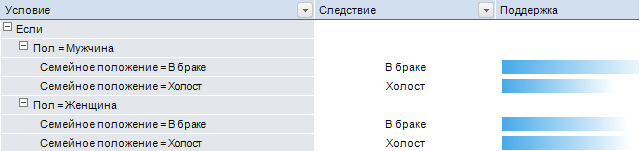
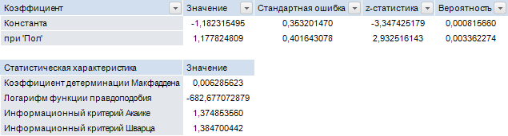
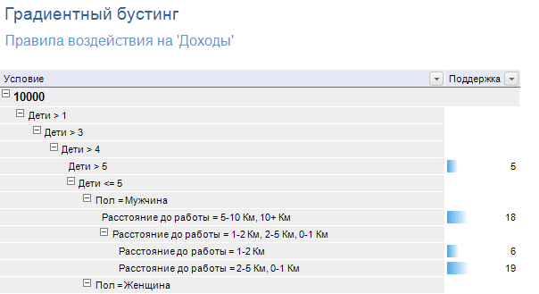
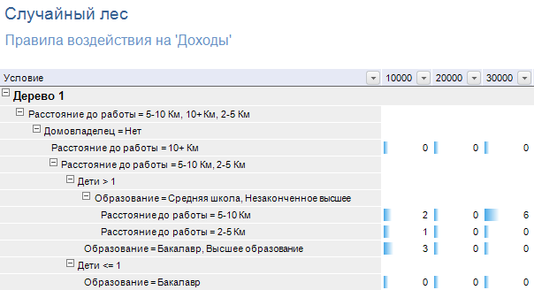
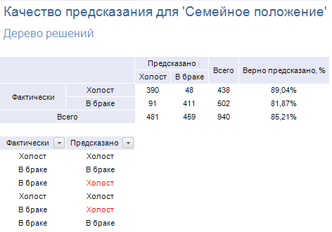
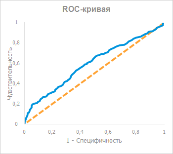
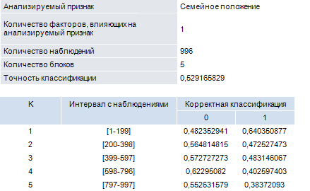

# Анализ «Заполнение по шаблону»

Анализ «Заполнение по шаблону»
-

# Анализ «Заполнение по шаблону»

Данный вид анализа заполняет пропущенные значения объясняемого признака
 в зависимости от значений объясняющих признаков на основе имеющейся классификации.

Для работы с анализом «Заполнение по
 шаблону»:

	- [Выберите данные для
	 анализа](../DataMining_Master1_Table.htm).

Примечание.
 Для расчёта метода [выбранные
 данные](../DataMining_Master1_Table.htm) должны содержать минимум один признак и два наблюдения не считая
 заголовков. Если в качестве источника данных выступает:

     • Регламентный
 отчет. Заголовками является первая строка в выбранном диапазоне;

     • Рабочая
 книга. Заголовками являются имена рядов;

     • Экспресс
 отчет, аналитическая панель,
 таблица данных. Заголовками являются
 заголовки столбцов.

	- [Выберите вид анализа](Performing_DataMining.htm).

	- Настройте параметры анализа. По умолчанию отображаются только
	 основные настройки анализа. Для отображения всех настроек нажмите
	 кнопку «Показать настройки»:

В окне доступны следующие операции:

[Выбор
 метода заполнения](javascript:TextPopup(this))

	В раскрывающемся списке выберите метод
	 заполнения пропущенных значений:

			- Дерево решений.
			 Метод на основе данных выстраивает иерархическое дерево правил,
			 где каждому объекту соответствует единственный узел, дающий
			 решение. Под правилом понимается логическая конструкция, представленная
			 в виде «если …, то …». Метод работает на категориальных значениях;

	Примечание.
	 Для увеличения производительности и ускорения [сохранения](../DataMining_Result.htm#saveresults)
	 значений, полученных с помощью данного метода, убедитесь, что таблица,
	 в которую будут сохранены данные, содержит [первичный
	 индекс](UiNavObj.chm::/Table/Master/UiDb_relational_table_master_Index.htm). Для определения первичного индекса установите
	 флажок «[Первичный ключ](UiNavObj.chm::/Table/Master/UiDb_relational_table_master_Index.htm#index_prop)»
	 в свойствах индекса.

			- Логистическая регрессия.
			 Метод применяется, если требуется предсказать вероятность
			 наступления некоего события на основе ряда признаков. Например,
			 если требуется предсказать наличие заболевания у пациента
			 на основе пола и возраста. Столбец для анализа должен содержать
			 бинарные данные;

			- Сеть обратного распространения.
			 Метод использует для заполнения пропусков нейронную сеть обратного
			 распространения. В данной сети применяется алгоритм обучения,
			 в котором ошибка распространяется от выходного слоя к входному,
			 т. е. в направлении, противоположном направлению
			 распространения сигнала при нормальном функционировании сети.
			 Метод работает на числовых значениях;

			- Ансамбли деревьев решений.
			 Метод использует результаты, полученные различными деревьями
			 решений или одним деревом решений, но построенного по разным
			 параметрам. Из деревьев формируется ансамбль и находится итоговое
			 коллективное решение.

[Выбор
 признака для анализа](javascript:TextPopup(this))

	В раскрывающемся списке выберите столбец
	 таблицы, в котором необходимо заполнить пропуски. Если признак для
	 анализа не содержит пропусков, будет выдано информационное сообщение.

	Примечание.
	 Для метода «Логистическая регрессия»
	 выбранный признак для анализа должен быть бинарным.

[Задание
 факторов, влияющих на анализируемый признак](javascript:TextPopup(this))

	Отметьте флажками факторы, на основе
	 которых будут заполняться пропуски в анализируемом столбце:

			- для отметки всех факторов нажмите кнопку «Отметить
			 все»;

			- для снятия отметки со всех факторов нажмите кнопку
			 «Снять отметку».

	Примечание.
	 Отмеченные факторы должны содержать какие-либо данные.

[Редактирование
 признака и факторов](javascript:TextPopup(this))

Для редактирования анализируемого признака или выбранного фактора, влияющего
 на анализируемый признак, нажмите кнопку «Редактировать»,
 расположенную напротив раскрывающегося списка со значениями зависимой
 переменной или напротив списка факторов, влияющих на зависимую переменную,
 соответственно. Будет открыто окно «[Редактировать признак](../Edit_Attribute.htm)».

	Примечание.
	 Редактирование анализируемого признака или выбранного фактора, влияющего
	 на анализируемый признак, доступно только в настольном приложении.
	 Для метода «Сеть обратного распространения»
	 доступно редактирование только признака для анализа.

[Задание
 порогового значения деления на группы](javascript:TextPopup(this))

	Примечание.
	 Доступно только для метода «Логистическая
	 регрессия».

	Минимизировать издержки ошибок заполнения
	 по шаблону можно с помощью выбора точки отсечения - порогового значения
	 вероятности, разделяющего данные на группы.

	Анализируемый признак может иметь только
	 два значения. При анализе происходит формирование значения признака
	 в зависимости от значения вероятности. Если вероятность больше порогового
	 значения, то значение анализируемого признака будет относиться к одной
	 группе, иначе - к другой. Оптимальным считается пороговое значение,
	 равное «0,50».

[Выбор
 и настройка алгоритма](javascript:TextPopup(this))

	Примечание.
	 Доступно только для метода «Ансамбли
	 деревьев решений».

	Для выбора алгоритма построения ансамблей
	 деревьев решений используйте раскрывающийся список «Алгоритм».
	 Набор доступных настроек зависит от выбранного алгоритма.

	Доступные алгоритмы:

			- Градиентный бустинг.
			 Алгоритм представляет собой поэтапную оптимизацию функции
			 потерь путем метода градиентного спуска. Параметры алгоритма:

				- Максимальное число
				 уровней в дереве. Значение в диапазоне: [1, <число
				 наблюдений>]. Значение по умолчанию - «7»;

				- Минимальное число
				 наблюдений. Значение в диапазоне: [1, <число
				 наблюдений> - 1]. Значение по умолчанию -
				 «25»;

				- Коэффициент скорости
				 обучения. Позволяет управлять величиной коррекции
				 весов на каждой итерации. Значение в диапазоне: (0, 1].
				 Значение по умолчанию - «0,1»;

				- Число итераций.
				 Значение в диапазоне: [1, 2147483647]. Значение по умолчанию
				 - «100»;

			- Случайный лес.
			 Для построения решающих правил предполагается использование
			 ансамбля (комитета) решающих деревьев. Классификация объектов
			 проводится путём голосования: каждое дерево сформированного
			 леса относит рассматриваемый объект к одной из категорий.
			 Побеждает категория, получившая наибольшее число голосов.
			 Параметры алгоритма:

				- Максимальное число
				 уровней в дереве. Значение в диапазоне: [1, <число
				 наблюдений>]. Значение по умолчанию - «7»;

				- Минимальное число
				 наблюдений. Значение в диапазоне: [1, <число
				 наблюдений> - 1]. Значение по умолчанию -
				 «25»;

				- Число деревьев
				 в случайном лесе. Значение в диапазоне: [1, 2147483647].
				 Значение по умолчанию - «100»;

				- Число
				 признаков в дереве. Значение в диапазоне: [1, <число
				 факторов>]. Значение по умолчанию - «4»;

				- Доля выборки для
				 обучения. Значение в диапазоне: (0, 1]. Значение
				 по умолчанию - «0,7».

[Настройка
 кросс-валидации](javascript:TextPopup(this))

	Кросс-валидация
	 (англ. Cross-validation)
	 - метод оценки качества классификации.

	Для настройки кросс-валидации:

			- Установите флажок «Кросс-валидация».
			 По умолчанию флажок установлен.

			- Выберите метод кросс-валидации и задайте его параметры:

				- Поэлементная кросс-валидация.
				 В качестве тестового набора данных используется отдельное
				 значение, остальные наблюдения из исходных данных используются
				 для обучения. Процесс обучения и проверки предсказанного
				 значения будет повторяться столько раз, сколько объектов
				 с известной классификацией есть в выборке. Метод не содержит
				 дополнительных параметров;

				- Валидация последовательным
				 случайным разбиением. Исходные данные случайным
				 образом разбиваются на обучающий и тестовый наборы.

				Задайте дополнительные параметры метода:

					- Размер обучающего
					 набора. С помощью ползунка или редактора чисел
					 определите размер обучающего набора. Значение параметра
					 варьируется в диапазоне от «1%» до «99%». По умолчанию
					 установлено значение «70%»;

					- Число повторений.
					 В редакторе чисел установите число повторений процедуры
					 валидации. Значение параметра варьируется в диапазоне
					 от «1» до «231-1».
					 По умолчанию установлено значение «10»;

				- Кросс-валидация
				 по K блокам. Метод установлен по умолчанию. Исходные
				 данные разбиваются на K
				 одинаковых по размеру блоков: один блок используется для
				 тестирования, остальные K-1
				 - для обучения. Процесс повторяется K
				 раз, каждый из блоков используется один раз как тестовый
				 набор. Получаются K
				 результатов, по одному на каждый блок, результирующая
				 оценка точности представляет собой усреднённое значение
				 по всем блокам.

				Задайте дополнительный параметр метода:

					- Количество
					 блоков. В редакторе чисел установите значение
					 параметра K, отвечающего за количество частей, на
					 которое требуется разбить исходные данные. Значение
					 параметра варьируется в диапазоне от «1» до количества
					 наблюдений. По умолчанию установлено значение «5».

Для перехода к следующей странице мастера
 нажмите кнопку «Далее».

	- Выполните необходимые действия над результатами
	 анализа.

Результаты анализа можно сохранить в файл,
 распечатать или вставить на лист регламентного отчёта. Более подробные
 сведения приведены в разделе «[Работа
 с результатами анализа](../DataMining_Result.htm)».

Пример результатов анализа «Заполнение
 по шаблону»:

Для анализа «Заполнение
 по шаблону» на странице «Результат
 анализа» отображаются вкладки:

[Заполнение
 по шаблону](javascript:TextPopup(this))

	На вкладке отображаются данные признака
	 для анализа. Заполненные по шаблону пропуски выделены цветом.

[Дерево
 решений](javascript:TextPopup(this))

	Вкладка отображается только для метода
	 заполнения «Дерево решений».

	Вкладка содержит список правил воздействия
	 на значения анализируемого признака:

	

[Логистическая
 регрессия](javascript:TextPopup(this))

	Вкладка отображается только для метода
	 заполнения «Логистическая регрессия».

	Вкладка содержит оценку коэффициентов
	 при факторах и общие характеристики модели.

	

[Градиентный
 бустинг](javascript:TextPopup(this))

	Вкладка отображается только для алгоритма
	 «Градиентный бустинг» в методе
	 «Ансамбли деревьев решений».

	Вкладка содержит список правил воздействия
	 на значения анализируемого признака:

	

[Случайный
 лес](javascript:TextPopup(this))

	Вкладка отображается только для алгоритма
	 «Случайный лес» в методе «Ансамбли деревьев решений».

	Вкладка содержит список правил воздействия
	 на значения анализируемого признака:

	

[Качество
 предсказания](javascript:TextPopup(this))

	На вкладке отображаются следующие таблицы:

			- таблица, описывающая качество классификации
			 и предсказания категорий объектов;

			- таблица, содержащая данные по переменным.

	

[ROC-кривая](javascript:TextPopup(this))

	Вкладка отображается для методов заполнения
	 «Логистическая регрессия»
	 и «Ансамбли деревьев решений»
	 при бинарной зависимой переменной.

	Вкладка содержит изображение ROC-кривой
	 и её характеристики:

			- площадь под кривой;

			- стандартная ошибка;

			- асимптотический доверительный интервал (нижняя и верхняя
			 границы).

	Пример ROC-кривой:

	

[Кросс-валидация](javascript:TextPopup(this))

	Вкладка отображается, если в настройках
	 параметра анализа установлен флажок «Кросс-валидация».

	Вкладка содержит параметры кросс-валидации:

	

[Предупреждения](javascript:TextPopup(this))

	Вкладка отображается, если во время выполнения
	 анализа возникли какие-либо [предупреждения](../Warnings.htm).

См. также:

[Выбор
 типа анализа](Performing_DataMining.htm) | [Дерево решений](lib.chm::/06_datamining/lib_decisiontree.htm)
 | [Логистическая
 регрессия](lib.chm::/06_datamining/lib_logisticregr.htm) | [Сеть обратного
 распространения](lib.chm::/06_datamining/lib_backpropagation.htm) | [ISmDecisionTree](statlib.chm::/interface/ismdecisiontree/ismdecisiontree.htm)
 | [ISmLogisticRegression](statlib.chm::/interface/ismlogisticregression/ismlogisticregression.htm) |
 [ISmBackPropagation](statlib.chm::/interface/ismbackpropagation/ismbackpropagation.htm)
 | [ISmRandomForest](statlib.chm::/interface/ISmRandomForest/ISmRandomForest.htm)
 | [ISmGradientBoostedTree](statlib.chm::/interface/ISmGradientBoostedTree/ISmGradientBoostedTree.htm)

		Справочная
		 система на версию 10.9
		 от 18/08/2025,
		 © ООО «ФОРСАЙТ»,
