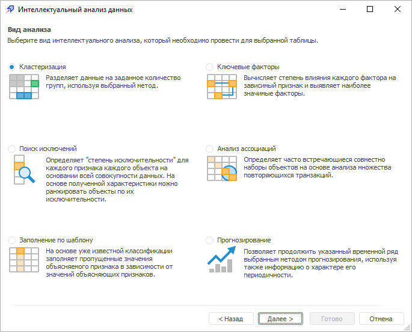

# Выбор типа анализа

Выбор типа анализа
-

# Выбор типа анализа

В зависимости от того, откуда был [запущен
 интеллектуальный анализ данных](../../DataMining_Starting.htm), возможны различные варианты выбора
 типа анализа:

	- из инструмента отчётности продукта
	 «Форсайт. Аналитическая платформа».
	 В группе «Интеллектуальный анализ
	 данных» на вкладке «Расширенная
	 аналитика» ленты инструментов нажмите кнопку, соответствующую
	 необходимому методу анализа:

	- из навигатора объектов и объекта
	 репозитория «Таблица». В окне установите переключатель,
	 соответствующий требуемому анализу:

В «Форсайт. Аналитическая платформа»
 доступны следующие виды интеллектуального анализа данных:

	- [Кластеризация](DataMining_CategDetect.htm);

	- [Поиск исключений](DataMining_ExceptionSearch.htm);

	- [Заполнение по шаблону](DataMining_PatternSubst.htm);

	- [Ключевые факторы](DataMining_KeyInf.htm);

	- [Анализ ассоциаций](DataMining_AssosiationAn.htm);

	- [Прогнозирование](DataMining_Forecasting.htm).

Примечание.
 Вид анализа «Прогнозирование»
 доступен для всех инструментов продукта «Форсайт. Аналитическая платформа»,
 кроме инструмента «Анализ временных
 рядов».

См. также:

[Выбор
 данных для анализа](../DataMining_Master1_Table.htm)

		Справочная
		 система на версию 10.9
		 от 18/08/2025,
		 © ООО «ФОРСАЙТ»,
