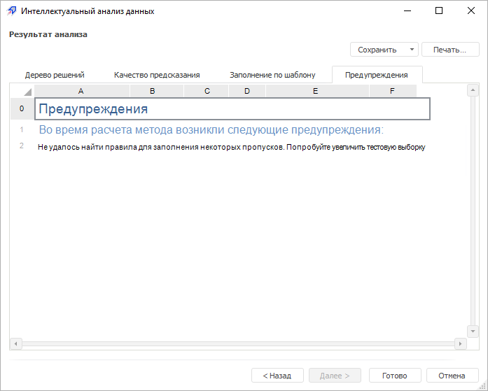

# Просмотр предупреждений

Просмотр предупреждений
-

# Просмотр предупреждений

Если при выполнении интеллектуального анализа данных возникли предупреждения,
 то они будут выведены в результаты анализа на отдельную вкладку «Предупреждения». Например:

В большинстве случаев текст предупреждения содержит рекомендации, следуя
 которым можно повысить качество анализа.

См. также:

[Выбор
 типа анализа](Methods/Performing_DataMining.htm)

		Справочная
		 система на версию 10.9
		 от 18/08/2025,
		 © ООО «ФОРСАЙТ»,
