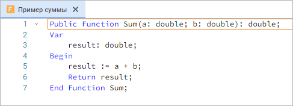
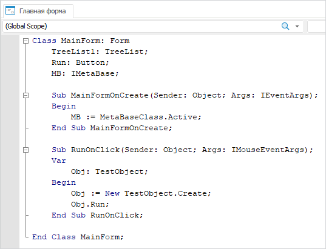
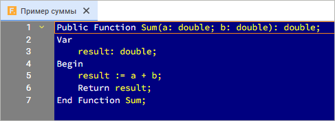
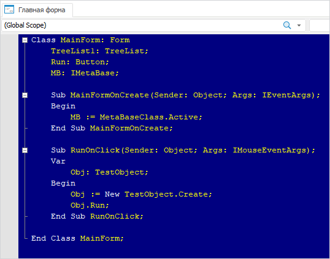
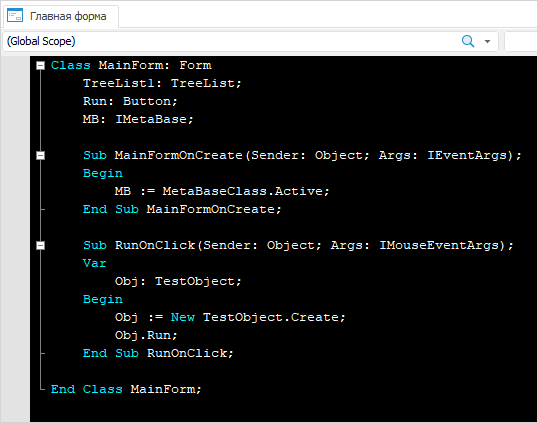

# Настройки редактора кода

Настройки редактора кода
-

# Настройки редактора кода

	Для определения параметров работы в среде разработки нажмите кнопку 
	 «Настройки» на панели инструментов
	 только в веб-приложении или выполните команду главного меню «Вид > Параметры
	 среды разработки» в веб-приложении и настольном приложении.

	При этом будет открыта панель параметров, содержащая три группы
	 настроек в веб-приложении или окно «Параметры
	 среды разработки», содержащее четыре вкладки, в настольном
	 приложении.

	Настройки редактора кода в веб-приложении можно сохранить в файл
	 формата JSON для их дальнейшей быстрой загрузки. Для сохранения настроек
	 выполните команду «Файл > Сохранить
	 настройки в файл» главного меню, после чего будет открыто стандартное
	 окно сохранения файла. Для загрузки настроек редактора кода из файла
	 выполните команду «Файл > Открыть
	 настройки из файла» главного меню, после чего в открывшемся
	 окне выберите требуемый файл.

## Подсветка синтаксиса

	В группе/вкладке «Подсветка синтаксиса»
	 определяются параметры отображения определенных частей кода в окне
	 макроса.

		 Веб-приложение
		  Настольное приложение

			

			

	Задайте параметры:

	[Шрифт](javascript:TextPopup(this))

		Определяет гарнитуру и размер шрифта, который будет использоваться
		 для отображения текста макроса.

	[Подсветка
	 синтаксиса](javascript:TextPopup(this))

		Для изменения цветового оформления можно:

			- выбрать в раскрывающемся списке «Стандартные
			 темы» одну из готовых тем цветового оформления.

			- самостоятельно задать цвет и фон для каждого элемента.

### Стандартные темы

			- По умолчанию:

			Веб-приложение Настольное приложение

				

				

			- Классическая:

			Веб-приложение Настольное приложение

				

				

			- Сумерки:

			Веб-приложение Настольное приложение

				

				

		Выбор той или иной схемы зависит только от предпочтений пользователя
		 и никаким образом не сказывается на функциональности редактора
		 кода.

### Самостоятельное определение цветового оформления

		Задайте параметры, отвечающие за цветовое оформление окна макроса.

		Чтобы задать цвет какого-либо элемента окна макроса выберите
		 его в списке, а затем на палитре выберите цвет.

		Элементы, цвет которых можно изменить:

			- ключевое слово;

			- число;

			- строка;

			- комментарий;

			- обычный текст;

			- точка останова;

			- ошибка;

			- выделенный текст;

			- гиперссылка;

			- выполняемая строка;

			- номера строк в веб-приложении.

## Дизайнер форм

	Вкладка «Дизайнер форм»
	 содержит параметры формы в режиме редактирования. Доступна в настольном
	 приложении.

	

	При установке флажка «Включить
	 привязку к сетке» при размещении компонентов на форме и изменении
	 их размеров с помощью мыши, привязка будет осуществляться к вершинам
	 сетки. Для точной настройки места расположения и размеров компонентов
	 при использовании мыши необходимо удерживать клавишу ALT.

	Числовое значения шага (в пикселях) определяется параметром «Размер шага сетки».

## Отладка/Выполнение

	Группа «Отладка»/вкладка
	 «Выполнение» содержит настройки,
	 определяющие порядок поведения при возникновении исключительных ситуаций
	 во время отладки пользовательской сборки/модуля/формы.

	Примечание.
	 Формы доступны только в настольном приложении.

		Веб-приложение Настольное приложение

			

			

	Установите/снимите флажки при необходимости:

		- Приостановить выполнение
		 при исключительной ситуации. Установка флажка приводит
		 к приостановке выполнения программы при возникновении исключительных
		 ситуаций. По умолчанию флажок установлен;

		- Очищать среду выполнения
		 Fore при компиляции. Установка флажка позволяет автоматически
		 очищать неиспользуемые объекты из памяти, выгружать неиспользуемые
		 сборки, [выявлять
		 утечки памяти](UiDevEnv.chm::/01_Development_Environment/02_Work_in_Development_Environment/detecting_leaks.htm) перед каждой компиляцией объектов
		 и сохранять граф оставшихся в памяти объектов. Если после очистки
		 в памяти останутся неосвобождённые объекты, то будет выдан диалог
		 сохранения графа объектов в файл. По умолчанию флажок снят. Доступно
		 в настольном приложении.

	Для принудительной очистки среды выполнения
	 Fore выполните команду главного меню «Сервис
	 > Очистить среду выполнения Fore» в среде разработки.

## Параметры редактора

	Группа/вкладка «Параметры редактора»
	 содержит настройки окна макроса редактора форм.

		Веб-приложение Настольное приложение

			

			

	Задайте параметры:

		- Размер шага табуляции.
		 Определяет длину табуляции, т.е. количество символов, на которые
		 производится отступ при нажатии клавиши TAB;

		- Использовать
		 автодополнение кода. Позволяет применять технологию [IntelliSense](UiDevEnv.chm::/01_Development_Environment/02_Work_in_Development_Environment/IntelliSense.htm),
		 анализирующую код и отображающую определённые элементы кода, доступные
		 для использования. По умолчанию флажок установлен;

		- Использовать
		 автоформатирование кода. Позволяет управлять автоматическим
		 форматированием текста редактируемой строки. Если флажок установлен,
		 то автоматически происходит удаление лишних или добавление недостающих
		 пробелов, т.е. создание форматированных строк для получения
		 легко читаемого и приятного глазу программного текста. По умолчанию
		 флажок установлен;

		- Отображать раскрывающиеся
		 блоки. Управляет видимостью знаков иерархии, позволяющих
		 свернуть в одну строку цикл, процедуру, класс и т.п. По умолчанию
		 флажок установлен;

		- Отображать нумерацию
		 строк. Используется для включения в окне макроса автоматической
		 нумерации строк кода. По умолчанию флажок установлен;

		- Закладки модулей.
		 Выбирается формат отображения вкладок открытых объектов среды
		 разработки:

			- Отображать наименования
			 в заголовках. По умолчанию;

			- Отображать идентификаторы
			 в заголовках;

		- Сохранять при
		 компиляции. Выбирается способ сохранения, применяемый при
		 компиляции:

			- Только компилируемый
			 модуль/форму;

			- Все открытые модули/формы.
			 По умолчанию.

См. также:

[Начало
 работы с инструментом «Среда разработки»](Start_the_Development_Environment.htm)

		Справочная
		 система на версию 10.9
		 от 18/08/2025,
		 © ООО «ФОРСАЙТ»,
