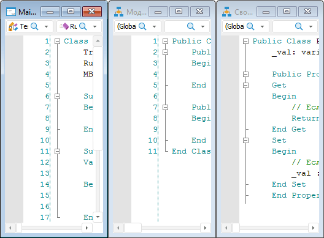
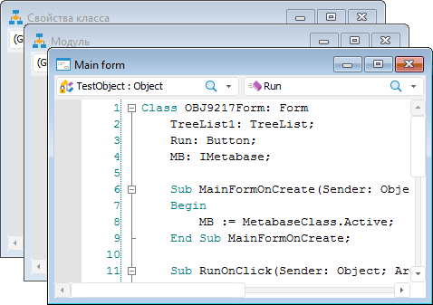
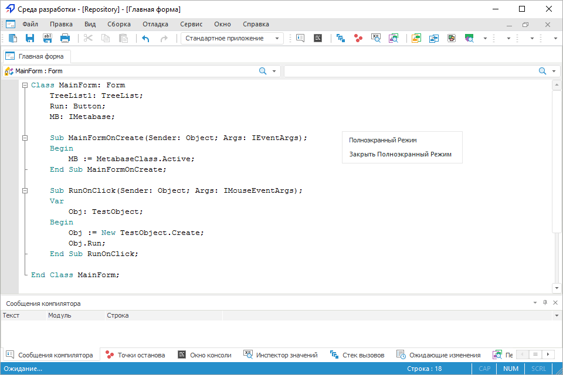

# Описание интерфейса инструмента в настольном приложении

Описание интерфейса инструмента в настольном приложении
-

# Описание интерфейса инструмента
 в настольном приложении

Окно среды разработки в настольном приложении состоит из ряда панелей,
 предназначенных для создания и настройки пользовательских форм, модулей
 и сборок. Наименование основного окна среды разработки содержит наименование
 репозитория и наименование текущего открытого объекта.

Окно среды разработки состоит из следующих элементов:

	- главное меню;

	- панели инструментов;

	- окно макроса;

	- панели компонентов;

	- инспектор кода;

	- инспектор сборок;

	- навигатор проекта;

	- инспектор объектов.

В нижней области среды разработки располагаются следующие панели:

	- сообщения компилятора;

	- точки останова;

	- окно консоли;

	- инспектор значений;

	- стек вызовов;

	- результаты поиска;

	- ожидающие изменения.

Примечание.
 Панель «Ожидающие изменения» присутствует, если репозиторий подключен
 к [системе
 управления версиям](UiDevEnv.chm::/01_Development_Environment/06_Version_Control_System/VSC_Introduction.htm).

В дизайнере форм широко используется механизм Drag&Drop - перетаскивание
 и встраивание. Практически все окна дизайнера форм являются встраиваемыми,
 то есть могут быть как встроенными в основное окно дизайнера, так и плавающими,
 при этом, они находятся поверх основного окна.

Встраиваемое окно позволяет пользователю экономить рабочую площадь экрана,
 что приводит к увеличению размера окна макроса, и тем самым к увеличению
 отображаемой части кода макроса. Для перевода окна из встроенного состояния
 в плавающее и обратно, достаточно дважды щёлкнуть по заголовку
 окна.

[Управление расположением
 окон в настольном приложении](javascript:TextPopup(this))

	Иногда в процессе разработки (написания) модулей (форм) необходимо
	 одновременно просматривать (редактировать) текст сразу нескольких
	 макросов. Для организации окон можно воспользоваться различными командами
	 из раздела главного меню «Окна».

		- Вертикальное расположение окон:

	

		- Горизонтальное расположение окон:

	

		- Каскадное расположение окон:

	

	При большом объеме текста для более наглядного просмотра в среде
	 разработки предусмотрен режим «Во
	 весь экран». В данном режиме скрываются все служебные окна
	 среды разработки. Окно макроса разворачивается во весь экран. Отображается
	 главное меню, раскрывающиеся списки для навигации по коду, панели
	 инструментов и панель «Полноэкранный
	 режим», используемая для возврата в обычный режим.

	Переход в полноэкранный режим осуществляется при выборе пункта меню
	 «Вид>На
	 весь экран» либо при использовании сочетания
	 клавиш SHIFT+ALT+ENTER. Настройка выбранного режима отображения и
	 расположение всех панелей сохраняются в реестр Windows и загружается
	 автоматически при каждом запуске среды разработки.

	

См. также:

[Настройки
 редактора кода](Development_Environment_Options.htm) | [Размещение
 компонентов на форме](Locate_component_on_form.htm)

		Справочная
		 система на версию 10.9
		 от 18/08/2025,
		 © ООО «ФОРСАЙТ»,
