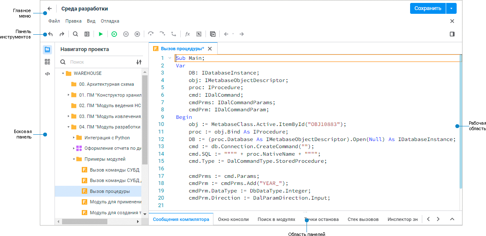
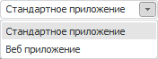
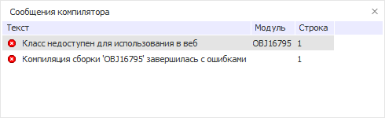

# Начало работы с инструментом «Среда разработки»

Начало работы с инструментом «Среда разработки»
-

# Начало работы с инструментом «Среда
 разработки»

Для начала работы с инструментом в [навигаторе
 объектов](GetStarted.chm::/Interface/Interface_Navigator.htm):

	- в веб-приложении создайте новую или откройте на редактирование
	 готовую [сборку](uidevenv.chm::/01_Development_Environment/02_Work_in_Development_Environment/DevEnv_Object/DevEnv_Assembly.htm)/[модуль](uidevenv.chm::/01_Development_Environment/02_Work_in_Development_Environment/DevEnv_Object/DevEnv_Module.htm)/[веб-форму](UiDevEnv.chm::/01_Development_Environment/02_Work_in_Development_Environment/DevEnv_Object/Web_Form.htm);

	- в настольном приложении:

		- выполните команду «Сервис
		 > Среда разработки» в главном меню навигатора объектов;

		- создайте новую или откройте на редактирование готовую [сборку](uidevenv.chm::/01_Development_Environment/02_Work_in_Development_Environment/DevEnv_Object/DevEnv_Assembly.htm)/[модуль](uidevenv.chm::/01_Development_Environment/02_Work_in_Development_Environment/DevEnv_Object/DevEnv_Module.htm)/[форму](uidevenv.chm::/01_Development_Environment/02_Work_in_Development_Environment/DevEnv_Object/DevEnv_Form.htm).
		 При первом сохранении созданного объекта будет выдан диалог для
		 указания папки, в которую необходимо сохранить форму/модуль. При
		 создании сборки она будет сохранена в том месте репозитория, где
		 была выполнена команда по созданию.

Пользовательский интерфейс среды разработки:

[Элементы интерфейса
 среды разработки](javascript:TextPopup(this))

	Среда разработки состоит из следующих элементов:

		- Главное меню. Содержит
		 основные команды для работы со средой разработки. По умолчанию
		 главное меню скрыто и доступ к нему осуществляется с помощью кнопки
		 
		 «Главное меню». Для отображения
		 главного меню и закрепления его в верхней части окна среды разработки
		 выполните команду «Закрепить
		 меню» в раскрывающемся списке кнопки 
		 «Главное меню». Для повторного
		 скрытия главного меню нажмите кнопку  «Открепить меню»;

		- Панель инструментов.
		 Содержит кнопки для работы с объектами среды разработки;

		- Боковая панель.
		 Предоставляет доступ к следующим панелям:

			- навигатор проекта;

			- инспектор сборок;

			- инспектор кода.

		- Рабочая область.
		 Предназначена для наполнения модулей среды разработки программным
		 кодом;

		- Область панелей.
		 Предоставляет доступ к следующим панелям:

			- сообщения компилятора;

			- окно консоли;

			- поиск в модулях;

			- точки останова;

			- стек вызовов;

			- инспектор значений;

			- локальные переменные.

Для определения параметров работы в среде разработки смотрите статью
 «[Настройки редактора кода](Development_Environment_Options.htm)».

[Ограничения
 при работе веб-приложений](javascript:TextPopup(this))

	При разработке кода, который может выполняться при работе веб-приложений,
	 существует ряд ограничений. Использование определенных классов, свойств
	 и методов будет приводить к исключительным ситуациям. Ниже представлен
	 список ресурсов, запрещенных для использования в веб-приложениях:

		- запрещена работа с буфером обмена (использование
		 свойств и методов, осуществляющих копирование/вырезание/вставку
		 в буфер обмена);

		- запрещена работа с формами (класс Form);

		- запрещено использование окон (окна, реализованные
		 в сборке Ui);

		- запрещена работа со свойствами, определяющими
		 состояние и положение курсора мыши.

	Для проверки корректности кода в среде разработки реализован специальный
	 раскрывающийся список. В данном списке содержатся конфигурации приложения,
	 в соответствии с которыми будет осуществляться компиляция:

	

	При выборе режима «Веб приложение»,
	 если в тексте макроса содержится код, попадающий под указанные ограничения,
	 то генерируется сообщение об ошибке «Класс/Метод недоступен для использования
	 в веб».

	

	По умолчанию устанавливается стандартный способ компиляции без ограничений.

См. также:

[Разработка
 в среде разработки](../Desktop_Title.htm) | [Пример создания
 простого приложения](simple_application.htm) | [Описание
 интерфейса инструмента в настольном приложении](Interface_description.htm)

		Справочная
		 система на версию 10.9
		 от 18/08/2025,
		 © ООО «ФОРСАЙТ»,
