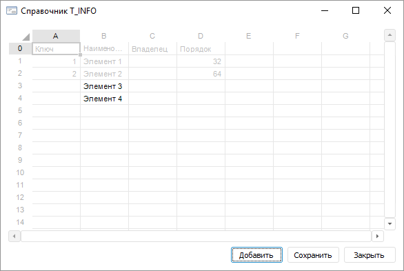

# Пример создания простого приложения

Пример создания простого приложения
-

# Пример создания простого приложения

Рассмотрим небольшой пример создания приложения, которое будет использоваться
 для просмотра содержимого справочника НСИ, а также для добавления в него
 новых элементов. Для этого в репозитории создадим следующие объекты:

	- Справочник НСИ с идентификатором T_INFO. Справочник имеет структуру
	 по-умолчанию, в дерево элементов можно добавить какие-либо элементы;

	- Форма с идентификатором F_SHOW_DICT. На форме необходимо разместить
	 следующие компоненты:

	-

		- TabSheetBox
		 и UiTabSheet. Для TabSheetBox в инспекторе объектов
		 в свойстве Source указать
		 в качестве источника данных UiTabSheet;

		- Три кнопки PPButton.
		 Для компонентов в инспекторе объектов в свойстве Text
		 задать следующие наименования: для PPButton1 - «Добавить»;
		 PPButton2 - «Сохранить»;
		 PPButton3 - «Закрыть».

С помощью формы реализуем следующий алгоритм работы:

	- При открытии формы в таблицу компонента TabSheetBox
	 будем загружать значения различных атрибутов для всех имеющихся в
	 справочнике элементов.

	- При нажатии на кнопку «Добавить»
	 будет выводиться диалог для ввода наименования нового элемента. После
	 ввода и нажатия кнопки «ОК»
	 будет формироваться список наименований добавляемых элементов. Также
	 наименования сразу будут добавляться в таблицу.

	- При нажатии на кнопку «Сохранить»
	 на основании информации из сформированного списка в справочник будут
	 добавлены новые элементы.

	- При нажатии на кнопку «Закрыть»
	 форма закрывается без добавления в справочник новых элементов.

Перед тем, как приступить к реализации алгоритма, выполните ещё ряд
 настроек. В инспекторе сборок уже отображаются подключенные сборки ExtCtrls
 и Forms. Необходимо подключить ещё ряд сборок. Для этого дважды щелкните
 по элементу «Ссылки» и установите
 флажки напротив сборок Collections, Drawing, Metabase, Rds, Tab и Ui.
 Ресурсы данных сборок потребуются при разработке кода. Также в коде формы
 необходимо добавить ряд переменных:

	Class F_SHOW_DICTForm: Form

	    PPButton1: PPButton;

	    PPButton2: PPButton;

	    PPButton3: PPButton;

	    TabSheetBox1: TabSheetBox;

	    UiTabSheet1: UiTabSheet;

	    Mb: IMetabase; //
	 Контекст репозитория

	    RdsDict: IRdsDictionaryInstance; // Открытый экземпляр справочника

	    TSheet: ITabSheet; // Таблица визуального компонента

	    NewElementsName: IStringList; // Список для хранения наименований новых элементов

	    ElementCount, NameAttrIndex: Integer; // Количество элементов и индекс атрибута Наименование

	    //
	 ...

	End Class F_SHOW_DICTForm;

Рассмотрим по шагам реализацию отдельных пунктов алгоритма.

[1. Загрузка
 списка элементов](javascript:TextPopup(this))

	При открытии формы генерируется событие OnCreate.
	 Создадим обработчик этого события и добавим код для загрузки элементов
	 справочника. Для этого выделите форму, в инспекторе объектов перейдите
	 на вкладку «События» и дважды
	 щелкните по элементу OnCreate.
	 В код формы будет добавлена процедура, которая будет осуществлять
	 обработку события:

		Sub F_SHOW_DICTFormOnCreate(Sender: Object; Args: IEventArgs);

		Begin

		End Sub F_SHOW_DICTFormOnCreate;

	Добавим в процедуру код для инициализации переменных:

		Sub F_SHOW_DICTFormOnCreate(Sender: Object; Args: IEventArgs);

		Begin

		    // Инициализация переменных

		     Mb := MetabaseClass.Active; // Получение контекста для работы с текущим репозиторием

		     TSheet := UiTabSheet1.TabSheet; // Получение таблицы для дальнейшей работы с ячейками

		     NewElementsName := New StringList.Create; // Коллекция для хранения наименований новых элементов

		End Sub F_SHOW_DICTFormOnCreate;

	Переменные объявлены на уровне формы и в дальнейшем будут использоваться
	 в различных процедурах. Для загрузки элементов добавим отдельную процедуру:

		//
		 Процедура для открытия справочника и загрузки информации по элементам

		Sub LoadDictionary;

		Var

		    Attrs: IRdsAttributesInstance;

		    Attr: IRdsAttributeInstance;

		    Elements: IRdsDictionaryElements;

		    Element: IRdsDictionaryElement;

		    Style: ITabCellStyle;

		    i, j, AttrCount: Integer;

		Begin

		    RdsDict := Mb.ItemById("T_INFO").Open(Null) As IRdsDictionaryInstance; // Открытие справочника

		    Attrs := RdsDict.Attributes;

		    // Загрузка списка атрибутов

		    For i := 0 To Attrs.Count - 1 Do

		        Attr := Attrs.Item(i);

		        // Ключи атрибутов в справочниках НСИ начинаются с единицы, поэтому их можно использовать

		        // в качестве индекса столбца для заполнения ячеек

		        TSheet.Cell(0, Attr.Key - 1).Value := Attr.Name;

		        If Attr = Attrs.Predefined(RdsPredefinedAttribute.Name) Then

		            // Запомним индекс атрибута Наименование, чтобы в дальнейшем

		            // записывать наименования новых элементов в нужный столбец

		            NameAttrIndex := i;

		        End If;

		    End For;

		    // Загрузка значений атрибутов для элементов

		    Elements := RdsDict.Elements;

		    ElementCount := Elements.Count - 1; // Количество элементов

		    AttrCount := Attrs.Count - 1; // Количество атрибутов

		    For i := 1 To ElementCount Do

		        Element := Elements.Item(i);

		        For j := 0 To AttrCount Do

		            TSheet.Cell(i, j).Value := Element.Value(j);

		        End For;

		    End For;

		    // Настройка стиля

		    Style := TSheet.Cells(0, 0, ElementCount, AttrCount).Style;

		    Style.Font.Color := GxColor.FromKnownColor(GxKnownColor.Silver);

		    // Запрет редактирования таблицы

		    TSheet.Table.Style.Locked := TriState.OnOption;

		End Sub LoadDictionary;

	В процедуре открывается справочник, наименования атрибутов справочника
	 выводятся в первую строку таблицы. Далее в каждом получившемся столбце
	 выводятся значения атрибутов для всех элементов справочника. Для получившегося
	 списка будет установлен серый цвет шрифта, а для всей таблицы будет
	 запрещено редактирование ячеек.

	Теперь необходимо процедуру LoadDictionary вызвать в событии OnCreate.
	 Обработчик события примет следующий вид:

		Sub F_SHOW_DICTFormOnCreate(Sender: Object; Args: IEventArgs);

		Begin

		    // Инициализация переменных

		    Mb := MetabaseClass.Active; // Получение контекста для работы с текущим репозиторием

		    TSheet := UiTabSheet1.TabSheet; // Получение таблицы для дальнейшей работы с ячейками

		    NewElementsName := New StringList.Create; // Коллекция для хранения наименований новых элементов

		    // Открытие справочника и загрузка информации по элементам

		    LoadDictionary;

		End Sub F_SHOW_DICTFormOnCreate;

[2. Добавление
 нового элемента](javascript:TextPopup(this))

	Добавление нового элемента будет осуществляться при нажатии на кнопку
	 «Добавить» (PPButton1). Добавим
	 для кнопки обработчик события OnClick.
	 Для этого выделите кнопку, в инспекторе объектов на вкладке события
	 дважды щёлкните по элементу OnClick
	 или дважды щёлкните по самой кнопке. В код формы будет добавлен обработчик:

		Sub PPButton1OnClick(Sender: Object; Args: IMouseEventArgs);

		Begin

		End Sub PPButton1OnClick;

	Для добавления нового элемента создадим отдельную процедуру:

		//
		 Процедура для добавления элемента

		Sub AddElement;

		Var

		    NewName: String;

		Begin

		    If WinApplication.InputBox("Новый элемент", "Наименование:", NewName) Then

		        NewElementsName.Add(NewName); // Добавление наименования в коллекцию

		        ElementCount := ElementCount + 1; // Увеличение количества элементов

		        TSheet.Cell(ElementCount, NameAttrIndex).Value := NewName; // Добавление наименования элемента в таблицу

		    End If;

		End Sub AddElement;

	В процедуре используется вызов диалога для ввода данных - WinApplicationClass.InputBox (Сборка
	 Ui). Это стандартный диалог, позволяющий вводить какое-либо одно значение.
	 Если в диалоге ввести текст и нажать кнопку «OK»,
	 то введённое наименование будет добавлено в массив NewElementsName,
	 а также добавлено в таблицу с элементами. Для добавленного элемента
	 будет отображаться значение только атрибута Наименование,
	 так как элемент фактически ещё не добавлен в справочник и значения
	 других атрибутов у него отсутствуют.

	Вызов процедуры добавим в обработчик события OnClick
	 кнопки:

		Sub PPButton1OnClick(Sender: Object; Args: IMouseEventArgs);

		Begin

		    AddElement;

		End Sub PPButton1OnClick;

[3. Сохранение
 элементов в справочник](javascript:TextPopup(this))

	Сохранение новых элементов и закрытие формы будет осуществляться
	 при нажатии на кнопку «Сохранить»
	 (PPButton2). Добавим для кнопки обработчик события OnClick
	 также, как это было сделано для кнопки «Добавить»
	 во втором шаге:

		Sub PPButton2OnClick(Sender: Object; Args: IMouseEventArgs);

		Begin

		End Sub PPButton2OnClick;

	Для создания элементов в справочнике НСИ добавим следующую процедуру:

		//
		 Процедура для сохранения добавленных элементов в справочник

		Sub SaveNewElements;

		Var

		    ElementName: String;

		    ElementData: IRdsDictionaryElementData;

		Begin

		    If NewElementsName.Count > 0 Then

		        ElementData := RdsDict.CreateElementData; //Создание объекта, в котором хранятся значения атрибутов элементов

		        //
		 Проходим по всем элементам массива NewElementsName

		        //
		 и добавляем соответствующие элементы в справочник НСИ

		        For Each ElementName In NewElementsName Do

		            ElementData.Value(NameAttrIndex) := ElementName; // Заполнение значения атрибута Наименование

		            RdsDict.Insert(-2, ElementData); //
		 Вставка нового элемента в корень справочника

		        End For;

		    End If;

		End Sub SaveNewElements;

	В процедуре проверяется, добавлены ли элементы в массив NewElementsName.
	 Если имеются добавленные элементы, то на основании их текста будут
	 добавлены элементы в справочник НСИ. Добавим код вызова процедуры
	 SaveNewElements и закрытие формы (метод Close
	 интерфейса IFormControl) в
	 обработчик события щелчка по кнопке:

		Sub PPButton2OnClick(Sender: Object; Args: IMouseEventArgs);

		Begin

		    SaveNewElements; //
		 Сохранение элементов в справочник НСИ

		    Self.Close; // Закрытие формы

		End Sub PPButton2OnClick;

[4. Закрытие
 формы без сохранения](javascript:TextPopup(this))

	Закрытие формы без сохранения изменений будет осуществляться при
	 нажатии на кнопку «Закрыть»
	 (PPButton3). Добавим для кнопки обработчик события OnClick,
	 также, как это было сделано для кнопки «Добавить»
	 во втором шаге:

		Sub PPButton3OnClick(Sender: Object; Args: IMouseEventArgs);

		Begin

		End Sub PPButton3OnClick;

	Для закрытия формы добавим вызов метода Close:

		Sub PPButton3OnClick(Sender: Object; Args: IMouseEventArgs);

		Begin

		    Self.Close;

		End Sub PPButton3OnClick;

Если всё выполнено корректно, то после запуска и добавления нескольких
 элементов форма будет выглядеть следующим образом:

		Справочная
		 система на версию 10.9
		 от 18/08/2025,
		 © ООО «ФОРСАЙТ»,
