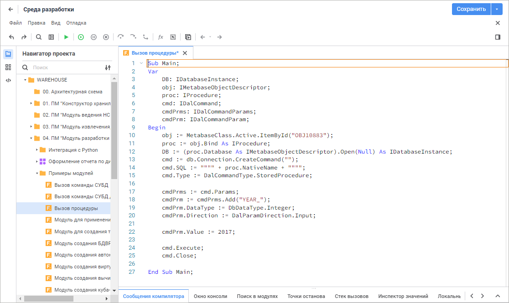
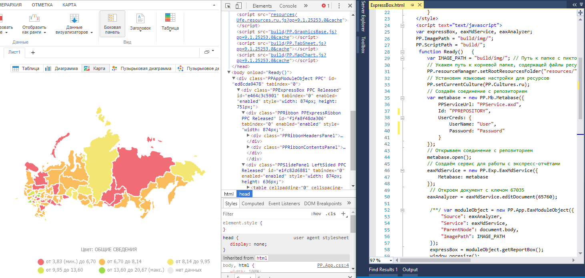

# Разработка приложений и расширение функциональности

Разработка приложений и расширение функциональности
-

# Разработка приложений и расширение
 функциональности

Продукт «Форсайт. Аналитическая платформа»
 предоставляет инструменты, позволяющие разрабатывать прикладные системы.
 Прикладная система может быть выполнена в виде настольного приложения,
 веб-приложения или в виде сочетания нескольких систем, например, связка
 веб-приложения и веб-портала.

Инструменты «Форсайт. Аналитическая платформа»
 позволяют организовать хранилище данных, создать объекты для анализа и
 визуального представления этих данных. Встроенные средства позволяют организовать
 необходимое взаимодействие между различными объектами. Доступные расширения
 («[Алгоритмы расчёта](CalculationAlgorithm.chm::/Purpose.htm)»,
 «[Управление бизнес-процессами](BPM.chm::/Modeling_of_business_processes.htm)»,
 «[Интерактивные формы ввода данных](DataEntryForms.chm::/DataEntryForms_Purpose.htm)»,
 «[Конструктор бизнес-приложений](Constructor.chm::/Intro/Designer_business_applications.htm)»)
 позволяют решить ряд типовых задач, связанных с планированием и управлением
 бизнес-процессами.

Если требуется решение нетиповых задач, кастомизация уже имеющегося
 интерфейса, доработка поведения имеющихся инструментов или разработка
 какого-либо специфического способа обработки и представления данных, то
 для этих целей в программном продукте «Форсайт. Аналитическая платформа»
 создана возможность разработки собственных макросов или прикладных форм.
 В макросах осуществляется обработка событий объектов или реализуются пользовательские
 функции, которые выполняют какие-либо действия по обработке и представлению
 данных. Формы позволяют создавать собственные приложение с визуальным
 интерфейсом, соответствующим решаемой задаче. Разработка выполняется в
 собственной [среде разработки](Desktop_Title.htm). Для расширения
 возможностей веб-приложений реализовано API, которое может использоваться
 во внешних средах разработки.

Перед тем, как приступить к разработке, изучите [общие
 правила и концепцию](About_Developing/the_concept_of_objects_selection.htm) выбора объектов для разработки.

## Разработка в среде разработки

Раздел «[Разработка в среде разработки](Desktop_Title.htm)»
 содержит описание общих принципов разработки прикладных проектов, а также
 описание языка программирования и среды разработки, которые для этого
 используются.

## Разработка веб-приложения с использованием DHTML-компонентов

Раздел «[Разработка веб-приложения с использованием
 DHTML-компонентов](Web_Title.htm)» содержит описание общих принципов разработки прикладных
 проектов в виде веб-приложений, а также описание DHTML-компонентов и веб-сервиса,
 которые для этого используются. 

См. также:

[Общие
 правила и концепция выбора объектов для разработки](About_Developing/the_concept_of_objects_selection.htm) | [Разработка
 в среде разработки](Desktop_Title.htm) | [Разработка веб-приложения
 с использованием DHTML-компонентов](Web_Title.htm)

		Справочная
		 система на версию 10.9
		 от 18/08/2025,
		 © ООО «ФОРСАЙТ»,
