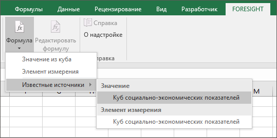
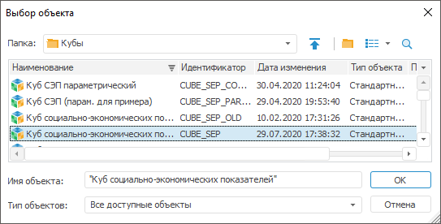
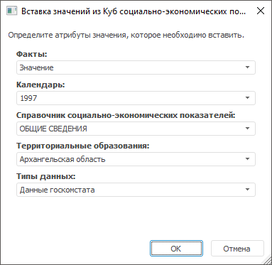
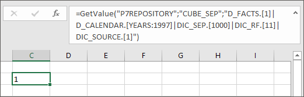
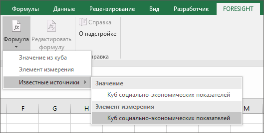
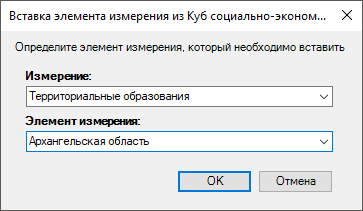
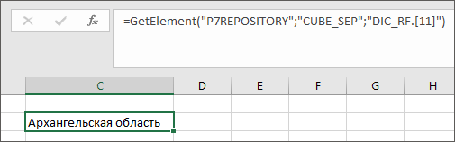

# Работа с формулами: Foresight Add-in for Excel

Работа с формулами: Foresight Add-in for Excel
-

# Работа с формулами

С помощью формул можно добавить отдельные [значения](#value)
 или [элементы измерений](#element) из куба в выбранную ячейку на
 листе рабочей книги.

Совет.
 В пределах одного листа рабочей книги можно использовать источники одного
 репозитория. Для добавления в рабочую книгу данных из разных репозиториев
 используйте отдельные листы для каждого из них.

## Добавление значения из куба

Для добавления значения из куба:

	- Выделите ячейку на листе рабочей книги, в которую необходимо
	 добавить значение.

	- Нажмите кнопку «Формула»
	 в группе «Формула» на вкладке
	 «FORESIGHT» ленты инструментов.
	 Выполните одно из действий:

		- если на текущий лист еще не
		 были добавлены формулы, в раскрывшемся списке выберите «Значение из куба». Откроется
		 [окно
		 регистрации](../../GetStarted/GetStarted/Get_Started.htm#regpage). Выберите репозиторий, введите имя пользователя
		 и пароль, нажмите кнопку «OK».
		 Перейдите к шагу 3;

		- если на текущий лист уже были
		 добавлены формулы, выполните одно из действий:

			- в раскрывшемся списке выберите «Значение
			 из куба», повторная регистрация не понадобится. Перейдите
			 к шагу 3;

			- в раскрывшемся списке выберите «Известные
			 источники». В группе «Значение»
			 выберите известный источник:

В списке перечислены источники, использованные
 ранее. Повторная регистрация не понадобится. Перейдите к шагу 4.

	- В открывшемся окне «Выбор объекта»
	 перечислены все кубы и папки репозитория, в которых они расположены.
	 Выберите нужный источник данных и нажмите кнопку «OK»:

	- Определите атрибуты значения в окне «Вставка
	 значений из <Наименование
	 источника>» и нажмите
	 кнопку «OK»:

В результате выполненных действий в выделенную ячейку на листе рабочей
 книги будет добавлено значение из куба:

Формула в ячейке принимает вид:

=GetValue("<Идентификатор репозитория>";"<Идентификатор
 куба>";"<Идентификатор измерения_1>.[<Уникальный
 идентификатор элемента>]"| "<Идентификатор измерения_2>.[<Уникальный
 идентификатор элемента>]"),

где <Уникальный идентификатор элемента>
 для справочников НСИ – ключ, для обычных и календарных справочников –
 идентификатор. Количество измерений в формуле зависит от количества измерений
 в кубе.

После завершения работы с формулами сохраните отчёт.

При открытии сохраненного файла, если на листе отчёта есть такие формулы,
 будет открыт диалог подключения к репозиторию. При переключении на другой
 лист, на котором заданы формулы, требующие подключения к кубу из другого
 репозитория, будет повторно открыт диалог подключения к другому репозиторию.

## Добавление элемента измерения из куба

Для добавления элемента измерения из куба:

	- Выделите ячейку на листе рабочей книги, в которую необходимо
	 добавить элемент измерения.

	- Нажмите кнопку «Формула»
	 в группе «Формула» на вкладке
	 «FORESIGHT» ленты инструментов.
	 Выполните одно из действий:

		- если на текущий лист еще не
		 были добавлены формулы, в раскрывшемся списке выберите «Элемент измерения». Откроется
		 [окно
		 регистрации](../../GetStarted/GetStarted/Get_Started.htm#regpage). Выберите репозиторий, введите имя пользователя
		 и пароль, нажмите кнопку «OK».
		 Перейдите к шагу 3;

		- если на текущий лист уже были
		 добавлены формулы, выполните одно из действий:

			- в раскрывшемся списке выберите «Элемент
			 измерения», повторная регистрация не понадобится. Перейдите
			 к шагу 3;

			- в раскрывшемся списке выберите «Известные
			 источники». В группе «Элемент
			 измерения» выберите известный источник:

В списке перечислены источники, использованные
 ранее. Повторная регистрация не понадобится. Перейдите к шагу 4.

	- В открывшемся окне «Выбор объекта»
	 перечислены все кубы и папки репозитория, в которых они расположены.
	 Выберите нужный источник данных и нажмите кнопку «OK»:

	- В окне «Вставка элемента измерения
	 из <Наименование
	 источника>» выберите
	 измерение и элемент измерения в соответствующих полях и нажмите кнопку
	 «OK»:

В результате выполненных действий в выделенную ячейку на листе рабочей
 книги будет добавлен элемент измерения из куба:

Формула в ячейке принимает вид:

=GetValue("<Идентификатор репозитория>";"<Идентификатор
 куба>";"<Идентификатор измерения>.[<Уникальный идентификатор
 элемента>]"),

где <Уникальный идентификатор элемента>
 для справочников НСИ – ключ, для обычных и календарных справочников -
 идентификатор.

После завершения работы с формулами сохраните отчёт.

При открытии сохраненного файла, если на листе отчёта есть такие формулы,
 будет открыт диалог подключения к репозиторию. При переключении на другой
 лист, на котором заданы формулы, требующие подключения к кубу из другого
 репозитория, будет повторно открыт диалог подключения к другому репозиторию.

## Редактирование формулы

Для редактирования формулы в ячейке на листе рабочей книги:

	- Выделите ячейку с формулой.

	- Нажмите кнопку «Редактировать
	 формулу» в группе «Формула»
	 на вкладке «FORESIGHT» ленты
	 инструментов.

	- Внесите необходимые изменения. Вид окна зависит от содержимого
	 ячейки:

		- если в ячейке содержится значение из куба, будет открыто
		 окно «Вставка значений из <Наименование источника>»;

		- если в ячейке содержится элемент измерения, будет открыто
		 окно «Вставка элемента измерения
		 из <Наименование
		 источника>».

## Удаление формулы

Для удаления формулы из ячейки очистите содержимое ячейки средствами
 Microsoft Office. После удаления содержимого формулу в ячейку можно добавить
 повторно.

См. также:

[Работа
 с аналитическими запросами (OLAP)](Olap_Mode/Olap_Mode.htm) | [Работа
 с временными рядами](TimeSeries_Mode/TimeSeries_Mode.htm)

		Справочная
		 система на версию 10.9
		 от 18/08/2025,
		 © ООО «ФОРСАЙТ»,
