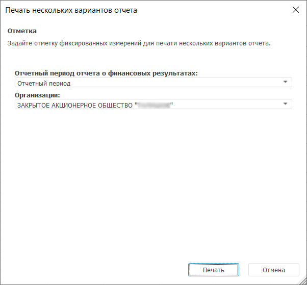
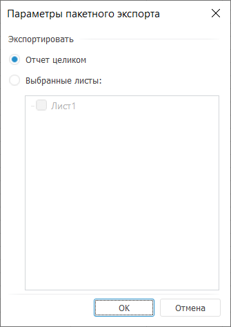
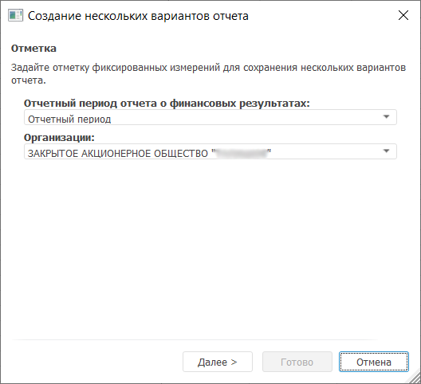
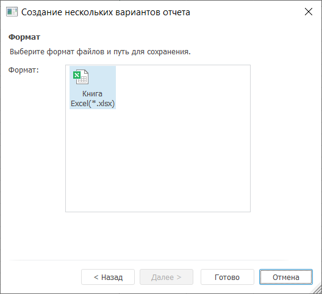

# Выполнение пакетных операций: Foresight Add-in for Excel

Выполнение пакетных операций: Foresight Add-in for Excel
-

# Выполнение пакетных операции

Пакетные операции - операции,
 выполняемые для нескольких вариантов отчета. Варианты отчета формируются
 по отметке элементов фиксированных измерений, которая задается с помощью
 элементов управления, общих для всех листов отчета.

Примечание.
 Если в источнике данных отсутствуют фиксированные измерения, то пакетные
 операции недоступны.

Количество вариантов отчёта равно декартову произведению всех элементов,
 отмеченных в фиксированных измерениях. Например, в отчёте существуют два
 фиксированных измерения. Если при выполнении пакетной операции для каждого
 измерения отметить по два элемента, то количество возможных пар, которые
 можно составить из этих элементов (т.е. декартово произведение) -
 четыре. Соответственно, будет сформировано четыре варианта отчёта.

Доступные пакетные операции:

	- пакетная печать;

	- [пакетный экспорт](Batch_Operations.htm#export).

## Пакетная печать

Пакетная печать - печать нескольких
 вариантов отчета, которые формируются по отметке фиксированных измерений.

Для выполнения пакетной печати нажмите кнопку 
 «Пакетная печать», расположенную
 в группе «Экспорт и печать» на
 вкладке «FORESIGHT» ленты инструментов.
 Будет открыт диалог «Печать нескольких
 вариантов отчета»:

В диалоге отображаются все фиксированные измерения. Задайте требуемую
 отметку и нажмите кнопку «Печать».

## Пакетный экспорт

Пакетный экспорт - экспорт
 нескольких вариантов отчета. Варианты отчета формируются по отметке фиксированных
 измерений источника данных.

Пакетный экспорт регламентного отчета возможен, если имеются элементы
 управления, общие для всех экспортируемых листов отчета. Элементы управления
 должны быть связаны с фиксированными измерениями. Если элементы управления
 являются общими для экспортируемых листов отчета, но при этом не связаны
 с фиксированными измерениями, то пакетный экспорт не будет произведен.

Для выполнения пакетного экспорта нажмите кнопку 
 «Пакетный экспорт», расположенную
 в группе «Экспорт и печать» на
 вкладке «FORESIGHT» ленты инструментов.
 Будет открыто окно «Параметры пакетного
 экспорта»:

Установите один из переключателей:

	- Отчет целиком. При установке
	 данного переключателя будет экспортироваться весь отчет;

	- Выбранные листы. При
	 установке данного переключателя отметьте флажками листы, которые будут
	 экспортироваться. В данном списке отсутствуют скрытые листы.

Нажмите кнопку «OK». Будет открыта
 первая страница мастера пакетного экспорта «Создание
 нескольких вариантов отчета»:

В раскрывающихся списках выберите элементы фиксированных измерений,
 по которым нужно создать варианты отчета. Количество отчетов, которые
 будут экспортированы, равно декартовому произведению отмеченных элементов
 в фиксированных измерениях.

Нажмите кнопку «Далее». Будет
 открыта вторая страница мастера пакетного экспорта:

Нажмите кнопку «Готово». Будет
 открыт стандартный диалог размещения созданного файла.

Наименования результирующих файлов формируются по следующему шаблону:
 <наименование файла>+(<комбинация
 элементов фиксированных измерений>)+.+<формат>. Например:
 Социально-экономические показатели (Данные
 регионов; Туризм).xls.

См. также:

[Работа
 с аналитическими запросами (OLAP)](../Olap_Mode.htm)

		Справочная
		 система на версию 10.9
		 от 18/08/2025,
		 © ООО «ФОРСАЙТ»,
