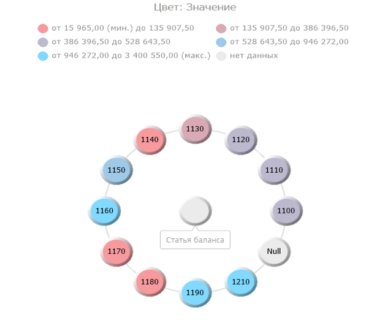

# Работа с пузырьковым деревом: Foresight Add-in for Excel

Работа с пузырьковым деревом: Foresight Add-in for Excel
-

# Работа с пузырьковым деревом

Пузырьковое дерево - способ
 отображения иерархических данных в виде набора взаимосвязанных пузырьков.
 Каждой ветке иерархии соответствует пузырек, который связан с пузырьками,
 являющимися элементам иерархии того же уровня. Все элементы одной ветки
 и одного уровня иерархии образуют круг, в центре которого - родительский
 элемент иерархии. Диаметр каждого пузырька пропорционален значению соответствующего
 элемента иерархии. Цвет пузырька также определяется значением элемента
 иерархии.

Пузырьковое дерево позволяет отобразить для иерархических данных наборы
 из двух значений:

	- первое значение определяет цвет пузырька;

	- второе значение определяет диаметр пузырька.

Преимущества пузырькового дерева:

	- позволяет выявить взаимосвязь между двумя показателями в иерархической
	 структуре данных;

	- позволяет наглядно отобразить связи элементов иерархии.

Для начала работы с пузырьковым деревом:

	- [Получите данные](../Excel_Work.htm).

	- Нажмите кнопку  «Пузырьковое
	 дерево», расположенную в группе «Вставка»
 на вкладке «FORESIGHT»
 ленты инструментов.

Пузырьковое дерево создается на отдельном листе в книге Microsoft Excel.
 Лист с пузырьковым деревом вставляется после активного листа рабочей книги
 Microsoft Excel.

Примечание.
 Одна [таблица](Table_Work/Table_Work.htm) может служить источником
 данных только для одного пузырькового дерева.

Пример пузырькового дерева:

С помощью группы вкладок «Формат»
 на панели свойств задайте
 настройки пузырькового дерева:

	- [легенда
	 цвета и размера](UiVisualizators.chm::/BubbleTree/Legend.htm);

	- заливка пузырькового дерева;

Примечание.
 Настройка выполняется аналогично настройке [заливки](UiMaps.chm::/Configure/Color.htm)
 представления данных «Карта».

	- [шкала
	 размера](UiVisualizators.chm::/BubbleTree/Size.htm);

	- [всплывающие
	 подсказки](UiVisualizators.chm::/BubbleChart/Tooltip.htm#bc-1).

См. также:

[Режим экспресс-анализа
 данных](Olap_Mode.htm)

		Справочная
		 система на версию 10.9
		 от 18/08/2025,
		 © ООО «ФОРСАЙТ»,
