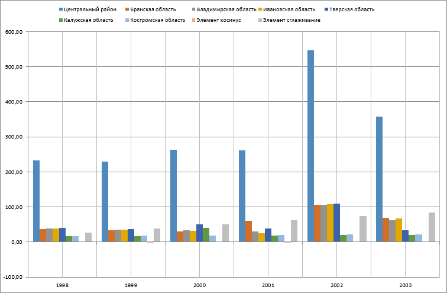

# Работа с диаграммой: Режим OLAP, Foresight Add-in for Excel

Работа с диаграммой: Режим OLAP, Foresight Add-in for Excel
-

# Работа с диаграммой

Диаграмма представляет
 собой форму графического отображения табличных данных отчета и предназначена
 для их наглядного отображения.

Для начала работы с диаграммой:

	- [Получите данные](../Excel_Work.htm).

	- Нажмите кнопку  «Диаграмма», расположенную в группе «Вставка»
 на вкладке «FORESIGHT»
 ленты инструментов.

Будет отображено раскрывающееся меню для выбора типа диаграммы:

	- гистограмма;

	- график;

	- круговая;

	- с областями;

	- точечная;

	- лепестковая.

Диаграмма создается на отдельном листе в книге Microsoft Excel. Лист с диаграммой
 вставляется после активного листа рабочей книги Microsoft Excel.

Примечание.
 Одна [таблица](Table_Work/Table_Work.htm) может служить источником
 данных только для одной диаграммы.

Пример диаграммы:

С помощью группы вкладок «Формат»
 на панели свойств задайте
 настройки диаграммы:

	- [общие
	 параметры диаграммы](uidiagrams.chm::/Params_diagram/UiDiagrams_params_diagram.htm);

	- [область
	 построения](uidiagrams.chm::/Tuning_format/uidiagrams_tuning_construction_area_digramm.htm);

	- [оси
	 диаграммы](uidiagrams.chm::/Params_diagram/UiDiagrams_Axis.htm);

	- [ряды
	 данных](uidiagrams.chm::/Series.htm);

	- [линии
	 уровня](uidiagrams.chm::/Tuning_format/Format_Axis/UiDiagrams_FormatAxis_Levels.htm);

	- [легенда](uidiagrams.chm::/Property_diagramm/UiDiagrams_PropertyDiagramm_legend.htm);

	- [всплывающие
	 подсказки](uidiagrams.chm::/Params_diagram/Tooltips.htm).

Также при работе с диаграммой доступны стандартные операции Microsoft Excel:

	- изменение типа диаграммы;

	- поворот источника данных;

	- выбор данных для построения диаграммы;

	- настройка макета и стиля диаграммы;

	- изменение расположения диаграммы;

	- изменение размера диаграммы и т.д.

См. также:

[Режим аналитических
 запросов](Olap_Mode.htm)

		Справочная
		 система на версию 10.9
		 от 18/08/2025,
		 © ООО «ФОРСАЙТ»,
