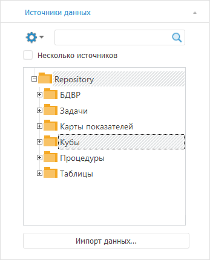

# Работа с источниками данных: Foresight Add-in for Excel

Работа с источниками данных: Foresight Add-in for Excel
-

# Работа с источниками данных

В режиме аналитических запросов надстройка Excel Add-In может оперировать
 данными одного или нескольких источников.

Источник данных представлен
 в виде многомерного массива данных. Каждый массив данных характеризуется
 набором [измерений](UiSelection.chm::/Selection/Dimension.htm),
 на пересечении которых находятся ячейки с данными. Если для экспресс-отчета
 используется [несколько
 источников](uiexpress.chm::/ChangeNote/UiExpress_Tabl_ChangeNote_PrivDim.htm) и существуют уникальные измерения, которыми
 обладает только один из источников, в измерениях выделяется отдельная
 группа измерений - [частные](UiSelection.chm::/Selection/Working_with_private_dimensions.htm).

Источниками данных для отчета могут быть:

	- все виды кубов;

	- базы данных временных рядов;

	- экспресс-отчёты.

Для выбора и поиска источников данных используйте вкладку «Источники
 данных» из группы «Источник»
 на панели свойств:

Данная вкладка становится активной после получения данных для отчета.
 В дереве объектов репозитория отображаются объекты, которые могут быть
 выбраны в качестве источников данных для отчета. При поиске источника
 в поле с деревом объектов репозитория отображается список результатов
 [поиска](uiexpress.chm::/purpose/Search.htm).

Выберите требуемые источники данных в дереве объектов или в списке результатов
 поиска. После чего таблица данных и прочие визуализаторы будут перестроены.

Далее выберите [вариант
 расположения измерения](UiSelection.chm::/Selection/Dimension.htm) и отметьте [элементы
 измерения](UiSelection.chm::/Selection/Selection_of_the_dimension_elements.htm).

С источниками данных доступны следующие операции:

[Выбор и смена
 источника данных](javascript:TextPopup(this))

	Для выбора и смены источника данных отметьте источник в дереве объектов
	 репозитория.

	Для создания отчета на основе [нескольких
	 источников](uiexpress.chm::/ChangeNote/UiExpress_Tabl_ChangeNote_PrivDim.htm) установите флажок «Несколько
	 источников». После этого в дереве объектов будет доступна множественная
	 отметка источников данных. При использовании нескольких источников
	 необходимо наличие первичного индекса во всех измерениях кубов.

	Примечание.
	 После установки флажка и выбора дополнительного источника на листе
	 появится надпись «Нет данных».
	 Для отображения данных измените отметку в [частных
	 измерениях](UiSelection.chm::/Selection/Working_with_private_dimensions.htm).

[Импорт источника
 данных](javascript:TextPopup(this))

	Для создания нового источника данных нажмите кнопку «Импорт
	 данных». Будет запущена процедура [импорта
	 данных](UiNavObj.chm::/Data_import_wizard/Data_import_wizard.htm).

[Выбор набора
 данных источника для использования в отчете](javascript:TextPopup(this))

	Источники могут содержать два типа данных: непосредственно данные
	 источника и данные сохраненного представления. Сохраненное представление
	 содержит пользовательские настройки отображения, например: отображаемые
	 элементы измерений, настройки диаграммы, параметры подписей и т.д.

	Для выбора типа загружаемых данных установите один из переключателей
	 в контекстном меню источника на панели
	 свойств:

		- Использовать только данные
		 источника. В отчет загружаются только данные источника;

		- Использовать данные источника
		 и сохраненную отметку. В отчет загружаются данные источника
		 и параметры отметки измерений источника, настроенные пользователем.
		 Если параметры отметки отсутствуют, то загружаются только данные
		 источника;

		- Использовать данные и сохранённое
		 представление источника. В отчет загружается сохранённое
		 представление. Если сохранённое представление отсутствует, то
		 загружаются только данные источника.

[Редактирование
 источника данных](javascript:TextPopup(this))

	Для редактирования источника данных выберите источник и выполните
	 команду «Редактировать» в
	 контекстном меню источника данных на вкладке «Источники
	 данных». Источник данных будет открыт на редактирование.

[Управление параметрами
 источника данных](javascript:TextPopup(this))

	Параметры позволяют динамически
	 управлять содержимым отчета. Для управления параметрами источников
	 данных отчета перейдите на вкладку «Параметры
	 источников данных» на панели
	 свойств. Подробное описание приведено в разделе «[Управление
	 параметрами источника данных](uiexpress.chm::/purpose/DataSourceParam.htm)».

[Поиск источников
 данных](javascript:TextPopup(this))

	В режиме аналитических запросов надстройки Excel Add-In доступны
	 режимы поиска:

		- стандартный поиск источников данных по их наименованию;

		- BI-поиск источников данных по их содержимому.

	Подробное описание приведено в разделе «[Поиск
	 источников данных](uiexpress.chm::/purpose/Search.htm)».

См. также:

[Режим аналитических запросов](Olap_Mode.htm)

		Справочная
		 система на версию 10.9
		 от 18/08/2025,
		 © ООО «ФОРСАЙТ»,
