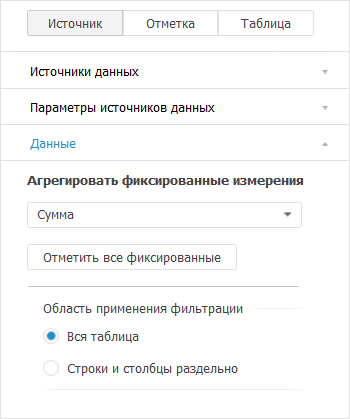

# Настройка отметки элементов измерения: Foresight Add-in for Excel

Настройка отметки элементов измерения: Foresight Add-in for Excel
-

# Настройка отметки элементов измерения

Отметка элементов измерения
 предназначена для выбора данных, отображаемых в таблице, диаграмме и других
 визуализаторах.

Изменение отметки производится с помощью:

[мыши](javascript:TextPopup(this))

		- Щелчок на элементе приводит к инвертированию состояния отметки.

		- Щелчок с удержанием клавиши SHIFT снимает отметку со всех
		 элементов и отмечает элементы (кроме свернутых), находящиеся между
		 сфокусированным элементом и элементом, на котором производится
		 щелчок.

		- Щелчок с удержанием клавиши CTRL приводит к установке или
		 снятию отметки для элемента и всех подчинённых ему элементов.

[контекстного
 меню измерения](javascript:TextPopup(this))

	В контекстном меню выберите вариант отметки.

[ленты инструментов](javascript:TextPopup(this))

	На вкладке «Отметка» ленты
	 инструментов выберите вариант отметки.

	Примечание.
	 Вкладка «Отметка» ленты инструментов
	 доступна при выборе группы вкладок «Отметка»
	 на панели свойств.

[клавиатуры](javascript:TextPopup(this))

		- Нажатие клавиши UP/DOWN перемещает фокусную
		 рамку.

		- Нажатие клавиши RIGHT/LEFT раскрывает/сворачивает
		 иерархию элемента, на котором находится фокус.

		- Нажатие клавиши ПРОБЕЛ приводит к инвертированию
		 состояния отметки. При нажатии клавиши ПРОБЕЛ можно удерживать клавишу
		 SHIFT или CTRL.

		- Нажатие клавиши ПРОБЕЛ с удержанием клавиши CTRL
		 приводит к инвертированию состояния отметки для элемента и всех
		 подчиненных ему элементов.

	Примечание.
	 Для списков с единичной отметкой (фиксированные измерения) перемещение
	 по элементам при помощи курсорных клавиш автоматически выделяет и
	 фокусирует элемент.

При изменении отметки измерения все зависящие от него измерения автоматически
 перестраиваются, после чего перестраиваются измерения, зависящие от перестроенных
 и т.д.

## Варианты отметки

[Отметить или
 снять отметку у элемента](javascript:TextPopup(this))

	Для отметки или снятия отметки с элемента измерения щёлкните по
	 нему на открытой вкладке с измерением на панели свойств.

[Отметить все](javascript:TextPopup(this))

	Для отметки всех элементов измерения откройте вкладку с измерением на
	 панели свойств,
	 затем:

		- нажмите кнопку «Отметить
		 все» на вкладке «Отметка»
		 ленты инструментов;

		- выполните команду «Отметить
		 все» в контекстном меню элемента измерения на панели свойств;

		- выполните команду «Отметить
		 все» в меню измерения 
		 на панели свойств.

	После выполнения одного из действий будут отмечены все элементы
	 измерения.

[Отметить с данными](javascript:TextPopup(this))

	Для отметки всех элементов измерения, по которым есть данные в источнике:

		- Перейдите на вкладку с измерением на панели
		 свойств.

		- Нажмите кнопку «Отметить
		 все с данными», расположенную
		 на вкладке «Отметка» ленты
		 инструментов.

	Примечание.
	 Возможность доступна в настольном приложении, если включено [кеширование
	 источника данных](UiNav.chm::/03_Objects/UiNav_Obj_BasicPropCache.htm).

[Снять отметку
 со всех](javascript:TextPopup(this))

	Для снятия отметки со всех элементов измерения на панели
	 свойств откройте вкладку с измерением, затем:

		- нажмите кнопку «Снять отметку»
		 на вкладке ленты «Отметка»;

		- выполните команду «Снять
		 отметку со всех» в контекстном меню элемента измерения
		 на панели свойств;

		- выполните команду «Снять
		 отметку со всех» в меню измерения 
		 на панели свойств.

	После выполнения одного из действий со всех элементов измерения
	 будет снята отметка.

[Отметить уровень](javascript:TextPopup(this))

	Для отметки уровня измерения:

		- Перейдите на вкладку с измерением на панели
		 свойств.

		- Выберите уровень в раскрывающемся меню:

			- кнопки «Отметить уровень»
			 на вкладке ленты «Отметка»;

			- пункта «Расширенная
			 отметка > Отметить уровень» в контекстном меню элемента
			 измерения на панели свойств;

			- пункта «Расширенная
			 отметка > Отметить уровень» в меню измерения 
			 на панели свойств.

	После выполнения действий будет отмечен выбранный уровень измерения.

	Примечание.
	 Отметка уровня доступна для измерений с настроенными уровнями.

[Отметить подчиненные](javascript:TextPopup(this))

	Для отметки всех подчиненных элементов:

		- Перейдите на вкладку с измерением на панели
		 свойств.

		- Выполните команду «Отметить
		 подчиненные по уровню» или «Отметить
		 все подчиненные»:

			- в контекстном меню элемента измерения на панели свойств;

			- в меню измерения 
			 на панели свойств.

[Снять отметку
 с подчиненных](javascript:TextPopup(this))

	Для снятия отметки со всех подчиненных элементов:

		- Перейдите на вкладку с измерением на панели
		 свойств.

		- Выполните команду «Снять
		 отметку с подчиненных»:

			- в контекстном меню элемента измерения на панели свойств;

			- в меню измерения 
			 на панели свойств.

[Множественная
 отметка и агрегация в фиксированных измерениях](javascript:TextPopup(this))

	Агрегация позволяет производить
	 множественную отметку элементов фиксированных измерений, с применением
	 выбранного метода агрегации.

	Для множественной отметки в фиксированных измерениях перейдите на
	 вкладку «Данные» в группе
	 «Источник» на панели
	 свойств:

	

	В раскрывающемся списке «Агрегировать
	 фиксированные измерения» выберите метод агрегации данных фиксированных
	 измерений:

		- Сумма. По выбранным
		 элементам в фиксированных измерениях будет произведено суммирование;

		- Среднее. По выбранным
		 элементам в фиксированных измерениях будет отображено среднее
		 значение;

		- Максимум. Из выбранных
		 элементов в фиксированных измерениях будет отображено максимальное
		 значение;

		- Минимум. Из выбранных
		 элементов в фиксированных измерениях будет отображено минимальное
		 значение;

		- Из измерений источника.
		 Метод доступен, если для источника данных настроена [агрегация
		 данных](UiNavObj.chm::/Cube/CreateCube/Master_Standart/UiMd_Cube_CreateCube_Master_Standart_7.htm). В фиксированных измерениях будет использоваться
		 агрегация в соответствии с [настройками
		 источника](UiNavObj.chm::/Cube/CreateCube/Master_Standart/UiMd_Cube_CreateCube_Master_Standart_7.htm). При работе с кубами ADOMD используется
		 агрегация, настроенная в соответствующих источниках ADOMD.

	Примечание.
	 При выборе любого пункта списка, кроме, «Нет»
	 становится активной кнопка «Отметить
	 все фиксированные», при нажатии на которую будут отмечены все
	 элементы в фиксированных измерениях.

## Отметка элементов календарного измерения

При работе с отметкой [элементов
 календарного измерения](UiSelection.chm::/Selection/Selection_of_the_CalendarDimension_elements.htm) доступен выбор режима отметки:
 элементы или уровни. Режим отметки зависит от режима, настроенного в отчёте,
 используемого в качестве источника данных.

## Использование схемы отметки

Использование схемы отметки доступно, если для справочника, на основе
 которого был построен источник данных отчета, создана хотя бы одна [схема
 отметки](UiNavObj.chm::/reference_book/look-and-feel_Reference_book/UiMd_reference_book_look-and-feel_Scheme.htm).

Схема отметки - объект репозитория,
 используемый в справочниках для автоматизации выделения элементов по заданным
 правилам.

Схема отметки будет применяться автоматически, пока не будет отключена.

[Создание схемы
 отметки по отмеченным элементам](javascript:TextPopup(this))

	Для создания схемы отметки измерения:

		- Перейдите на вкладку с измерением на панели
		 свойств.

		- Выберите пункт «Создать
		 схему по отмеченным элементам» в раскрывающемся меню:

			- кнопки
			 «Схема отметки», расположенной на вкладке «Отметка»
			 ленты инструментов;

			- «Расширенная отметка
			 > Применить схему отметки» в контекстном меню элемента
			 измерения на панели свойств;

			- «Расширенная отметка
			 > Применить схему отметки» меню измерения  на панели свойств.

	К элементам измерения будет применена созданная схема отметки.

	Примечание.
	 Если в измерении присутствует вычислимый элемент, задана альтернативная
	 либо пользовательская иерархия, то создание схемы отметки недоступно.

[Применение
 схемы отметки](javascript:TextPopup(this))

	Для применения схемы отметки измерения:

		- Перейдите на вкладку с измерением на панели
		 свойств.

		- Выберите схему отметки в раскрывающемся меню:

			- кнопки «Схема отметки»,
			 расположенной на вкладке «Отметка»
			 ленты инструментов;

			- «Расширенная отметка
			 > Применить схему отметки» в контекстном меню элемента
			 измерения на панели свойств;

			- «Расширенная отметка
			 > Применить схему отметки» меню измерения  на панели свойств.

	Если необходимо применять эту схему отметки при открытии отчёта,
	 установите флажок «При открытии отчета».

	Для отключения применения схемы отметки выберите пункт «Сбросить».

[Редактирование
 схемы отметки](javascript:TextPopup(this))

	Для редактирования схемы отметки:

		- Перейдите на вкладку с измерением на панели
		 свойств.

		- Выберите пункт «Редактировать»
		 в раскрывающемся меню:

			- кнопки «Схема отметки», расположенной на вкладке «Отметка»
			 ленты инструментов;

			- «Расширенная отметка
			 > Применить схему отметки» в контекстном меню элемента
			 измерения на панели свойств;

			- «Расширенная отметка
			 > Применить схему отметки» меню измерения  на панели свойств.

	В открывшемся окне «[Схемы отметки](UiNavObj.chm::/reference_book/look-and-feel_Reference_book/UiMd_reference_book_look-and-feel_Scheme.htm)»
	 добавьте примитивы схемы отметки, в соответствии с которыми будет
	 осуществляться отметка элементов.

## Использование группы элементов

Использование группы элементов доступно, если для справочника, на основе
 которого был построен источник данных отчета, создана хотя бы одна [группа
 элементов](UiNavObj.chm::/reference_book/look-and-feel_Reference_book/UiMd_reference_book_look-and-feel_Group.htm).

Группа элементов - объект репозитория,
 используемый в справочниках для ограничения списка доступных элементов.

[Создание группы
 элементов по отмеченным элементам](javascript:TextPopup(this))

	Для создания группы элементов измерения:

		- Перейдите на вкладку с измерением на панели
		 свойств.

		- Выберите пункт «Создать
		 группу по отмеченным элементам» в раскрывающемся меню:

			- кнопки
			 «Отметить группу», расположенной на вкладке «Отметка»
			 ленты инструментов;

			- «Расширенная отметка
			 > Отметить группу» в контекстном меню элемента измерения
			 на панели свойств;

			- «Расширенная отметка
			 > Отметить группу» меню измерения  на панели свойств.

	В измерении будут отмечены только те элементы, которые входят в
	 созданную группу.

	Примечание.
	 Если в измерении присутствует вычислимый элемент, задана альтернативная
	 либо пользовательская иерархия, то создание группы элементов недоступно.

[Отметка группы
 элементов](javascript:TextPopup(this))

	Для отметки группы элементов измерения:

		- Перейдите на вкладку с измерением на панели
		 свойств.

		- Выберите группу элементов в раскрывающемся меню:

			- кнопки «Отметить группу»,
			 расположенной на вкладке «Отметка»
			 ленты инструментов;

			- «Расширенная отметка
			 > Отметить группу» в контекстном меню элемента измерения
			 на панели свойств;

			- «Расширенная отметка
			 > Отметить группу» меню измерения  на панели свойств.

	Применение отметки «Группа элементов»
	 снимет отметку со всех элементов и отметит группу.

	Пункт «Сбросить» аналогичен
	 команде «Снять отметку со всех».

[Редактирование
 группы элементов](javascript:TextPopup(this))

	Для редактирования группы элементов:

		- Перейдите на вкладку с измерением на панели
		 свойств.

		- Выберите пункт «Редактировать»
		 в раскрывающемся меню:

			- кнопки «Отметить группу», расположенной на вкладке «Отметка»
			 ленты инструментов;

			- «Расширенная отметка
			 > Отметить группу» в контекстном меню элемента измерения
			 на панели свойств;

			- «Расширенная отметка
			 > Отметить группу» меню измерения  на панели свойств.

	В открывшемся окне «[Группы элементов](UiNavObj.chm::/reference_book/look-and-feel_Reference_book/UiMd_reference_book_look-and-feel_Group.htm)»
	 добавьте примитивы группы элементов, в соответствии с которыми будет
	 сформирован набор элементов.

## Использование альтернативной иерархии

Отметка иерархий доступна, если для текущего [справочника](UiNavObj.chm::/reference_book/UiMd_reference_book_Hierarchy.htm)
 создана хотя бы одна [альтернативная иерархия](UiNavObj.chm::/reference_book/UiMd_reference_book_Hierarchy.htm)
 или настроена пользовательская иерархия.

Альтернативная иерархия - иерархия
 любого другого справочника, связанная с иерархией основного справочника
 для сопоставления элементов, или пользовательская иерархия, созданная
 при [редактировании измерений](../SettingViewDimension.htm#edit_dim)
 или [добавлении нового
 вычисляемого элемента](../SettingViewDimension.htm#add_newelement).

[Отметка иерархии](javascript:TextPopup(this))

	Для отметки альтернативной иерархии:

		- Перейдите на вкладку с измерением на панели
		 свойств.

		- Выполните команду «Расширенная
		 отметка > Отметить иерархию»:

			- в контекстном меню элемента измерения на панели свойств;

			- в меню измерения 
			 на панели свойств.

		- В раскрывающемся меню выберите необходимую альтернативную
		 иерархию.

	При применении отметки альтернативной иерархии будет снята текущая
	 отметка со всех элементов и будут отмечены элементы иерархии.

	Для снятия отметки с элементов альтернативной иерархии выполните
	 команду «Сбросить». Команда
	 аналогична команде «Снять отметку
	 со всех».

См. также:

[Режим экспресс-анализа
 данных](Olap_Mode.htm)

		Справочная
		 система на версию 10.9
		 от 18/08/2025,
		 © ООО «ФОРСАЙТ»,
