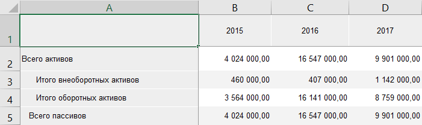
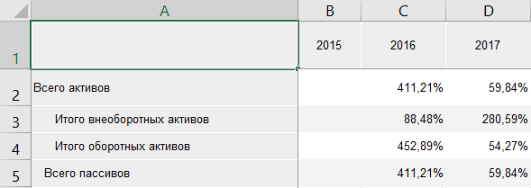

# Преобразование данных: Foresight Add-in for Excel

Преобразование данных: Foresight Add-in for Excel
-

# Преобразование данных

Преобразование данных позволяет
 представить данные таблицы в различных представлениях.

Для выполнения преобразования выбранных данных:

	- Нажмите кнопку  «Преобразовать
	 данные», расположенную в группе «Вид»
	 на вкладке «Таблица» ленты
	 инструментов.

	- В раскрывающемся меню кнопки выберите вариант преобразования
	 для строк/столбцов:

		- Рост, %. Будет отображаться
		 изменение значения в процентах;

		- Прирост, %. Будет
		 отображаться процент прироста;

		- Изменение. Будет
		 отображаться разница между текущим и предыдущим значением;

		- Доля, %. Будет отображаться
		 доля значения ячейки от суммы значений всей строки/столбца.

Для отмены преобразования данных нажмите кнопку 
 «Преобразовать данные».

## Пример преобразования данных

Исходные данные таблицы:

Данные после преобразования «Рост по
 строкам, %»:

См. также:

[Работа с таблицей данных](Table_Work.htm)

		Справочная
		 система на версию 10.9
		 от 18/08/2025,
		 © ООО «ФОРСАЙТ»,
