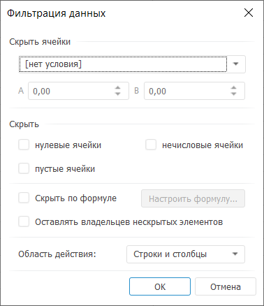

# Фильтрация данных: Foresight Add-in for Excel

Фильтрация данных: Foresight Add-in for Excel
-

# Фильтрация данных

Фильтрация позволяет выделить
 подмножество данных из таблицы и отобразить только те данные, которые
 соответствуют заданным условиям.

Для включения фильтрации данных:

	- нажмите кнопку  «Фильтр», расположенную в группе
	 «Вид» на вкладке «Таблица»
	 ленты инструментов. Будет открыто окно «[Фильтрация данных](#data_filtering)»;

	- нажмите на нижнюю часть кнопки  «Фильтр»
	 и выберите необходимое условие фильтрации (фильтров):

		- Скрыть пустые строки и
		 столбцы. Будут скрыты столбцы и строки, не содержащие данных;

		- Скрыть строки и столбцы
		 с нулевыми значениями. Будут скрыты столбцы и строки, содержащие
		 только нулевые значения;

		- Скрыть строки и столбцы
		 с нечисловыми значениями. Будут скрыты строки и столбцы,
		 содержащие только нечисловые значения;

		- Скрыть строки и столбцы
		 по условию. При выборе данного варианта будет открыто
		 окно «Фильтрация по условию».
		 Задайте в нем условие фильтрации. Будут скрыты строки и столбцы,
		 удовлетворяющие заданному условию;

		- Другие способы фильтрации.
		 При выборе данного варианта будет открыто окно «[Фильтрация
		 данных](#data_filtering)».

Одновременно можно применять несколько фильтров. Каждый следующий фильтр
 добавляется к результатам предыдущего и дополнительно сужает подмножество
 данных.

Совет. Для быстрой
 настройки фильтрации используйте вкладку «[Фильтрация](UiAnalyticalArea.chm::/Working_with_table_data/Filtering.htm)»
 на панели свойств.

Для отключения фильтрации данных:

	- переведите кнопку 
	 «Фильтр» в ненажатое состояние;

	- нажмите на нижнюю часть кнопки  «Фильтр»
	 и выберите в раскрывающемся списке вариант «Отключить».

## Настройка пользовательских параметров
 фильтрации

Для настройки пользовательских параметров фильтрации используйте
 окно «Фильтрация данных».

[Для открытия
 окна](javascript:TextPopup(this))

		- Нажмите на нижнюю часть кнопки  «Фильтр».

		- Выберите пункт «Другие
		 способы фильтрации».

Задайте в окне параметры фильтрации:

	- Скрыть ячейки. В раскрывающемся
	 списке выберите условие фильтрации числовых значений.

[Доступные
 условия](javascript:TextPopup(this))

			- равные А;

			- не равные А;

			- больше А;

			- меньше А;

			- большие или равные А;

			- меньшие или равные А;

			- между А и В включительно;

			- меньшие А или большие В.

Будут скрыты только те значения, которые
 соответствуют заданному условию. По умолчанию условие фильтрации не задано;

	- Скрыть. Группа предназначена
	 для настройки параметров скрытия ячеек. Установите флажки напротив
	 тех типов ячеек, которые необходимо скрыть:

		- нулевые ячейки;

		- нечисловые ячейки;

		- пустые ячейки;

	- Скрывать по формуле.
	 Для задания необходимого условия фильтрации после установки флажка
	 нажмите кнопку «Настроить формулу».
	 В открывшемся окне «[Редактор
	 выражения](UiNav.chm::/GUI/ExpressionEditor.htm)» сформируйте выражение, возвращающее
	 логическое значение;

	- Оставлять владельцев нескрытых
	 элементов. После установки флажка в отфильтрованной таблице
	 будут отображаться родительские элементы, не отвечающие условию фильтрации,
	 даже если их собственные значения удовлетворяют условию фильтрации;

	- Область действия. В
	 раскрывающемся списке выберите область таблицы, к которой будет применяться
	 фильтрация:

		- строки и столбцы;

		- строки;

		- столбцы.

См. также:

[Работа
 с таблицей данных](Table_Work.htm)

		Справочная
		 система на версию 10.9
		 от 18/08/2025,
		 © ООО «ФОРСАЙТ»,
