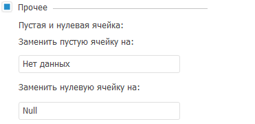

# Оформление таблицы и её элементов: Foresight Add-in for Excel

Оформление таблицы и её элементов: Foresight Add-in for Excel
-

# Оформление таблицы и её элементов

Для оформления элементов таблицы перейдите на вкладку «Оформление»
 на панели свойств.

[Для отображения
 вкладки](javascript:TextPopup(this))

		- Выделите элемент таблицы, для которого необходимо настроить
		 оформление.

		- Перейдите в группу «Таблица»
		 на панели свойств.

	Примечание.
	 При выделении элемента таблицы группа вкладок панели свойств будет
	 переименована в соответствии с выделенным элементом:

	         ■   если
	 выделен уголок, вкладка будет называться «Уголок»;

	         ■   если
	 выделены шапка или боковик - «Формат»;

	         ■   если
	 выделены данные - «Таблица»;

	         ■   если
	 выделены [итоговые значения](Totals.htm) - «Итоги»;

	         ■   если
	 выделены все ячейки с данными - «Данные».

		- Перейдите на вкладку «Оформление».

	Примечание.
	 При выделении элемента таблицы вкладка будет переименована в соответствии
	 с выделенным элементом:

	         ■   если
	 выделен уголок или данные, вкладка будет называться «Оформление»;

	         ■   если
	 выделены шапка, боковик или [итоговые значения](Totals.htm)
	 - «Оформление заголовка»
	 и «Оформление данных».

В зависимости от выделенного элемента таблицы доступны следующие настройки
 оформления:

[Показывать наименования](javascript:TextPopup(this))

	Для настройки содержимого уголка используйте группу настроек «Показывать наименования»:

		- Установите флажок «Показывать
		 наименования».

		- Установите переключатель, определяющий, откуда будет браться
		 наименование:

			- из шапки таблицы;

			- из боковика таблицы.

		- Задайте вид наименования:

			- Измерение. Будет
			 отображаться наименование измерения;

			- Атрибут. Будет
			 отображаться наименование атрибута измерения;

			- Измерение. Атрибут.
			 Будут отображаться наименования измерения и атрибута.

[Специальный
 формат](javascript:TextPopup(this))

	Для настройки специального формата данных, отображаемых в шапке/боковике
	 таблицы, используйте группу настроек «Специальный
	 формат» на вкладке «Оформление
	 данных» на панели свойств:

		- Установите флажок «Специальный
		 формат».

		- В раскрывающемся списке выберите необходимый формат:

			- Общий;

			- Числовой;

			- Денежный;

			- Дата;

			- Время;

			- Процентный;

			- Экспоненциальный;

			- Текстовый;

			- Дополнительный;

			- Пользовательский.

	Подробное описание настройки специального формата данных приведено
	 в разделе «[Настройка формата данных](UiAnalyticalArea.chm::/TableView/Formatting/Data_format.htm)».

	Совет. Для быстрой
	 настройки формата данных таблицы используйте группу «Формат
	 числа» на вкладке «Таблица»
	 ленты инструментов.

[Специальный
 шрифт](javascript:TextPopup(this))

	Для изменения настроек шрифта:

		- Установите флажок «Специальный
		 шрифт».

		- Задайте настройки шрифта:

			- Тип шрифта.
			 В раскрывающемся списке выберите шрифт, доступный в операционной
			 системе. По умолчанию выбран шрифт Arial;

			- Размер. В числовом
			 редакторе введите или выберите размер шрифта. При изменении
			 размера шрифта будет автоматически изменяться размер ячеек
			 таблицы;

			- Цвет. В раскрывающейся
			 палитре выберите цвет шрифта;

			- Начертание.
			 В раскрывающемся списке выберите вариант начертания:

				- Обычное;

				- Курсивное;

				- Жирное;

				- Жирное Курсивное;

			- Выравнивание.
			 В раскрывающемся списке выберите вариант выравнивания содержимого
			 ячеек таблицы:

				- По значению;

				- По левому краю;

				- По центру;

				- По правому краю;

				- По ширине.

[Заливка](javascript:TextPopup(this))

	Для настройки заливки ячеек таблицы:

		- Установите флажок «Заливка».

		- Установите переключатель напротив необходимого типа заливки:

			- Один цвет. В
			 раскрывающейся палитре выберите цвет заливки;

			- Перетекание.
			 После установки переключателя задайте параметры:

				- Наклон.
				 В числовом редакторе выберите или введите угол наклона
				 градиента;

				- В цветовых палитрах установите цвет начала и конца
				 градиента;

			- Текстура. В
			 качестве заливки ячеек таблицы будет использоваться изображение.
			 Для выбора изображения нажмите кнопку .
			 В открывшемся окне выберите изображение в формате *.bmp, *.dib,
			 *.rle, *.bmz, *.jpg, *.jpeg, *.jfif, *.jpe, *.gif, *.png,
			 *.emf, *.wmf.

[Отображать границы](javascript:TextPopup(this))

	Для настройки границ выделенного элемента таблицы:

		- Установите флажок «Отображать
		 границы».

		- Установите флажки напротив типов границ, которые необходимо
		 отобразить:

			- Верхняя;

			- Левая;

			- Правая;

			- Нижняя;

			- Горизонтальная сетка;

			- Вертикальная сетка;

			- Правая диагональ;

			- Левая диагональ.

		- Задайте оформление границ. Выберите в списке одну или несколько
		 границ и установите их настройки:

			- Линия. В раскрывающемся
			 списке выберите тип линии;

			- Цвет. В раскрывающейся
			 палитре выберите цвет границы.

[Прочее](javascript:TextPopup(this))

	Пустые ячейки или ячейки с нулевым значением могут быть заполнены
	 произвольным содержимым.

		- Установите флажок «Прочее».

	Примечание.
	 Флажок недоступен, если в таблице выделены уголок или заголовки итоговых
	 значений.

		- Введите текст, число или символы, которые будут отображены
		 в пустых или нулевых ячейках в соответствующих полях:

	

	Значения, которыми заполняются пустые ячейки, в том числе и числовые,
	 не будут сохранены в источнике. Пустые ячейки не будут учитываться
	 при выполнении [преобразования](Convert_Data.htm), [ранжирования](Ranking.htm)
	 данных, [распределении](Pareto.htm) или [вычислении
	 итогов](Totals.htm). Значения нулевых ячеек с замененным содержимым будут рассматриваться
	 как «0».

Для оформления нескольких элементов таблицы, применяемого только при
 выполнении определённых условий, используйте [условное
 форматирование](UiAnalyticalArea.chm::/Analysis/Conditional_formatting.htm).

## Отображение экспандеров

В экспресс-отчете, открытом в Microsoft Excel, будут отображаться экспандеры,
 если они были настроены в источнике данных текущего отчета в настольном
 приложении «Форсайт. Аналитическая платформа».

См. также:

[Работа
 с таблицей данных](Table_Work.htm)

		Справочная
		 система на версию 10.9
		 от 18/08/2025,
		 © ООО «ФОРСАЙТ»,
