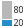
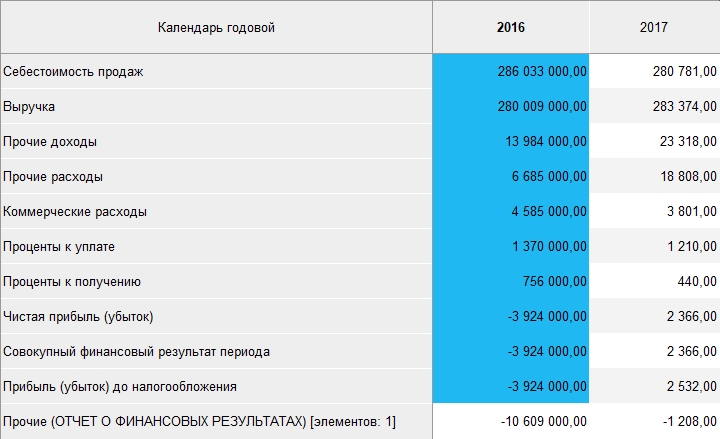

# Распределение: Foresight Add-in for Excel

Распределение: Foresight Add-in for Excel
-

# Распределение

Распределение позволяет оставить
 в таблице набор значений, которые составят определенный процент (или число)
 от общей суммы всех значений выбранного столбца. Остальные значения будут
 отображены общей суммой.

Примечание.
 Распределение осуществляется только для значений в одном столбце или в
 одной строке таблицы. Если настроить распределение для другого столбца/строки
 таблицы, текущее распределение будет снято.

Распределение задается по количеству,
 процентам или сумме
 для первых или последних элементов:

	- Количество. Оставляет
	 в таблице первые/последние N
	 элементов столбца/строки. Например, распределение «Первые
	 10 элементов» оставит 10 элементов с наибольшими значениями.
	 Остальные элементы будут отображены общей суммой;

	- Проценты. Оставляет
	 в таблице набор значений, которые составляют N%
	 от общей суммы всех значений выбранного столбца/строки. Например,
	 распределение «Первые 80%»
	 оставит элементы, сумма значений которых составляет 80% от суммы всех
	 значений. Остальные элементы (20%) будут отображены общей суммой;

	- Сумма. Оставляет в таблице
	 набор значений, сумма которых меньше или равна заданному числу N. Например, распределение «Сумма последних элементов <= 100»
	 оставит наименьшие элементы, сумма которых не превышает 100. Остальные
	 элементы будут отображены общей суммой;

	- Первые. Распределение
	 будет отображать элементы с наибольшими значениями. По умолчанию заливка
	 имеет синий цвет;

	- Последние. Распределение
	 будет отображать элементы с наименьшими значениями. По умолчанию заливка
	 имеет оранжевый цвет.

Для выполнения распределения данных:

	- Выделите несколько ячеек столбцов/строк таблицы, по которым
	 необходимо выполнить распределение.

Примечание.
 Если выбрана одна ячейка, распределение будет настроено для столбца, содержащего
 данную ячейку.

	- Нажмите на нижнюю часть кнопки  «Рапределение»,
	 расположенной в группе «Анализ»
	 на вкладке «Таблица» ленты
	 инструментов.

	- В раскрывающемся меню кнопки
	 выберите метод распределения:

[Распределение
 по заданным параметрам](javascript:TextPopup(this))

			- Первые 10 элементов.
			 Выбираются 10 максимальных значений в анализируемом столбце/строке;

			- Первые 80%.
			 Выбираются максимальные значения в анализируемом столбце/строке,
			 сумма которых составляет 80% от общей суммы;

			- Последние 10 элементов.
			 Выбираются 10 минимальных значений в анализируемом столбце/строке;

			- Последние 20%.
			 Выбираются минимальные значения в анализируемом столбце/строке,
			 сумма которых составляет 20% от общей суммы.

[Распределение
 по пользовательским параметрам](javascript:TextPopup(this))

			- Первые N элементов. Выбираются N максимальных значений
			 в анализируемом столбце/строке;

			- Первые N%. Выбираются максимальные
			 значения в анализируемом столбце/строке, сумма которых составляет N% от общей суммы;

			- Сумма первых элементов
			 <=N.
			 Выбираются максимальные значения в анализируемом столбце/строке,
			 сумма которых меньше или равна N;

			- Последние N элементов. Выбираются N минимальных значений
			 в анализируемом столбце/строке;

			- Последние N%. Выбираются минимальные
			 значения в анализируемом столбце/строке, сумма которых составляет N% от общей суммы;

			- Сумма последних элементов
			 <=N.
			 Выбираются минимальные значения в анализируемом столбце/строке,
			 сумма которых меньше или равна N.

	В открывшемся диалоге введите значение
	 для параметра N.

Для выключения распределения нажмите кнопку  «Распределение».

Пример таблицы с распределением:

См. также:

[Работа
 с таблицей данных](Table_Work.htm)

		Справочная
		 система на версию 10.9
		 от 18/08/2025,
		 © ООО «ФОРСАЙТ»,
