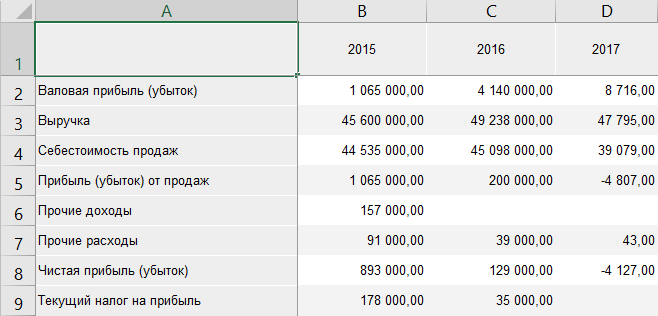
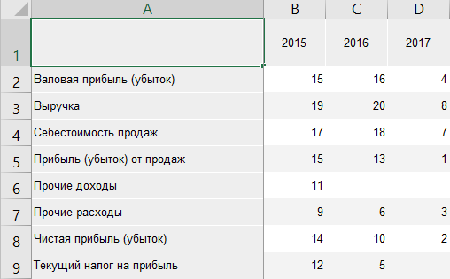

# Ранжирование данных: Foresight Add-in for Excel

Ранжирование данных: Foresight Add-in for Excel
-

# Ранжирование данных

Ранжирование данных позволяет
 определить порядок значений в таблице по их значениям.

Примечание.
 Если рассчитываются [итоговые значения](Totals.htm), то ранжирование
 может быть выполнено некорректно. Перед ранжированием будет предложено
 выключить расчёт итогов.

Для выполнения ранжирования данных:

	- Нажмите на нижнюю часть кнопки  «Отобразить
	 как ранги», расположенной в группе «Вид»
	 на вкладке «Таблица» ленты
	 инструментов.

	- В раскрывающемся меню кнопки выберите способ ранжирования:

		- по убыванию по строкам;

		- по возрастанию по строкам;

		- по убыванию по столбцам;

		- по возрастанию по столбцам;

		- по убыванию по всей таблице;

		- по возрастанию по всей таблице.

Для отмены ранжирования данных нажмите кнопку 
 «Отобразить как ранги».

## Пример применения ранжирования

Исходные данные:

Ранжирование по возрастанию по всей таблице:

См. также:

[Работа
 с таблицей данных](Table_Work.htm)

		Справочная
		 система на версию 10.9
		 от 18/08/2025,
		 © ООО «ФОРСАЙТ»,
